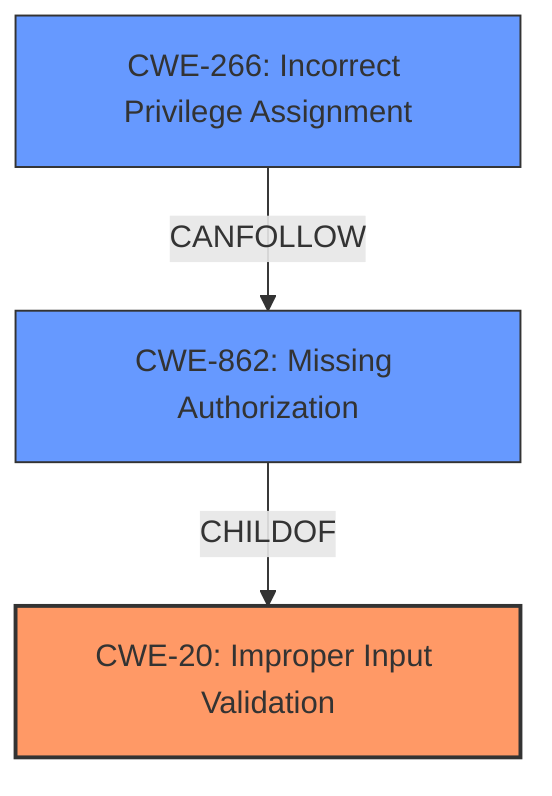

# Analysis for CVE-2024-40662

# Summary
| CWE ID | CWE Name | Confidence | CWE Abstraction Level | CWE Vulnerability Mapping Label | CWE-Vulnerability Mapping Notes |
|---|---|---|---|---|---|
| CWE-20 | Improper Input Validation | 0.9 | Class | Allowed-with-Review | The vulnerability is due to **improper input validation** which is the root cause. CWE-20 is a Class and might have Base-level children that would be more appropriate |
| CWE-862 | Missing Authorization | 0.4 | Class | Allowed-with-Review | Authorization could be missing because of the **improper input validation**. CWE-862 is a Class and might have Base-level children that would be more appropriate |
| CWE-266 | Incorrect Privilege Assignment | 0.4 | Base | Allowed | Incorrect Privilege Assignment can occur due to the **improper input validation** and the **Missing Authorization** |

## Evidence and Confidence

*   **Confidence Score:** 0.7
*   **Evidence Strength:** MEDIUM

## Relationship Analysis
The primary weakness is **improper input validation (CWE-20)**, which can lead to other weaknesses such as **missing authorization (CWE-862)** and **incorrect privilege assignment (CWE-266)**. CWE-20 is a parent Class. CWE-862 is a Class and child of others, and CWE-266 is a Base.

## Vulnerability Chain
The vulnerability chain starts with **improper input validation (CWE-20)**, which leads to **missing authorization (CWE-862)**, and then to **incorrect privilege assignment (CWE-266)**. The root cause is the **improper input validation**, which allows for the other weaknesses to occur.

## Summary of Analysis
The vulnerability is due to **improper input validation (CWE-20)** in the scheme of Uri.java. This allows for the crafting of a malformed Uri object, which can lead to local escalation of privilege. The **improper input validation** is the root cause of the vulnerability.

The evidence for this is:
- **Vulnerability Description Key Phrases:**
  - **rootcause:** **improper input validation**
- **CVE Reference Links Content Summary:**
  - **Improper Input Sanitization:** The code attempts to sanitize the URI scheme by removing the "://" delimiter. However, this is insufficient as it does not prevent injection of malicious schema components.
  - **Scheme Injection:** By crafting a scheme string with multiple "://" instances or with a malicious payload embedded within it, an attacker can inject a malicious scheme into a URI object.

The graph relationships influenced the final selection by showing how the **improper input validation** leads to other weaknesses such as **missing authorization** and **incorrect privilege assignment**.

The selected CWEs are at the optimal level of specificity because they accurately represent the weaknesses in the vulnerability. **CWE-20** is the root cause, while **CWE-862** and **CWE-266** are the resulting weaknesses.

Relevant CWE Information: