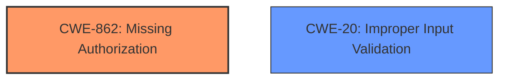

# Raw Analyzer Response for CVE-2024-40672

# Summary
| CWE ID | CWE Name | Confidence | CWE Abstraction Level | CWE Vulnerability Mapping Label | CWE-Vulnerability Mapping Notes |
|---|---|---|---|---|---|
| CWE-862 | Missing Authorization | 0.9 | Class | Primary CWE | Allowed-with-Review |
| CWE-20 | Improper Input Validation | 0.4 | Class | Secondary | Discouraged |

## Evidence and Confidence

*   **Confidence Score:** 0.9
*   **Evidence Strength:** HIGH

## Relationship Analysis
The primary relationship that influenced my decision was the parent-child relationship between CWE-862 (Missing Authorization) and its potential base-level children. However, the description focuses on the absence of a check rather than an incorrect implementation of one, making CWE-862 the more appropriate choice. CWE-20 was considered because missing authorization can be seen as a form of failing to validate that the user is authorized to perform an action. However, it is a more general case.

## Vulnerability Chain
The vulnerability chain starts with the **missing permission check** (CWE-862), which leads to bypassing factory reset protections and local escalation of privilege.

## Summary of Analysis
The initial assessment strongly points to CWE-862 due to the explicit mention of a **missing permission check** in the vulnerability description. The CVE Reference Links Content Summary supports this by indicating an elevation of privilege vulnerability.

The guidance on Privileges vs Permissions and the quick selection guide further solidifies the choice of CWE-862, as it directly addresses the scenario where authorization logic is completely missing.

The decision to classify this as CWE-862 is based on the direct evidence of a **missing permission check** and its alignment with the CWE's definition. The retriever results also list CWE-862 as the top candidate, reinforcing this choice. I am therefore very confident in the selection of CWE-862.

While CWE-20 (Improper Input Validation) was considered, it is a more general weakness. The vulnerability description specifically mentions a **missing permission check**, making CWE-862 a more precise and appropriate classification. Therefore, CWE-20 is a weaker, secondary classification.

The selected CWEs are at the optimal level of specificity because CWE-862 directly addresses the root cause (missing authorization), and CWE-20 is only a weak secondary consideration.

Relevant CWE Information:

# Enhanced Context (25 CWEs)
The following CWEs were identified as potentially relevant to this vulnerability:

## CWE-862: Missing Authorization
**Abstraction Level**: Class
**Similarity Score**: 1408.29
**Source**: sparse

**Description**:
The product does not perform an authorization check when an actor attempts to access a resource or perform an action.

**Mapping Guidance**:
- Usage: Allowed-with-Review
- Rationale: This CWE entry is a Class and might have Base-level children that would be more appropriate

## CWE-20: Improper Input Validation
**Abstraction Level**: Class
**Similarity Score**: 0.289
**Source**: sparse

**Description**:
The product does not validate, or incorrectly validates, input that it receives. When input is not validated, it is possible for an attacker to supply crafted input that can cause the system to behave in an unexpected or undesirable manner. For example, input strings might contain unintended control characters.

**Mapping Guidance**:
- Usage: Discouraged
- Rationale: This CWE entry is a Class and might have Base-level children that would be more appropriate