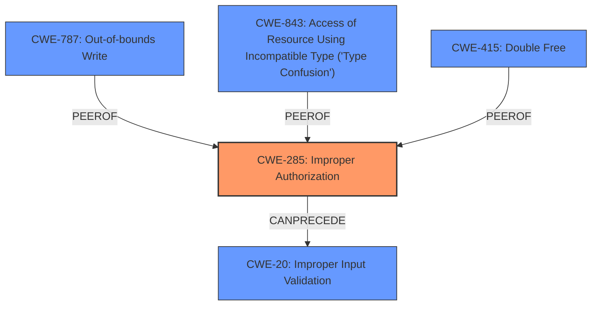

# Analysis Report for CVE-2024-40793

# Vulnerability Analysis Report: CVE-2024-40793

## Description

This issue was addressed by removing the vulnerable code. This issue is fixed in iOS 16.7.9 and iPadOS 16.7.9, macOS Ventura 13.6.8, macOS Monterey 12.7.6, iOS 17.6 and iPadOS 17.6, watchOS 10.6, macOS Sonoma 14.6. An app may be able to access user-sensitive data.

## Vulnerability Description Key Phrases

- **Impact:** access user-sensitive data
- **Product:** ['iOS', 'iPadOS', 'macOS Ventura', 'macOS Monterey', 'iOS', 'iPadOS', 'watchOS', 'macOS Sonoma']
- **Version:** ['16.7.9', '16.7.9', '13.6.8', '12.7.6', '17.6', '17.6', '10.6', '14.6']

## Analysis (with Relationship Data)

# Summary
| CWE ID | CWE Name | Confidence | CWE Abstraction Level | CWE Vulnerability Mapping Label | CWE-Vulnerability Mapping Notes |
|---|---|---|---|---|---|
| CWE-285 | Improper Authorization | 0.7 | Class | Primary | Allowed-with-Review |

## Evidence and Confidence

*   **Confidence Score:** 0.7
*   **Evidence Strength:** MEDIUM

## Relationship Analysis
The primary CWE identified is CWE-285, which is a Class-level CWE. While it is generally preferred to select a more specific Base or Variant level CWE, the available information does not provide sufficient detail to narrow down the classification further. The retriever results suggested several other CWEs, including CWE-787, CWE-843, and CWE-415, but these are more related to memory corruption issues and type confusion issues. Given that the core issue involves an application gaining unauthorized access to sensitive data, CWE-285 remains the most relevant despite its higher abstraction level.



## Vulnerability Chain
The vulnerability chain starts with **vulnerable code** in the Shortcuts application that leads to **improper authorization**, enabling an app to **access user-sensitive data**.

## Summary of Analysis
The primary finding is that the vulnerability allows an app to access user-sensitive data due to **vulnerable code**. This access suggests a failure in authorization mechanisms.

The most appropriate CWE is CWE-285 [Improper Authorization]. This is based on the fact that the core security issue revolves around an application being able to access data it should not have access to.

The evidence is derived from the "CVE Reference Links Content Summary" section, specifically:
*   "weaknesses": \["An app may be able to access user-sensitive data"]
*   "root\_cause": "The vulnerability was caused by **vulnerable code** in the Shortcuts application."

While the retriever results suggested other CWEs, such as CWE-787 [Out-of-bounds Write], CWE-843 [Access of Resource Using Incompatible Type ('Type Confusion')], and CWE-415 [Double Free], these are less directly relevant to the described vulnerability. These CWEs typically relate to memory corruption issues, which aren't explicitly mentioned in the vulnerability description.

CWE-285 is selected because it directly addresses the core issue of unauthorized access to sensitive data.


## CWE Relationship Analysis

Current CWEs represent these abstraction levels: .


### Vulnerability Chain Analysis

**Chain starting from CWE-787:**
- 787 (Out-of-bounds Write) - ROOT


**Chain starting from CWE-843:**
- 843 (Access of Resource Using Incompatible Type ('Type Confusion')) - ROOT


### CWE Relationship Diagram

```mermaid
graph TD
    classDef primary fill:#f96,stroke:#333,stroke-width:2px
    classDef secondary fill:#69f,stroke:#333
    classDef tertiary fill:#9e9,stroke:#333
```


*Report generated on 2025-07-13 12:32:19*
