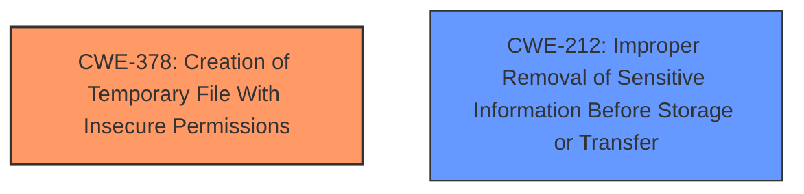

# Analysis Report for CVE-2024-40826

# Vulnerability Analysis Report: CVE-2024-40826

## Description

A privacy issue was addressed with improved handling of files. This issue is fixed in iOS 18 and iPadOS 18, macOS Sequoia 15. An unencrypted document may be written to a temporary file when using print preview.

## Vulnerability Description Key Phrases

- **Impact:** unencrypted document may be written to a temporary file
- **Product:** ['iOS', 'iPadOS', 'macOS']
- **Version:** ['18', '18', 'Sequoia 15']
- **Component:** print preview

## Analysis (with Relationship Data)

# Summary
| CWE ID | CWE Name | Confidence | CWE Abstraction Level | CWE Vulnerability Mapping Label | CWE-Vulnerability Mapping Notes |
|---|---|---|---|---|---|
| CWE-378 | Creation of Temporary File With Insecure Permissions | 0.8 | Base | Primary | Allowed |
| CWE-212 | Improper Removal of Sensitive Information Before Storage or Transfer | 0.6 | Base | Secondary | Allowed |

## Evidence and Confidence

*   **Confidence Score:** 0.7
*   **Evidence Strength:** MEDIUM

## Relationship Analysis
The primary relationship considered was the parent-child relationship. Specifically, the analysis focused on identifying the most specific **Base** or **Variant** CWE that accurately reflects the vulnerability. The retriever results suggested several candidates, but CWE-378 stood out due to its direct relevance to the creation of temporary files.



## Vulnerability Chain
The vulnerability chain starts with the **creation of a temporary file** and then the **potential storage of unencrypted data within it**.

1.  **Root Cause:** Creation of a temporary file with insecure permissions (**CWE-378**).
2.  **Weakness:** Improper Removal of Sensitive Information Before Storage or Transfer (**CWE-212**) because the document is unencrypted.
3.  **Impact:** Exposure of sensitive information through the unencrypted temporary file.

## Summary of Analysis
The initial assessment focused on identifying the **root cause** of the vulnerability, which is the **creation of a temporary file without adequate security measures**. The vulnerability description explicitly mentions that "an unencrypted document may be written to a temporary file when using print preview." This directly aligns with **CWE-378 (Creation of Temporary File With Insecure Permissions)**.

The secondary CWE, **CWE-212 (Improper Removal of Sensitive Information Before Storage or Transfer)**, was considered because the document written to the temporary file is unencrypted, indicating a failure to properly remove sensitive information before storage.

The graph relationship helped in visualizing the connection between the creation of an insecure temporary file and the potential exposure of sensitive information. This further solidified the selection of **CWE-378** as the primary weakness and **CWE-212** as a contributing factor.

The selected CWEs are at the optimal level of specificity because they directly address the actions and conditions described in the vulnerability. **CWE-378** focuses on the insecure creation of temporary files, while **CWE-212** highlights the failure to remove sensitive data (encryption) before storage.

Relevant CWE Information:

# Enhanced Context (25 CWEs)

## CWE-203: Observable Discrepancy
**Abstraction Level**: Base
**Similarity Score**: 0.67
**Source**: dense

**Description**:
The product behaves differently or sends different responses under different circumstances in a way that is observable to an unauthorized actor, which exposes security-relevant information about the state of the product, such as whether a particular operation was successful or not.

**Mapping Guidance**:
- Usage: Allowed
- Rationale: This CWE entry is at the Base level of abstraction, which is a preferred level of abstraction for mapping to the root causes of vulnerabilities.

*Not used because:* This CWE does not directly address the root cause of the vulnerability, which is related to insecure temporary file creation. The observable discrepancy is more of an impact than a cause.

## CWE-277: Insecure Inherited Permissions
**Abstraction Level**: Variant
**Similarity Score**: 0.67
**Source**: dense

**Description**:
A product defines a set of insecure permissions that are inherited by objects that are created by the program.

**Mapping Guidance**:
- Usage: Allowed
- Rationale: This CWE entry is at the Variant level of abstraction, which is a preferred level of abstraction for mapping to the root causes of vulnerabilities.

*Not used because:* While insecure permissions are relevant, the primary issue is the creation of a temporary file without proper security measures, making CWE-378 more applicable.

## CWE-459: Incomplete Cleanup
**Abstraction Level**: Base
**Similarity Score**: 0.66
**Source**: dense

**Description**:
The product does not properly "clean up" and remove temporary or supporting resources after they have been used.

**Mapping Guidance**:
- Usage: Allowed
- Rationale: This CWE entry is at the Base level of abstraction, which is a preferred level of abstraction for mapping to the root causes of vulnerabilities.

*Not used because:* The immediate issue is not about cleaning up, but creating the file securely.

## CWE-378: Creation of Temporary File With Insecure Permissions
**Abstraction Level**: Base
**Similarity Score**: 0.66
**Source**: dense

**Description**:
Opening temporary files without appropriate measures or controls can leave the file, its contents and any function that it impacts vulnerable to attack.

**Mapping Guidance**:
- Usage: Allowed
- Rationale: This CWE entry is at the Base level of abstraction, which is a preferred level of abstraction for mapping to the root causes of vulnerabilities.

*Used because:* The vulnerability description explicitly states that an unencrypted document may be written to a temporary file, directly aligning with the insecure creation of a temporary file.

## CWE-451: User Interface (UI) Misrepresentation of Critical Information
**Abstraction Level**: Class
**Similarity Score**: 0.66
**Source**: dense

**Description**:
The user interface (UI) does not properly represent critical information to the user, allowing the information - or its source - to be obscured or spoofed. This is often a component in phishing attacks.

**Mapping Guidance**:
- Usage: Allowed-with-Review
- Rationale: This CWE entry is a Class and might have Base-level children that would be more appropriate

*Not used because:* This vulnerability is not related to UI misrepresentation.

## CWE-665: Improper Initialization
**Abstraction Level**: Class
**Similarity Score**: 0.66
**Source**: dense

**Description**:
The product does not initialize or incorrectly initializes a resource, which might leave the resource in an unexpected state when it is accessed or used.

**Mapping Guidance**:
- Usage: Discouraged
- Rationale: This CWE entry is a level-1 Class (i.e., a child of a Pillar). It might have lower-level children that would be more appropriate

*Not used because:* Improper initialization is not the core issue; it's about the insecure creation and handling of temporary files.

## CWE-345: Insufficient Verification of Data Authenticity
**Abstraction Level**: Class
**Similarity Score**: 0.65
**Source**: dense

**Description**:
The product does not sufficiently verify the origin or authenticity of data, in a way that causes it to accept invalid data.

**Mapping Guidance**:
- Usage: Discouraged
- Rationale: This CWE entry is a level-1 Class (i.e., a child of a Pillar). It might have lower-level children that would be more appropriate

*Not used because:* The vulnerability is not about data authenticity.

## CWE-843: Access of Resource Using Incompatible Type ('Type Confusion')
**Abstraction Level**: Base
**Similarity Score**: 0.65
**Source**: dense

**Description**:
The product allocates or initializes a resource such as a pointer, object, or variable using one type, but it later accesses that resource using a type that is incompatible with the original type.

**Mapping Guidance**:
- Usage: Allowed
- Rationale: This CWE entry is at the Base level of abstraction, which is a preferred level of abstraction for mapping to the root causes of vulnerabilities.

*Not used because:* Type confusion is not relevant to this vulnerability.

## CWE-131: Incorrect Calculation of Buffer Size
**Abstraction Level**: Base
**Similarity Score**: 0.65
**Source**: dense

**Description**:
The product does not correctly calculate the size to be used when allocating a buffer, which could lead to a buffer overflow.

**Mapping Guidance**:
- Usage: Allowed
- Rationale: This CWE entry is at the Base level of abstraction, which is a preferred level of abstraction for mapping to the root causes of vulnerabilities.

*Not used because:* The vulnerability does not involve buffer size calculations or buffer overflows.

## CWE-212: Improper Removal of Sensitive Information Before Storage or Transfer
**Abstraction Level**: Base
**Similarity Score**: 0.65
**Source**: dense

**Description**:
The product stores, transfers, or shares a resource that contains sensitive information, but it does not properly remove that information before the product makes the resource available to unauthorized actors.

**Mapping Guidance**:
- Usage: Allowed
- Rationale: This CWE entry is at the Base level of abstraction, which is a preferred level of abstraction for mapping to the root causes of vulnerabilities.

*Used because:* Since the document is unencrypted, it aligns with failing to remove sensitive data


## CWE Relationship Analysis

Current CWEs represent these abstraction levels: .


### Vulnerability Chain Analysis

**Chain starting from CWE-378:**
- 378 (Creation of Temporary File With Insecure Permissions) - ROOT


**Chain starting from CWE-203:**
- 203 (Observable Discrepancy) - ROOT


### CWE Relationship Diagram

```mermaid
graph TD
    classDef primary fill:#f96,stroke:#333,stroke-width:2px
    classDef secondary fill:#69f,stroke:#333
    classDef tertiary fill:#9e9,stroke:#333
```


*Report generated on 2025-07-13 12:36:38*
