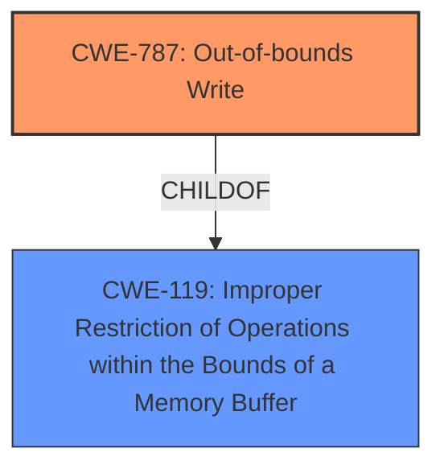

# Raw Analyzer Response for CVE-2024-40841

# Summary
| CWE ID | CWE Name | Confidence | CWE Abstraction Level | CWE Vulnerability Mapping Label | CWE-Vulnerability Mapping Notes |
|---|---|---|---|---|---|
| CWE-787 | Out-of-bounds Write | 1.0 | Base | Allowed | Primary CWE. The vulnerability description explicitly states an **out-of-bounds write** issue. |
| CWE-119 | Improper Restriction of Operations within the Bounds of a Memory Buffer | 0.5 | Class | Discouraged | Secondary Candidate. CWE-119 is a broader category that encompasses out-of-bounds write issues. While it's related, CWE-787 is a more specific and accurate representation of the vulnerability.|

## Evidence and Confidence

*   **Confidence Score:** 1.0
*   **Evidence Strength:** HIGH

## Relationship Analysis
The primary relationship is that CWE-787 (Out-of-bounds Write) is a child of CWE-119 (Improper Restriction of Operations within the Bounds of a Memory Buffer). This hierarchical relationship indicates that CWE-787 is a specific type of CWE-119. Since the vulnerability description explicitly mentions an **out-of-bounds write**, selecting the more specific CWE-787 is appropriate.

## Vulnerability Chain
The vulnerability chain starts with a maliciously crafted video file, leading to an **out-of-bounds write**, which then results in unexpected application termination.

Malicious Video File --> **Out-of-bounds Write** (CWE-787) --> Application Termination

## Summary of Analysis
The analysis is based on the provided vulnerability description, which explicitly states an **out-of-bounds write** issue. The evidence is strong, and the confidence level is high.

The graph relationships influenced the selection by highlighting the parent-child relationship between CWE-787 and CWE-119. While CWE-119 is a related and broader category, CWE-787 is a more specific and accurate representation of the vulnerability described.

The selected CWE, CWE-787, is at the optimal level of specificity because it directly corresponds to the **root cause** identified in the vulnerability description.

Relevant CWE Information:

# Enhanced Context (25 CWEs)
The following CWEs were identified as potentially relevant to this vulnerability:

## CWE-125: Out-of-bounds Read
CWE-125 was considered but not selected because the vulnerability description explicitly states an **out-of-bounds write** issue, not a read.

## CWE-843: Access of Resource Using Incompatible Type ('Type Confusion')
CWE-843 was considered but not selected because the vulnerability description explicitly states an **out-of-bounds write** issue, not type confusion.

## CWE-131: Incorrect Calculation of Buffer Size
CWE-131 was considered but not selected because there is no evidence to suggest that the buffer size was incorrectly calculated. The description focuses on an out-of-bounds write, which may or may not be caused by an incorrect buffer size calculation.

## CWE-667: Improper Locking
CWE-667 was considered but not selected because there is no evidence to suggest that improper locking is involved.

## CWE-665: Improper Initialization
CWE-665 was considered but not selected because there is no evidence to suggest that improper initialization is the root cause of the vulnerability.

## CWE-193: Off-by-one Error
CWE-193 was considered but not selected because the description focuses on a more general **out-of-bounds write** rather than a specific off-by-one error.

## CWE-252: Unchecked Return Value
CWE-252 was considered but not selected because there is no evidence to suggest that an unchecked return value is related to the vulnerability.

## CWE-119: Improper Restriction of Operations within the Bounds of a Memory Buffer
CWE-119 was considered and listed as a secondary candidate. It's a broader category that encompasses out-of-bounds write issues. However, CWE-787 is a more specific and accurate representation of the vulnerability.

## CWE-367: Time-of-check Time-of-use (TOCTOU) Race Condition
CWE-367 was considered but not selected because there is no evidence to suggest that a TOCTOU race condition is involved.

## CWE-824: Access of Uninitialized Pointer
CWE-824 was considered but not selected because there is no evidence to suggest that an uninitialized pointer is related to the vulnerability.

## CWE-190: Integer Overflow or Wraparound
CWE-190 was considered but not selected because there is no evidence to suggest that an integer overflow or wraparound is related to the vulnerability.

## CWE-197: Numeric Truncation Error
CWE-197 was considered but not selected because there is no evidence to suggest that a numeric truncation error is related to the vulnerability.

## CWE-128: Wrap-around Error
CWE-128 was considered but not selected because there is no evidence to suggest that a wrap-around error is related to the vulnerability.

## CWE-823: Use of Out-of-range Pointer Offset
CWE-823 was considered but not selected because there is no evidence to suggest that the use of an out-of-range pointer offset is related to the vulnerability. The description focuses on a general out-of-bounds write.

## CWE-124: Buffer Underwrite ('Buffer Underflow')
CWE-124 was considered but not selected because the vulnerability is described as an **out-of-bounds write**, not a buffer underwrite.

## CWE-1339: Insufficient Precision or Accuracy of a Real Number
CWE-1339 was considered but not selected because there is no evidence to suggest that insufficient precision or accuracy of a real number is related to the vulnerability.

## CWE-825: Expired Pointer Dereference
CWE-825 was considered but not selected because there is no evidence to suggest that an expired pointer dereference is related to the vulnerability.