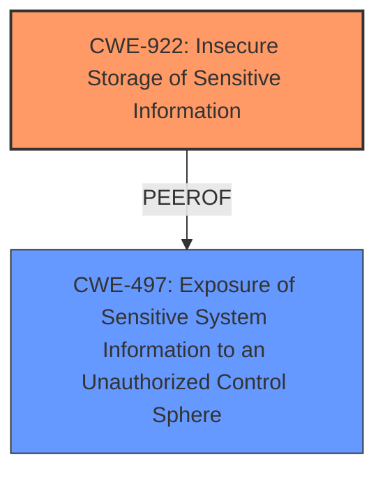

# Enhanced Analysis for CVE-2024-40863

# Summary
| CWE ID | CWE Name | Confidence | CWE Abstraction Level | CWE Vulnerability Mapping Label | CWE-Vulnerability Mapping Notes |
|---|---|---|---|---|---|
| CWE-922 | Insecure Storage of Sensitive Information | 0.7 | Class | Allowed-with-Review | Primary CWE |
| CWE-497 | Exposure of Sensitive System Information to an Unauthorized Control Sphere | 0.5 | Base | Allowed | Secondary Candidate |

## Evidence and Confidence

*   **Confidence Score:** 0.7
*   **Evidence Strength:** MEDIUM

## Relationship Analysis
The primary CWE is CWE-922, which is a Class-level CWE. While it would be preferable to have a more specific Base or Variant CWE, there isn't enough information to determine a more specific child. CWE-497 is a possible related issue, where system information is exposed.



## Vulnerability Chain
The application has a **sandbox issue**, which leads to **insecure storage of sensitive information**, and that leads to **leak sensitive user information** and an attacker gaining access to sensitive user data.

## Summary of Analysis
The vulnerability description indicates that an app is able to **leak sensitive user information** due to a **sandbox issue**. The CVE Reference Links Content Summary confirms that a **weakness/vulnerability present** allows an app to potentially leak sensitive user information, with the **impact of exploitation** being an attacker gaining access to sensitive user data.

Based on this information, the most appropriate CWE is CWE-922 [CWE-922: Insecure Storage of Sensitive Information]. This is because the vulnerability allows an app to leak sensitive user information, indicating that the information is not being stored securely.

The retriever results also suggest CWE-497 [CWE-497: Exposure of Sensitive System Information to an Unauthorized Control Sphere]. This CWE is related, as it involves the exposure of sensitive system-level information to unauthorized actors. While CWE-922 [CWE-922: Insecure Storage of Sensitive Information] is the primary issue, CWE-497 [CWE-497: Exposure of Sensitive System Information to an Unauthorized Control Sphere] could be a secondary contributing factor.

CWE-285 [CWE-285: Improper Authorization] was considered since it's related to security vulnerabilities, but it's not directly applicable here as the issue is related to data storage rather than authorization. Similarly, CWE-787 [CWE-787: Out-of-bounds Write], CWE-665 [CWE-665: Improper Initialization], CWE-843 [CWE-843: Access of Resource Using Incompatible Type ('Type Confusion')], CWE-20 [CWE-20: Improper Input Validation], CWE-415 [CWE-415: Double Free], and CWE-757 [CWE-757: Selection of Less-Secure Algorithm During Negotiation ('Algorithm Downgrade')] are less relevant because they focus on memory corruption, input validation, and algorithm negotiation, which are not the primary issues described in the vulnerability.

The selection of CWE-922 [CWE-922: Insecure Storage of Sensitive Information] is at the optimal level of specificity because the vulnerability description specifically mentions the leakage of sensitive user information, indicating that the information is not being stored securely. While a more specific child CWE of CWE-922 [CWE-922: Insecure Storage of Sensitive Information] might exist, there is not enough information provided to determine which one would be the most appropriate.


## CWE Relationship Analysis

Current CWEs represent these abstraction levels: .


### Vulnerability Chain Analysis

**Chain starting from CWE-757:**
- 757 (Selection of Less-Secure Algorithm During Negotiation ('Algorithm Downgrade')) - ROOT


**Chain starting from CWE-415:**
- 415 (Double Free) - ROOT


### CWE Relationship Diagram

```mermaid
graph TD
    classDef primary fill:#f96,stroke:#333,stroke-width:2px
    classDef secondary fill:#69f,stroke:#333
    classDef tertiary fill:#9e9,stroke:#333
```