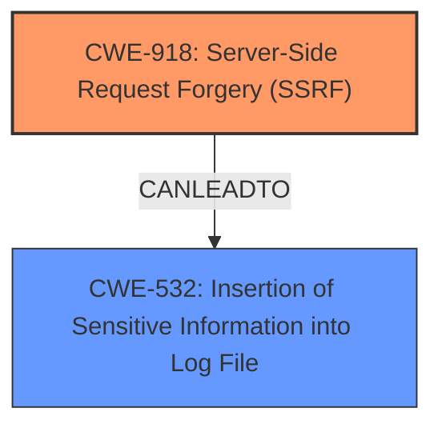

# Analysis for CVE-2024-40898

# Summary
| CWE ID | CWE Name | Confidence | CWE Abstraction Level | CWE Vulnerability Mapping Label | CWE-Vulnerability Mapping Notes |
|---|---|---|---|---|---|
| CWE-918 | Server-Side Request Forgery (SSRF) | 1.0 | Base | Primary | Allowed |
| CWE-532 | Insertion of Sensitive Information into Log File | 0.7 | Base | Secondary | Allowed |

## Evidence and Confidence

*   **Confidence Score:** 0.9
*   **Evidence Strength:** HIGH

## Relationship Analysis
The primary relationship identified is that of CWE-918 as the root cause, leading to potential information disclosure. CWE-532 (Insertion of Sensitive Information into Log File) is related to the impact of leaking NTLM hashes. The abstraction levels are appropriate, with CWE-918 at the Base level, and CWE-532 at the Base Level.

## Vulnerability Chain
The vulnerability chain starts with the **SSRF** (CWE-918), which allows for the potential leakage of NTLM hashes. This leaked information (NTLM hashes) can be considered sensitive information. If this information were logged, it would result in CWE-532. The **root cause** is the **SSRF**, leading to potential sensitive information leakage.
  - **Root Cause:** CWE-918: Server-Side Request Forgery (SSRF)
  - **Impact:** CWE-532: Insertion of Sensitive Information into Log File (potential, if the hashes are logged)

## Summary of Analysis
The analysis is primarily based on the vulnerability description and the CVE Reference Links Content Summary, both of which clearly indicate a Server-Side Request Forgery (**SSRF**) vulnerability (CWE-918). The description states "**SSRF** in Apache HTTP Server on Windows with mod_rewrite in server/vhost context, allows to potentially leak NTML hashes to a malicious server via **SSRF** and malicious requests." The summary also confirms "The core vulnerability is an SSRF."

The choice of CWE-918 is supported by the retriever results, which gives it a score of 1.0. Also "This CWE entry is at the Base level of abstraction, which is a preferred level of abstraction for mapping to the root causes of vulnerabilities."

CWE-532 is included as a secondary concern, as the NTLM hashes, if leaked, might be logged, leading to sensitive information exposure. "The **SSRF** can be exploited to potentially leak NTLM hashes."

The selected CWEs are at the optimal level of specificity, representing the root cause and a potential impact of the vulnerability.

Relevant CWE Information:

# Enhanced Context (25 CWEs)
The following CWEs were identified as potentially relevant to this vulnerability:

## CWE-918: Server-Side Request Forgery (SSRF)
**Abstraction Level**: Base
**Similarity Score**: 0.78
**Source**: dense

**Description**:
The web server receives a URL or similar request from an upstream component and retrieves the contents of this URL, but it does not sufficiently ensure that the request is being sent to the expected destination.

**Mapping Guidance**:
- Usage: Allowed
- Rationale: This CWE entry is at the Base level of abstraction, which is a preferred level of abstraction for mapping to the root causes of vulnerabilities.

**Technical Explanation for CWE-918:**

The vulnerability description clearly points to a **SSRF** issue. The Apache HTTP Server, when running on Windows with `mod_rewrite`, can be induced to make requests to arbitrary servers. This aligns directly with the description of CWE-918: "The web server receives a URL or similar request from an upstream component and retrieves the contents of this URL, but it does not sufficiently ensure that the request is being sent to the expected destination."

*   **How the vulnerability's details match the CWE's characteristics:** The `mod_rewrite` component allows for manipulating the request destination, and the server fails to validate this destination properly.
*   **The security implications and potential impact:** An attacker can redirect the server's requests to internal or external resources, potentially leaking sensitive information like NTLM hashes.
*   **Any parent-child relationships or chain patterns that influenced your mapping:** N/A
*   **Whether the weakness is primary or secondary in the vulnerability:** Primary
*   **How the official MITRE mapping guidance influenced your decision:** The mapping guidance states that CWE-918 is at the Base level of abstraction and is allowed for mapping.

**Technical Explanation for CWE-532:**

The vulnerability allows for the potential leakage of NTLM hashes. If the application logs these hashes, this would constitute the insertion of sensitive information into a log file. While not directly confirmed in the description, it is a likely consequence.

*   **How the vulnerability's details match the CWE's characteristics:** The leakage of NTLM hashes due to **SSRF** could result in their inclusion in logs.
*   **The security implications and potential impact:** Exposure of sensitive data (NTLM hashes) in logs, which could be accessed by unauthorized parties.
*   **Any parent-child relationships or chain patterns that influenced your mapping:** This is a secondary impact stemming from the primary **SSRF** vulnerability.
*   **Whether the weakness is primary or secondary in the vulnerability:** Secondary
*   **How the official MITRE mapping guidance influenced your decision:** The mapping guidance states that CWE-532 is at the Base level of abstraction and is allowed for mapping.

**CWEs Considered but Not Used:**

*   CWE-611 (Improper Restriction of XML External Entity Reference): While present in the retriever results, the vulnerability does not involve XML or external entities.
*   CWE-113 (Improper Neutralization of CRLF Sequences in HTTP Headers ('HTTP Request/Response Splitting')): This CWE relates to CRLF injection, which isn't the primary issue here. The core problem is the SSRF, not header manipulation.
*   CWE-22 (Improper Limitation of a Pathname to a Restricted Directory ('Path Traversal')): This CWE relates to path traversal, which is not related to the vulnerability.