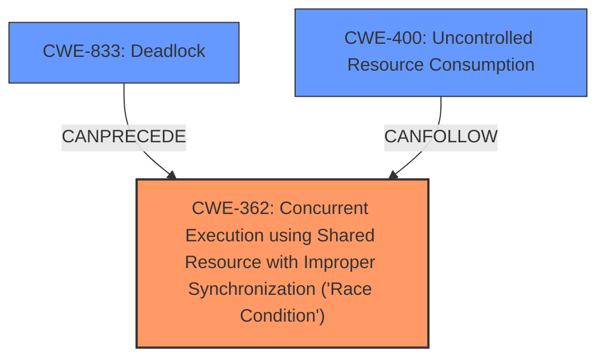

# Raw Analyzer Response for CVE-2024-40935

# Summary
| CWE ID | CWE Name | Confidence | CWE Abstraction Level | CWE Vulnerability Mapping Label | CWE-Vulnerability Mapping Notes |
|---|---|---|---|---|---|
| CWE-362 | Concurrent Execution using Shared Resource with Improper Synchronization ('Race Condition') | 0.8 | Class | Primary | Allowed-with-Review |
| CWE-833 | Deadlock | 0.7 | Base | Secondary | Allowed |
| CWE-400 | Uncontrolled Resource Consumption | 0.6 | Class | Secondary | Discouraged |

## Evidence and Confidence

*   **Confidence Score:** 0.7
*   **Evidence Strength:** MEDIUM

## Relationship Analysis
The primary relationship that influenced the CWE selection was the parent-child relationship between CWE-362 and its base variants. While the vulnerability description indicates a **race condition** leading to a potential deadlock, the information isn't granular enough to pinpoint a specific type of **race condition**. Therefore, the higher-level class CWE-362 is selected. CWE-833, Deadlock, is selected as a secondary issue. The final impact is a denial of service, which can be represented by CWE-400.

## Vulnerability Chain
The vulnerability chain starts with a **race condition** (CWE-362) when the cache is marked as DEAD during an open request. This leads to a hung task/deadlock (CWE-833) because the kernel process is waiting for a copen. The irreversible DEAD state, combined with the hung task, results in a denial of service (CWE-400).

## Summary of Analysis
The initial assessment focused on identifying the root cause and resulting impact based on the provided description. The **weakness** is described as a **race condition**, resulting in a deadlock and ultimately a denial of service.

The selection of CWE-362 is based on the description of concurrent execution and improper synchronization leading to a **race condition**. While more specific variants of CWE-362 exist, the evidence does not point to a specific TOCTOU or other variant. CWE-833 is selected because the **race condition** leads to a deadlock. Finally, CWE-400 is selected due to the denial-of-service impact.

The evidence for the **race condition** (CWE-362) comes from the "Vulnerability Description Key Phrases" which lists "**weakness:** **race condition**". Further evidence is extracted from the "CVE Reference Links Content Summary": "While not explicitly stated, a **race condition** may exist where an I/O error occurs at a specific time during daemon operation that results in the deadlock.".

The relatively high retriever scores for CWE-362 and CWE-833 support these selections. The abstraction levels of Class and Base are appropriate given the available information. The mapping guidance allows for CWE-362 with review, and CWE-833 is allowed.

Other CWEs considered but not selected:

*   CWE-667: Improper Locking - While locking issues are often related to race conditions, the description doesn't explicitly mention improper locking mechanisms.
*   CWE-367: Time-of-check Time-of-use (TOCTOU) Race Condition - This is a specific type of race condition, but the description doesn't provide enough detail to confirm a TOCTOU scenario.
*   CWE-787: Out-of-bounds Write - The description focuses on synchronization and resource management, not memory corruption.
*   CWE-476: NULL Pointer Dereference - No evidence of a NULL pointer dereference is provided.

The final selection provides a clear mapping of the vulnerability, from the initial **race condition** to the resulting denial of service.

Relevant CWE Information:

# Enhanced Context (25 CWEs)
The following CWEs were identified as potentially relevant to this vulnerability:

## CWE-667: Improper Locking
**Abstraction Level**: Class
**Similarity Score**: 0.73
**Source**: dense

**Description**:
The product does not properly acquire or release a lock on a resource, leading to unexpected resource state changes and behaviors.

**Mapping Guidance**:
- Usage: Allowed-with-Review
- Rationale: This CWE entry is a Class and might have Base-level children that would be more appropriate

## CWE-833: Deadlock
**Abstraction Level**: Base
**Similarity Score**: 0.72
**Source**: dense

**Description**:
The product contains multiple threads or executable segments that are waiting for each other to release a necessary lock, resulting in deadlock.

**Mapping Guidance**:
- Usage: Allowed
- Rationale: This CWE entry is at the Base level of abstraction, which is a preferred level of abstraction for mapping to the root causes of vulnerabilities.

## CWE-404: Improper Resource Shutdown or Release
**Abstraction Level**: Class
**Similarity Score**: 0.72
**Source**: dense

**Description**:
The product does not release or incorrectly releases a resource before it is made available for re-use.

**Mapping Guidance**:
- Usage: Allowed-with-Review
- Rationale: This CWE entry is a Class and might have Base-level children that would be more appropriate

## CWE-362: Concurrent Execution using Shared Resource with Improper Synchronization ('Race Condition')
**Abstraction Level**: Class
**Similarity Score**: 0.71
**Source**: dense

**Description**:
The product contains a concurrent code sequence that requires temporary, exclusive access to a shared resource, but a timing window exists in which the shared resource can be modified by another code sequence operating concurrently.

**Mapping Guidance**:
- Usage: Allowed-with-Review
- Rationale: This CWE entry is a Class and might have Base-level children that would be more appropriate

## CWE-367: Time-of-check Time-of-use (TOCTOU) Race Condition
**Abstraction Level**: Base
**Similarity Score**: 0.71
**Source**: dense

**Description**:
The product checks the state of a resource before using that resource, but the resource's state can change between the check and the use in a way that invalidates the results of the check. This can cause the product to perform invalid actions when the resource is in an unexpected state.

**Mapping Guidance**:
- Usage: Allowed
- Rationale: This CWE entry is at the Base level of abstraction, which is a preferred level of abstraction for mapping to the root causes of vulnerabilities.

## CWE-366: Race Condition within a Thread
**Abstraction Level**: Base
**Similarity Score**: 0.71
**Source**: dense

**Description**:
If two threads of execution use a resource simultaneously, there exists the possibility that resources may be used while invalid, in turn making the state of execution undefined.

**Mapping Guidance**:
- Usage: Allowed
- Rationale: This CWE entry is at the Base level of abstraction, which is a preferred level of abstraction for mapping to the root causes of vulnerabilities.

## CWE-617: Reachable Assertion
**Abstraction Level**: Base
**Similarity Score**: 0.71
**Source**: dense

**Description**:
The product contains an assert() or similar statement that can be triggered by an attacker, which leads to an application exit or other behavior that is more severe than necessary.

**Mapping Guidance**:
- Usage: Allowed
- Rationale: This CWE entry is at the Base level of abstraction, which is a preferred level of abstraction for mapping to the root causes of vulnerabilities.

## CWE-789: Memory Allocation with Excessive Size Value
**Abstraction Level**: Variant
**Similarity Score**: 0.70
**Source**: dense

**Description**:
The product allocates memory based on an untrusted, large size value, but it does not ensure that the size is within expected limits, allowing arbitrary amounts of memory to be allocated.

**Mapping Guidance**:
- Usage: Allowed
- Rationale: This CWE entry is at the Variant level of abstraction, which is a preferred level of abstraction for mapping to the root causes of vulnerabilities.

## CWE-41: Improper Resolution of Path Equivalence
**Abstraction Level**: Base
**Similarity Score**: 0.70
**Source**: dense

**Description**:
The product is vulnerable to file system contents disclosure through path equivalence. Path equivalence involves the use of special characters in file and directory names. The associated manipulations are intended to generate multiple names for the same object.

**Mapping Guidance**:
- Usage: Allowed
- Rationale: This CWE entry is at the Base level of abstraction, which is a preferred level of abstraction for mapping