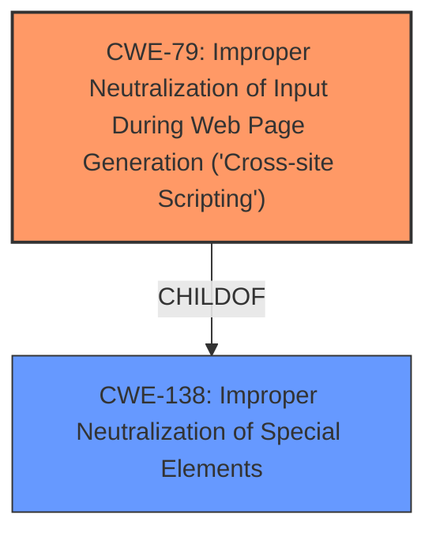

# Enhanced Analysis for CVE-2024-4095

# Summary
| CWE ID | CWE Name | Confidence | CWE Abstraction Level | CWE Vulnerability Mapping Label | CWE-Vulnerability Mapping Notes |
|---|---|---|---|---|---|
| CWE-79 | Improper Neutralization of Input During Web Page Generation ('Cross-site Scripting') | 1.0 | Base | Allowed | Primary CWE: The root cause is **insufficient input sanitization and output escaping**, leading to XSS. |

## Evidence and Confidence

*   **Confidence Score:** 1.0
*   **Evidence Strength:** HIGH

## Relationship Analysis
The primary relationship that influenced the CWE selection is the parent-child relationship between CWE-138 (Improper Neutralization of Special Elements) and CWE-79 (Improper Neutralization of Input During Web Page Generation). While CWE-138 is a broader class, CWE-79 is a more specific base class that directly addresses the context of web page generation, making it a more fitting choice. There is no evidence to indicate that a variant of CWE-79 is needed.



## Vulnerability Chain
The vulnerability chain starts with **insufficient input sanitization and output escaping** (CWE-79), which allows attackers to inject arbitrary web scripts. The chain is direct:

1.  **Insufficient Sanitization/Escaping (CWE-79)**: The plugin fails to properly sanitize user-supplied attributes in shortcodes.
2.  **XSS Payload Injection**: An attacker injects malicious JavaScript code into these attributes.
3.  **Arbitrary Script Execution**: When a user views the page, the injected script executes in their browser, leading to potential account takeover, malware distribution, or website defacement.

## Summary of Analysis
The analysis is based on the provided vulnerability description and the CVE reference summary, both of which clearly indicate **insufficient input sanitization and output escaping** as the root cause of the stored XSS vulnerability.

The evidence is strong: "**insufficient input sanitization and output escaping on user supplied attributes**" directly points to a neutralization issue, which is characteristic of XSS vulnerabilities. The CVE reference summary reinforces this, stating: "The root cause is **insufficient input sanitization and output escaping** of user-supplied attributes within the plugin's `expand` and `expandsub` shortcodes."

CWE-79 (Improper Neutralization of Input During Web Page Generation) is selected because it precisely describes the vulnerability: the plugin does not properly neutralize user-controllable input before placing it in a web page, allowing for XSS.

The other CWEs considered but not selected are:

*   CWE-116 (Improper Encoding or Escaping of Output): This is a class-level CWE, and while relevant, CWE-79 is more specific to XSS.
*   CWE-352 (Cross-Site Request Forgery (CSRF)): This vulnerability is not related to CSRF.
*   CWE-138 (Improper Neutralization of Special Elements): This is a class-level CWE and too general. CWE-79, being a base CWE, is more specific.
*   CWE-96 (Improper Neutralization of Directives in Statically Saved Code ('Static Code Injection')): While there is code injection, the context is web page generation, making XSS a more accurate classification.

The selection of CWE-79 is at the optimal level of specificity because it directly addresses the root cause and the context of the vulnerability.


## CWE Relationship Analysis

Current CWEs represent these abstraction levels: .


### Vulnerability Chain Analysis

**Chain starting from CWE-116:**
- 116 (Improper Encoding or Escaping of Output) - ROOT


**Chain starting from CWE-79:**
- 79 (Improper Neutralization of Input During Web Page Generation ('Cross-site Scripting')) - ROOT


### CWE Relationship Diagram

```mermaid
graph TD
    classDef primary fill:#f96,stroke:#333,stroke-width:2px
    classDef secondary fill:#69f,stroke:#333
    classDef tertiary fill:#9e9,stroke:#333
```