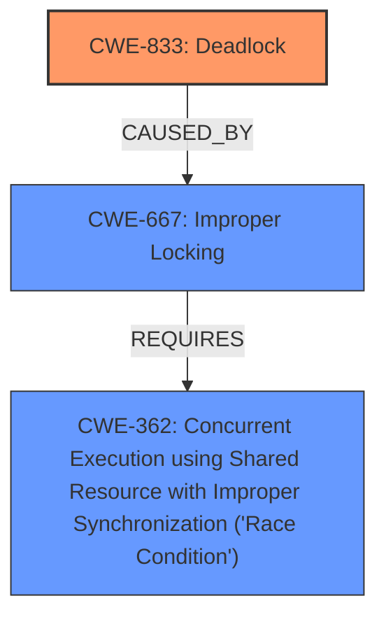

# Analysis for CVE-2024-40965

# Summary

| CWE ID | CWE Name | Confidence | CWE Abstraction Level | CWE Vulnerability Mapping Label | CWE-Vulnerability Mapping Notes |
|---|---|---|---|---|---|
| CWE-833 | Deadlock | 1.0 | Base | Primary | Allowed |
| CWE-667 | Improper Locking | 0.8 | Class | Secondary Candidate | Allowed-with-Review |
| CWE-362 | Concurrent Execution using Shared Resource with Improper Synchronization ('Race Condition') | 0.7 | Class | Secondary Candidate | Allowed-with-Review |

## Evidence and Confidence

*   **Confidence Score:** 0.9
*   **Evidence Strength:** HIGH

## Relationship Analysis

The primary weakness is a **deadlock** (CWE-833). This can result from **improper locking** (CWE-667) in a concurrent environment, which is a **race condition** (CWE-362). Thus, CWE-833 is the most specific root cause, while CWE-667 and CWE-362 represent contributing factors or preconditions.

## Vulnerability Chain

The vulnerability chain starts with concurrent execution and the need for exclusive access to shared resources. **Improper locking** leads to a **race condition**, ultimately resulting in a **deadlock**.

1.  Concurrent Execution using Shared Resources
2.  **Improper Locking** (CWE-667)
3.  **Race Condition** (CWE-362)
4.  **Deadlock** (CWE-833)

## Summary of Analysis

The primary weakness is the **deadlock**, which occurs due to **improper locking** when accessing the I2C bus and clock rate concurrently. The vulnerability description and CVE reference links clearly point to this scenario. The evidence strongly supports CWE-833 as the primary CWE, with CWE-667 and CWE-362 as contributing factors.

The selection of CWE-833 is at the optimal level of specificity because it accurately represents the root cause of the vulnerability, as stated in the vulnerability description: "A **deadlock** has been observed while adding tlv320aic32x4 audio codec to the system."

Relevant CWE Information:

# Enhanced Context (25 CWEs)

## CWE-833: Deadlock
**Abstraction Level**: Base
**Similarity Score**: 0.78
**Source**: dense

**Description**:
The product contains multiple threads or executable segments that are waiting for each other to release a necessary lock, resulting in deadlock.

**Mapping Guidance**:
- Usage: Allowed
- Rationale: This CWE entry is at the Base level of abstraction, which is a preferred level of abstraction for mapping to the root causes of vulnerabilities.

## CWE-667: Improper Locking
**Abstraction Level**: Class
**Similarity Score**: 0.77
**Source**: dense

**Description**:
The product does not properly acquire or release a lock on a resource, leading to unexpected resource state changes and behaviors.

**Mapping Guidance**:
- Usage: Allowed-with-Review
- Rationale: This CWE entry is a Class and might have Base-level children that would be more appropriate

## CWE-362: Concurrent Execution using Shared Resource with Improper Synchronization ('Race Condition')
**Abstraction Level**: Class
**Similarity Score**: 0.73
**Source**: dense

**Description**:
The product contains a concurrent code sequence that requires temporary, exclusive access to a shared resource, but a timing window exists in which the shared resource can be modified by another code sequence operating concurrently.

**Mapping Guidance**:
- Usage: Allowed-with-Review
- Rationale: This CWE entry is a Class and might have Base-level children that would be more appropriate

## CWE-413: Improper Resource Locking
**Abstraction Level**: Base
**Similarity Score**: 0.73
**Source**: dense

**Description**:
The product does not lock or does not correctly lock a resource when the product must have exclusive access to the resource.

**Mapping Guidance**:
- Usage: Allowed
- Rationale: This CWE entry is at the Base level of abstraction, which is a preferred level of abstraction for mapping to the root causes of vulnerabilities.

## CWE-120: Buffer Copy without Checking Size of Input ('Classic Buffer Overflow')
**Abstraction Level**: base
**Similarity Score**: 2.21
**Source**: graph

**Description**:
CWE-120: Buffer Copy without Checking Size of Input ('Classic Buffer Overflow')

**Mapping Guidance**:
- Usage: Allowed-with-Review
- Rationale: There are some indications that this CWE ID might be misused and selected simply because it mentions "buffer overflow" - an increasingly vague term. This CWE entry is only appropriate for "Buffer Copy" operations (not buffer reads), in which where there is no "Checking [the] Size of Input", and (by implication of the copy) writing past the end of the buffer.

**Relationships**:
- PARENTOF -> CWE-785
- CANFOLLOW -> CWE-456
- CANFOLLOW -> CWE-416
- CANFOLLOW -> CWE-231
- CANFOLLOW -> CWE-170

I considered CWE-120, but it is not relevant because the vulnerability is not related to a buffer overflow, but rather a **deadlock** scenario. I also considered CWE-413, but it is less specific than CWE-833, as the issue isn't just about resource locking, but the specific situation that causes a **deadlock**.