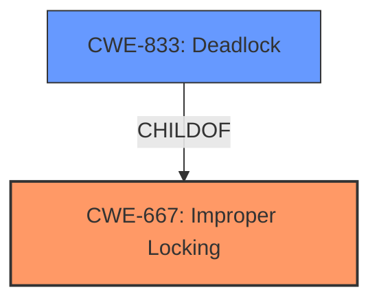

# Enhanced Analysis for CVE-2024-40972

# Summary
| CWE ID  | CWE Name | Confidence | CWE Abstraction Level | CWE Vulnerability Mapping Label | CWE-Vulnerability Mapping Notes |
|----------------|-----------------------------------------------------------------------------------------------------------|----------------|-------------------------|-----------------------------------|---------------------------------------------------|
| CWE-667 | Improper Locking | 0.9 | Class | Primary | Allowed-with-Review |
| CWE-833 | Deadlock | 0.8 | Base | Secondary | Allowed |

## Evidence and Confidence

*   **Confidence Score:** 0.85
*   **Evidence Strength:** HIGH

## Relationship Analysis
The primary relationship influencing the decision is the parent-child relationship between CWE-667 (Improper Locking) and CWE-833 (Deadlock). CWE-833 is a specific type of CWE-667 where the improper locking leads to a deadlock. The vulnerability description directly mentions the occurrence of a deadlock due to improper locking mechanisms in the ext4 filesystem. Although a Base CWE is preferred, the description explicitly mentions "improper locking" which is the class, and "deadlock" which is the base. The allocation of EA inodes while holding a buffer lock is the root cause that leads to the deadlock condition.



## Vulnerability Chain
The vulnerability chain starts with **improper locking** (CWE-667) where the `ext4_xattr_set_entry()` function creates new EA inodes while holding a buffer lock. This leads to nested locking and, under specific conditions like filesystem corruption, results in a **deadlock** (CWE-833), causing a denial of service.

## Summary of Analysis
The primary CWE is CWE-667 Improper Locking, because the vulnerability description and CVE reference summary explicitly state that the issue is due to creating EA inodes while holding a buffer lock, leading to nested locking and a high risk of deadlock. This is further supported by the key phrase "improper locking" in the Vulnerability Description Key Phrases section.

The secondary CWE is CWE-833 Deadlock. The vulnerability description mentions that the improper locking can lead to a deadlock, especially when the filesystem is corrupted. The CVE reference summary also confirms this, stating that the nested locking creates a deadlock scenario.

The selection is based on the provided evidence, focusing on the root cause (improper locking) and its direct consequence (deadlock). The graph relationships show that deadlock is a specific type of improper locking.

The selected CWEs are at an appropriate level of specificity. While CWE-667 is a Class, it accurately represents the general issue of improper locking. CWE-833 is a Base CWE which accurately describes the deadlock condition.

Relevant CWE Information:
*   **CWE-667 Improper Locking**:  The product does not properly acquire or release a lock on a resource, leading to unexpected resource state changes and behaviors.
*   **CWE-833 Deadlock**: The product contains multiple threads or executable segments that are waiting for each other to release a necessary lock, resulting in deadlock.
*   Vulnerability Description: "...ext4_xattr_set_entry() creates new EA inodes while holding buffer lock..."
*   Vulnerability Description Key Phrases: "**weakness:** **improper locking**", "**impact:** deadlock"
*   CVE Reference Links Content Summary: "The vulnerability lies in the `ext4_xattr_set_entry()` function within the Linux kernel's ext4 filesystem driver. This function was creating new extended attribute (EA) inodes while holding a buffer lock on the external xattr block. This nested locking of buffer locks with allocation locks creates potential for deadlocks."

Other CWEs Considered:

*   CWE-413 Improper Resource Locking: This was considered, but CWE-667 is a more general class that better encompasses the issue.
*   CWE-362 Concurrent Execution using Shared Resource with Improper Synchronization ('Race Condition'): This was considered, but the description mentions a deadlock, which is more specific than a race condition.
*   CWE-770 Allocation of Resources Without Limits or Throttling: This was considered because the allocation of resources is mentioned, but the primary issue is the improper locking, not the allocation itself.


## CWE Relationship Analysis

Current CWEs represent these abstraction levels: .


### Vulnerability Chain Analysis

**Chain starting from CWE-770:**
- 770 (Allocation of Resources Without Limits or Throttling) - ROOT


**Chain starting from CWE-667:**
- 667 (Improper Locking) - ROOT


### CWE Relationship Diagram

```mermaid
graph TD
    classDef primary fill:#f96,stroke:#333,stroke-width:2px
    classDef secondary fill:#69f,stroke:#333
    classDef tertiary fill:#9e9,stroke:#333
```