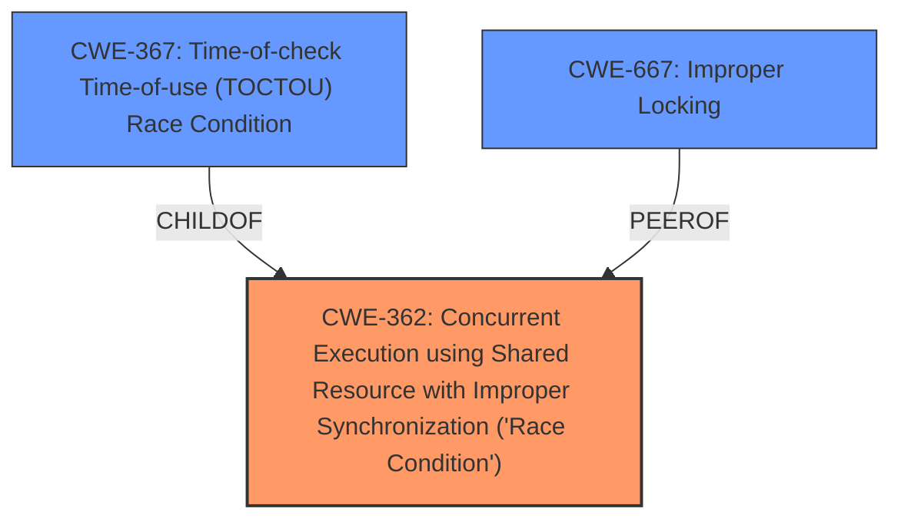

# Analysis Report for CVE-2024-40976

# Vulnerability Analysis Report: CVE-2024-40976

## Description

In the Linux kernel, the following vulnerability has been resolved drm/lima mask irqs in timeout path before hard reset There is a **race condition** in which a rendering job might take just long enough to trigger the drm sched job timeout handler but also still complete before the hard reset is done by the timeout handler. This runs into **race condition**s not expected by the timeout handler. In some very specific cases it currently may result in a refcount imbalance on lima_pm_idle, with a stack dump such as [10136.669170] WARNING CPU 0 PID 0 at drivers/gpu/drm/lima/lima_devfreq.c205 lima_devfreq_record_idle+0xa0/0xb0 ... [10136.669459] pc lima_devfreq_record_idle+0xa0/0xb0 ... [10136.669628] Call trace [10136.669634] lima_devfreq_record_idle+0xa0/0xb0 [10136.669646] lima_sched_pipe_task_done+0x5c/0xb0 [10136.669656] lima_gp_irq_handler+0xa8/0x120 [10136.669666] __handle_irq_event_percpu+0x48/0x160 [10136.669679] handle_irq_event+0x4c/0xc0 We can prevent that **race condition** entirely by masking the irqs at the beginning of the timeout handler, at which point we give up on waiting for that job entirely. The irqs will be enabled again at the next hard reset which is already done as a recovery by the timeout handler.

## Vulnerability Description Key Phrases

- **Rootcause:** race condition
- **Impact:** refcount imbalance
- **Product:** Linux kernel
- **Component:** drm/lima mask irqs in timeout path before hard reset

## Analysis (with Relationship Data)

# Summary
| CWE ID  | CWE Name  | Confidence | CWE Abstraction Level | CWE Vulnerability Mapping Label | CWE-Vulnerability Mapping Notes |
|---|---|---|---|---|---|
| CWE-362 | Concurrent Execution using Shared Resource with Improper Synchronization ('**Race Condition**') | 1.0 | Class | Allowed-with-Review | Primary CWE. The vulnerability is due to a **race condition** in the Lima DRM driver's scheduler. |
| CWE-667 | Improper Locking | 0.7 | Class | Allowed-with-Review | Secondary Candidate.  While the fix involves masking interrupts, the underlying issue is the lack of proper synchronization which could involve locking. |
| CWE-367 | Time-of-check Time-of-use (TOCTOU) **Race Condition** | 0.6 | Base | Allowed | Secondary Candidate. A TOCTOU race condition could be present, but the information isn't sufficient to confirm. |

## Evidence and Confidence

*   **Confidence Score:** 0.8
*   **Evidence Strength:** MEDIUM

## Relationship Analysis
The primary CWE is CWE-362, which is a Class-level CWE. Several related CWEs were considered, including CWE-367, CWE-364, and CWE-667. CWE-367 (Time-of-check Time-of-use) is a Base CWE and a child of CWE-362, but the description doesn't provide sufficient detail to confirm that a TOCTOU condition exists, so CWE-362 is the more appropriate choice. CWE-667 (Improper Locking) is also a Class-level CWE that could be related, as the root cause might stem from improper locking mechanisms.



## Vulnerability Chain
The vulnerability chain starts with concurrent execution without proper synchronization, leading to a **race condition**. This can then lead to a refcount imbalance, and ultimately a system crash/denial of service.

Concurrent Execution (CWE-362) -> **Race Condition** -> Refcount Imbalance -> Denial of Service.

## Summary of Analysis
The initial analysis identified a **race condition** in the Linux kernel's DRM lima driver, specifically when a rendering job completes concurrently with the timeout handler's actions. The primary CWE selected is CWE-362 (Concurrent Execution using Shared Resource with Improper Synchronization ('**Race Condition**')), because the vulnerability description mentions a **race condition** directly, and the fix involves masking IRQs to prevent the **race condition**.

The evidence supporting CWE-362 comes from the following:
- "There is a **race condition** in which a rendering job might take just long enough to trigger the drm sched job timeout handler but also still complete before the hard reset is done by the timeout handler. This runs into **race condition**s not expected by the timeout handler."
- "We can prevent that **race condition** entirely by masking the irqs at the beginning of the timeout handler, at which point we give up on waiting for that job entirely."

The other CWEs were considered as follows:
- CWE-367 (Time-of-check Time-of-use (TOCTOU) **Race Condition**): While a TOCTOU **race condition** is possible, the provided details do not explicitly confirm it. Therefore, a more general CWE is more appropriate.
- CWE-667 (Improper Locking): While masking IRQs is a potential fix, the problem stems from concurrent execution with shared resources, making CWE-362 a better fit.

The selection of CWE-362 is at the Class level because more specific information regarding the type of **race condition** is lacking. If there was a TOCTOU condition, then CWE-367 would be preferred.

Relevant CWE Information:
# Enhanced Context (25 CWEs)
The following CWEs were identified as potentially relevant to this vulnerability:

CWE-362: Concurrent Execution using Shared Resource with Improper Synchronization ('**Race Condition**')
**Technical Explanation**: The product contains a concurrent code sequence that requires temporary, exclusive access to a shared resource, but a timing window exists in which the shared resource can be modified by another code sequence operating concurrently.
**Security Implications**: This can lead to data corruption, system instability, or denial of service. In this case, the **race condition** leads to a refcount imbalance and stack dump.
**Relationship**: CWE-362 is a Class-level CWE.
**Mapping Guidance Influence**: The Mapping Guidance suggests using Base-level children where possible, but in this case, the description doesn't provide sufficient information for a more specific CWE.
**Usage**: Allowed-with-Review

CWE-667: Improper Locking
**Technical Explanation**: The product does not properly acquire or release a lock on a resource, leading to unexpected resource state changes and behaviors.
**Security Implications**: Improper locking can lead to **race condition**s, data corruption, and denial of service.
**Relationship**: CWE-609 Double-Checked Locking is a child of CWE-667.
**Mapping Guidance Influence**: The Mapping Guidance suggests using Base-level children where possible.
**Usage**: Allowed-with-Review

CWE-367: Time-of-check Time-of-use (TOCTOU) **Race Condition**
**Technical Explanation**: The product checks the state of a resource before using that resource, but the resource's state can change between the check and the use in a way that invalidates the results of the check.
**Security Implications**: Can cause the product to perform invalid actions when the resource is in an unexpected state.
**Relationship**: CWE-367 is a Base-level CWE and a child of CWE-362.
**Mapping Guidance Influence**: The Mapping Guidance suggests using this CWE if a TOCTOU condition is present.
**Usage**: Allowed


## CWE Relationship Analysis

Current CWEs represent these abstraction levels: .


### Vulnerability Chain Analysis

**Chain starting from CWE-667:**
- 667 (Improper Locking) - ROOT


**Chain starting from CWE-364:**
- 364 (Signal Handler Race Condition) - ROOT


### CWE Relationship Diagram

```mermaid
graph TD
    classDef primary fill:#f96,stroke:#333,stroke-width:2px
    classDef secondary fill:#69f,stroke:#333
    classDef tertiary fill:#9e9,stroke:#333
```


*Report generated on 2025-07-13 12:45:38*
