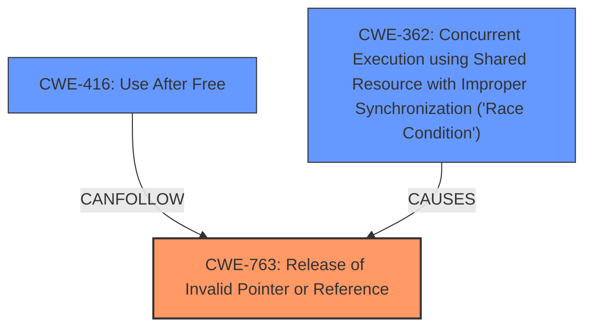

# Analysis Report for CVE-2024-40983

# Vulnerability Analysis Report: CVE-2024-40983

## Description

In the Linux kernel, the following vulnerability has been resolved tipc force a dst refcount before doing decryption As it says in commit 3bc07321ccc2 (xfrm Force a dst refcount before entering the xfrm type handlers) Crypto requests might return asynchronous. In this case we leave the rcu protected region, so force a refcount on the skbs destination entry before we enter the xfrm type input/output handlers. On TIPC decryption path it has the same problem, and skb_dst_force() should be called before doing decryption to avoid a possible crash. Shuang reported this issue when this warning is triggered [] WARNING include/net/dst.h337 tipc_sk_rcv+0x1055/0x1ea0 [tipc] [] Kdump loaded Tainted G W --------- - - 4.18.0-496.el8.x86_64+debug [] Workqueue crypto cryptd_queue_worker [] RIP 0010tipc_sk_rcv+0x1055/0x1ea0 [tipc] [] Call Trace [] tipc_sk_mcast_rcv+0x548/0xea0 [tipc] [] tipc_rcv+0xcf5/0x1060 [tipc] [] tipc_aead_decrypt_done+0x215/0x2e0 [tipc] [] cryptd_aead_crypt+0xdb/0x190 [] cryptd_queue_worker+0xed/0x190 [] process_one_work+0x93d/0x17e0

## Vulnerability Description Key Phrases

- **Impact:** possible crash
- **Product:** Linux kernel
- **Version:** 4.18.0-496.el8.x86_64+debug
- **Component:** TIPC

## Analysis (with Relationship Data)

# Summary
| CWE ID | CWE Name | Confidence | CWE Abstraction Level | CWE Vulnerability Mapping Label | CWE-Vulnerability Mapping Notes |
|---|---|---|---|---|---|
| CWE-763 | Release of Invalid Pointer or Reference | 0.9 | Base | Primary | Allowed |
| CWE-416 | Use After Free | 0.7 | Variant | Secondary | Allowed |
| CWE-362 | Concurrent Execution using Shared Resource with Improper Synchronization ('Race Condition') | 0.5 | Class | Secondary | Allowed-with-Review |

## Evidence and Confidence

*   **Confidence Score:** 0.7
*   **Evidence Strength:** MEDIUM

## Relationship Analysis
The primary weakness is the **release of an invalid pointer or reference** due to missing reference counting, leading to a **use-after-free** condition. The asynchronous nature of the cryptographic operation introduces a potential **race condition**. CWE-763 is a base level CWE which can lead to CWE-416. There may also be an underlying CWE-362 race condition.



## Vulnerability Chain
The vulnerability chain starts with **missing reference counting** on the destination entry of a socket buffer before decryption, which causes the **release of an invalid pointer or reference**. This leads to a **use-after-free** condition when the code later tries to access the freed memory, resulting in a kernel crash. The asynchronous nature of the cryptographic operation may introduce a **race condition** where the memory is freed by one thread while another thread is still using it.

## Summary of Analysis
The analysis is based on the vulnerability description and the provided CVE reference content summary. The root cause is the **missing reference counting**, which results in the release of an invalid pointer, ultimately leading to a use-after-free. The vulnerability description mentions that `skb_dst_force()` should be called before decryption to avoid a possible crash. This strongly suggests that the **missing reference counting** is the primary issue. The asynchronous nature introduces a possible race condition.

*   **CWE-763 Release of Invalid Pointer or Reference:** This CWE accurately describes the core issue of releasing an invalid pointer due to missing reference counting. The evidence from the vulnerability description clearly supports this classification.
*   **CWE-416 Use After Free:** This CWE represents the direct consequence of releasing an invalid pointer. When the code attempts to access the freed memory, a use-after-free condition occurs, leading to a crash.
*   **CWE-362 Concurrent Execution using Shared Resource with Improper Synchronization ('Race Condition'):** The asynchronous nature of cryptographic operations may introduce a race condition. This is a contributing factor, but not the primary root cause.

The selected CWEs are at the optimal level of specificity, representing the root cause, the direct consequence, and a contributing factor.

**CWE Considerations:**

*   **CWE-415 Double Free:** This CWE was considered but rejected because the primary issue is not a double free, but the release of an invalid pointer or reference due to missing reference counting.
*   **CWE-909 Missing Initialization of Resource:** This CWE was considered but rejected because the issue is not the missing initialization of a resource, but the failure to maintain a proper reference count, leading to premature release.
*   **CWE-1284 Improper Validation of Specified Quantity in Input:** This CWE was considered but rejected as it is not related to the vulnerability description.
*   **CWE-911 Improper Update of Reference Count:** This CWE was considered but rejected because while reference count is related it is the release that is the main issue.

# Enhanced Context (25 CWEs)
The following CWEs were identified as potentially relevant to this vulnerability:

## CWE-362: Concurrent Execution using Shared Resource with Improper Synchronization ('Race Condition')
**Abstraction Level**: Class
**Similarity Score**: 0.72
**Source**: dense

**Description**:
The product contains a concurrent code sequence that requires temporary, exclusive access to a shared resource, but a timing window exists in which the shared resource can be modified by another code sequence operating concurrently.

**Mapping Guidance**:
- Usage: Allowed-with-Review
- Rationale: This CWE entry is a Class and might have Base-level children that would be more appropriate


## CWE-667: Improper Locking
**Abstraction Level**: Class
**Similarity Score**: 0.72
**Source**: dense

**Description**:
The product does not properly acquire or release a lock on a resource, leading to unexpected resource state changes and behaviors.

**Mapping Guidance**:
- Usage: Allowed-with-Review
- Rationale: This CWE entry is a Class and might have Base-level children that would be more appropriate


## CWE-755: Improper Handling of Exceptional Conditions
**Abstraction Level**: Class
**Similarity Score**: 0.71
**Source**: dense

**Description**:
The product does not handle or incorrectly handles an exceptional condition.

**Mapping Guidance**:
- Usage: Discouraged
- Rationale: This CWE entry is a level-1 Class (i.e., a child of a Pillar). It might have lower-level children that would be more appropriate


## CWE-125: Out-of-bounds Read
**Abstraction Level**: Base
**Similarity Score**: 0.70
**Source**: dense

**Description**:
The product reads data past the end, or before the beginning, of the intended buffer.

**Mapping Guidance**:
- Usage: Allowed
- Rationale: This CWE entry is at the Base level of abstraction, which is a preferred level of abstraction for mapping to the root causes of vulnerabilities.


## CWE-617: Reachable Assertion
**Abstraction Level**: Base
**Similarity Score**: 0.70
**Source**: dense

**Description**:
The product contains an assert() or similar statement that can be triggered by an attacker, which leads to an application exit or other behavior that is more severe than necessary.

**Mapping Guidance**:
- Usage: Allowed
- Rationale: This CWE entry is at the Base level of abstraction, which is a preferred level of abstraction for mapping to the root causes of vulnerabilities.


## CWE-131: Incorrect Calculation of Buffer Size
**Abstraction Level**: Base
**Similarity Score**: 0.70
**Source**: dense

**Description**:
The product does not correctly calculate the size to be used when allocating a buffer, which could lead to a buffer overflow.

**Mapping Guidance**:
- Usage: Allowed
- Rationale: This CWE entry is at the Base level of abstraction, which is a preferred level of abstraction for mapping to the root causes of vulnerabilities.


## CWE-476: NULL Pointer Dereference
**Abstraction Level**: Base
**Similarity Score**: 0.70
**Source**: dense

**Description**:
The product dereferences a pointer that it expects to be valid but is NULL.

**Mapping Guidance**:
- Usage: Allowed
- Rationale: This CWE entry is at the Base level of abstraction, which is a preferred level of abstraction for mapping to the root causes of vulnerabilities.


## CWE-191: Integer Underflow (Wrap or Wraparound)
**Abstraction Level**: Base
**Similarity Score**: 0.70
**Source**: dense

**Description**:
The product subtracts one value from another, such that the result is less than the minimum allowable integer value, which produces a value that is not equal to the correct result.

**Mapping Guidance**:
- Usage: Allowed
- Rationale: This CWE entry is at the Base level of abstraction, which is a preferred level of abstraction for mapping to the root causes of vulnerabilities.


## CWE-252: Unchecked Return Value
**Abstraction Level**: Base
**Similarity Score**: 0.70
**Source**: dense

**Description**:
The product does not check the return value from a method or function, which can prevent it from detecting unexpected states and conditions.

**Mapping Guidance**:
- Usage: Allowed
- Rationale: This CWE entry is at the Base level of abstraction, which is a preferred level of abstraction for mapping to the root causes of vulnerabilities.


## CWE-1285: Improper Validation of Specified Index, Position, or Offset in Input
**Abstraction Level**: Base
**Similarity Score**: 0.70
**Source**: dense

**Description**:
The product receives input that is expected to specify an index, position, or offset into an indexable resource such as a buffer or file, but it does not validate or incorrectly validates that the specified index/position/offset has the required properties.

**Mapping Guidance**:
- Usage: Allowed
- R


## CWE Relationship Analysis

Current CWEs represent these abstraction levels: .


### Vulnerability Chain Analysis

**Chain starting from CWE-1284:**
- 1284 (Improper Validation of Specified Quantity in Input) - ROOT


**Chain starting from CWE-416:**
- 416 (Use After Free) - ROOT


### CWE Relationship Diagram

```mermaid
graph TD
    classDef primary fill:#f96,stroke:#333,stroke-width:2px
    classDef secondary fill:#69f,stroke:#333
    classDef tertiary fill:#9e9,stroke:#333
```


*Report generated on 2025-07-13 12:46:17*
