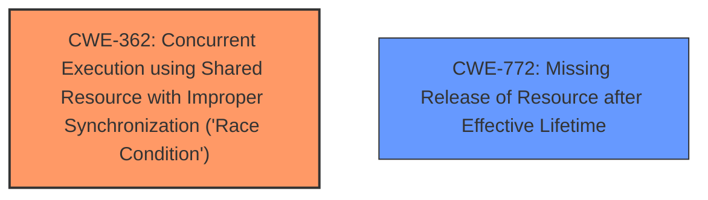

# Analysis Report for CVE-2024-41005

# Vulnerability Analysis Report: CVE-2024-41005

## Description

In the Linux kernel, the following vulnerability has been resolved netpoll Fix **race condition in netpoll_owner_active** KCSAN detected a race condition in netpoll BUG KCSAN data-race in net_rx_action / netpoll_send_skb write (marked) to 0xffff8881164168b0 of 4 bytes by interrupt on cpu 10 net_rx_action (./include/linux/netpoll.h90 net/core/dev.c6712 net/core/dev.c6822) read to 0xffff8881164168b0 of 4 bytes by task 1 on cpu 2 netpoll_send_skb (net/core/netpoll.c319 net/core/netpoll.c345 net/core/netpoll.c393) netpoll_send_udp (net/core/netpoll.c?) value changed 0x0000000a -> 0xffffffff This happens because netpoll_owner_active() needs to check if the current CPU is the owner of the lock, touching napi->poll_owner non atomically. The ->poll_owner field contains the current CPU holding the lock. Use an atomic read to check if the poll owner is the current CPU.

## Vulnerability Description Key Phrases

- **Rootcause:** race condition in netpoll_owner_active
- **Impact:** data-race in net_rx_action/netpoll_send_skb
- **Product:** Linux kernel

## Analysis (with Relationship Data)

# Summary
| CWE ID | CWE Name | Confidence | CWE Abstraction Level | CWE Vulnerability Mapping Label | CWE-Vulnerability Mapping Notes |
|---|---|---|---|---|---|
| CWE-362 | Concurrent Execution using Shared Resource with Improper Synchronization ('Race Condition') | 1.0 | Class | Primary | Allowed-with-Review |
| CWE-772 | Missing Release of Resource after Effective Lifetime | 0.7 | Class | Secondary | Allowed-with-Review |

## Evidence and Confidence

*   **Confidence Score:** 0.9
*   **Evidence Strength:** HIGH

## Relationship Analysis
The primary weakness is a **race condition**, which is best represented by CWE-362. CWE-362 is a Class-level CWE, and while there might be more specific Base-level children, the description fits the general case of concurrent execution with improper synchronization. There are no clear relationships to other CWEs in this specific vulnerability description that would warrant including them in the primary mapping. A secondary CWE of CWE-772 is added because the race condition implies there is a **missing release of the resource** after the lifetime which is noted as a resource leak.



## Vulnerability Chain
The vulnerability chain starts with concurrent access to a shared resource (`napi->poll_owner`) without proper synchronization, which is the **root cause**. This leads to a **data race** where the value of `napi->poll_owner` can be corrupted. The impact of this corruption can be a kernel crash or undefined behavior.

## Summary of Analysis
The analysis is based on the provided vulnerability description and the CVE reference link content summary. The **root cause** is a **race condition** in `netpoll_owner_active()` due to non-atomic access to `napi->poll_owner`. The evidence is clear from the description: "KCSAN detected a **race condition** in netpoll" and "This happens because netpoll_owner_active() needs to check if the current CPU is the owner of the lock, touching napi->poll_owner non atomically." This directly indicates CWE-362. The suggested fix (using `READ_ONCE`) further supports this classification as it enforces atomic access to prevent the **race condition**.

The retriever results also support CWE-362 as the top candidate. While other CWEs like CWE-367 (Time-of-check Time-of-use) and CWE-667 (Improper Locking) were considered, they do not accurately reflect the core issue, which is the lack of synchronization in accessing a shared resource. The race condition also implies that the lock that owned the resource was not released properly, so CWE-772 is added as a secondary.

The selection of CWE-362 is at an appropriate level of specificity. While more specific variants of **race conditions** exist, the provided information does not pinpoint a specific type beyond the general case of concurrent execution with improper synchronization.

Relevant CWE Information:

# Enhanced Context (25 CWEs)
The following CWEs were identified as potentially relevant to this vulnerability:

## CWE-362: Concurrent Execution using Shared Resource with Improper Synchronization ('Race Condition')
**Abstraction Level**: Class
**Similarity Score**: 0.77
**Source**: dense

**Description**:
The product contains a concurrent code sequence that requires temporary, exclusive access to a shared resource, but a timing window exists in which the shared resource can be modified by another code sequence operating concurrently.

**Mapping Guidance**:
- Usage: Allowed-with-Review
- Rationale: This CWE entry is a Class and might have Base-level children that would be more appropriate


## CWE-667: Improper Locking
**Abstraction Level**: Class
**Similarity Score**: 0.77
**Source**: dense

**Description**:
The product does not properly acquire or release a lock on a resource, leading to unexpected resource state changes and behaviors.

**Mapping Guidance**:
- Usage: Allowed-with-Review
- Rationale: This CWE entry is a Class and might have Base-level children that would be more appropriate


## CWE-367: Time-of-check Time-of-use (TOCTOU) Race Condition
**Abstraction Level**: Base
**Similarity Score**: 0.76
**Source**: dense

**Description**:
The product checks the state of a resource before using that resource, but the resource's state can change between the check and the use in a way that invalidates the results of the check. This can cause the product to perform invalid actions when the resource is in an unexpected state.

**Mapping Guidance**:
- Usage: Allowed
- Rationale: This CWE entry is at the Base level of abstraction, which is a preferred level of abstraction for mapping to the root causes of vulnerabilities.


## CWE-366: Race Condition within a Thread
**Abstraction Level**: Base
**Similarity Score**: 0.75
**Source**: dense

**Description**:
If two threads of execution use a resource simultaneously, there exists the possibility that resources may be used while invalid, in turn making the state of execution undefined.

**Mapping Guidance**:
- Usage: Allowed
- Rationale: This CWE entry is at the Base level of abstraction, which is a preferred level of abstraction for mapping to the root causes of vulnerabilities.


## CWE-833: Deadlock
**Abstraction Level**: Base
**Similarity Score**: 0.73
**Source**: dense

**Description**:
The product contains multiple threads or executable segments that are waiting for each other to release a necessary lock, resulting in deadlock.

**Mapping Guidance**:
- Usage: Allowed
- Rationale: This CWE entry is at the Base level of abstraction, which is a preferred level of abstraction for mapping to the root causes of vulnerabilities.


## CWE-755: Improper Handling of Exceptional Conditions
**Abstraction Level**: Class
**Similarity Score**: 0.72
**Source**: dense

**Description**:
The product does not handle or incorrectly handles an exceptional condition.

**Mapping Guidance**:
- Usage: Discouraged
- Rationale: This CWE entry is a level-1 Class (i.e., a child of a Pillar). It might have lower-level children that would be more appropriate


## CWE-754: Improper Check for Unusual or Exceptional Conditions
**Abstraction Level**: Class
**Similarity Score**: 0.71
**Source**: dense

**Description**:
The product does not check or incorrectly checks for unusual or exceptional conditions that are not expected to occur frequently during day to day operation of the product.

**Mapping Guidance**:
- Usage: Allowed-with-Review
- Rationale: This CWE entry is a Class and might have Base-level children that would be more appropriate


## CWE-909: Missing Initialization of Resource
**Abstraction Level**: Class
**Similarity Score**: 0.71
**Source**: dense

**Description**:
The product does not initialize a critical resource.

**Mapping Guidance**:
- Usage: Allowed-with-Review
- Rationale: This CWE entry is a Class and might have Base-level children that would be more appropriate


## CWE-703: Improper Check or Handling of Exceptional Conditions
**Abstraction Level**: Pillar
**Similarity Score**: 0.71
**Source**: dense

**Description**:
The product does not properly anticipate or handle exceptional conditions that rarely occur during normal operation of the product.

**Mapping Guidance**:
- Usage: Discouraged
- Rationale: This CWE entry is extremely high-level, a Pillar.


## CWE-208: Observable Timing Discrepancy
**Abstraction Level**: Base
**Similarity Score**: 0.71
**Source**: dense

**Description**:
Two separate operations in a product require different amounts of time to complete, in a way that is observable to an actor and reveals security-relevant information about the state of the product, such as whether a particular operation was successful or not.

**Mapping Guidance**:
- Usage: Allowed
- Rationale: This CWE entry is at the Base level of abstraction, which is a preferred level of abstraction for mapping to the root causes of vulnerabilities.


## CWE-667: Improper Locking
**Abstraction Level**: Class
**Similarity Score**: 1229.10
**Source**: sparse

**Description**:
The product does not properly acquire or release a lock on a resource, leading to unexpected resource state changes and behaviors.

**Mapping Guidance**:
- Usage: Allowed-with-Review
- Rationale: This CWE entry is a Class and might have Base-level children that would be more appropriate


## CWE-362: Concurrent Execution using Shared Resource with Improper Synchronization ('Race Condition')
**Abstraction Level**: Class
**Similarity Score**: 1220.78
**Source**: sparse

**Description**:
The product contains a concurrent code sequence that requires temporary, exclusive access to a shared resource, but a timing window exists in which the shared resource can be modified by another


## CWE Relationship Analysis

Current CWEs represent these abstraction levels: .


### Vulnerability Chain Analysis

**Chain starting from CWE-667:**
- 667 (Improper Locking) - ROOT


**Chain starting from CWE-833:**
- 833 (Deadlock) - ROOT


### CWE Relationship Diagram

```mermaid
graph TD
    classDef primary fill:#f96,stroke:#333,stroke-width:2px
    classDef secondary fill:#69f,stroke:#333
    classDef tertiary fill:#9e9,stroke:#333
```


*Report generated on 2025-07-13 12:48:18*
