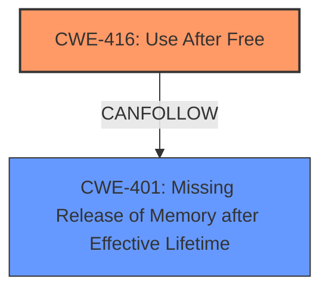

# Analysis Report for CVE-2024-41006

# Vulnerability Analysis Report: CVE-2024-41006

## Description

In the Linux kernel, the following vulnerability has been resolved netrom Fix a **memory leak** in nr_heartbeat_expiry() syzbot reported a **memory leak** in nr_create() [0]. Commit 409db27e3a2e (netrom Fix **use-after-free of a listening socket**.) added sock_hold() to the nr_heartbeat_expiry() function, where a) a socket has a SOCK_DESTROY flag or b) a listening socket has a SOCK_DEAD flag. But in the case a, when the SOCK_DESTROY flag is set, the file descriptor has already been closed and the nr_release() function has been called. So it makes no sense to hold the reference count because no one will call another nr_destroy_socket() and put it as in the case b. nr_connect nr_establish_data_link nr_start_heartbeat nr_release switch (nr->state) case NR_STATE_3 nr->state = NR_STATE_2 sock_set_flag(sk, SOCK_DESTROY) nr_rx_frame nr_process_rx_frame switch (nr->state) case NR_STATE_2 nr_state2_machine() nr_disconnect() nr_sk(sk)->state = NR_STATE_0 sock_set_flag(sk, SOCK_DEAD) nr_heartbeat_expiry switch (nr->state) case NR_STATE_0 if (sock_flag(sk, SOCK_DESTROY) || (sk->sk_state == TCP_LISTEN

## Vulnerability Description Key Phrases

- **Rootcause:** use-after-free of a listening socket
- **Weakness:** ['double free', 'memory leak']
- **Product:** Linux kernel
- **Component:** nr_heartbeat_expiry() function

## Analysis (with Relationship Data)

# Summary
| CWE ID | CWE Name | Confidence | CWE Abstraction Level | CWE Vulnerability Mapping Label | CWE-Vulnerability Mapping Notes |
|---|---|---|---|---|---|
| CWE-416 | Use After Free | 0.8 | Variant | Primary | Allowed |
| CWE-401 | Missing Release of Memory after Effective Lifetime | 0.7 | Base | Secondary | Allowed |

## Evidence and Confidence

*   **Confidence Score:** 0.75
*   **Evidence Strength:** MEDIUM

## Relationship Analysis
The primary weakness is **Use After Free (CWE-416)**, which occurs because of a failure to properly manage the lifetime of a resource. This can lead to a **memory leak** **(CWE-401)** if the resource is not released after its effective lifetime.mermaid



## Vulnerability Chain
The vulnerability chain involves a **use-after-free** condition leading to a **memory leak**:

1.  A socket is held using `sock_hold()` within `nr_heartbeat_expiry()`.
2.  Under certain conditions (e.g., `SOCK_DESTROY` flag set), the socket's file descriptor is closed, and `nr_release()` is called.
3.  The reference count held by `sock_hold()` is not properly released, resulting in a **memory leak** **(CWE-401)**.
4.  The **use-after-free** **(CWE-416)** occurs because the socket may be accessed after it has been freed.

## Summary of Analysis
The primary weakness is **CWE-416 (Use After Free)**, stemming from the incorrect handling of socket references in the `nr_heartbeat_expiry()` function within the Linux kernel's netrom module. The vulnerability description explicitly mentions "netrom Fix **use-after-free of a listening socket**." leading directly to the root cause. The secondary weakness is **CWE-401 (Missing Release of Memory after Effective Lifetime)**, since the failure to properly release the socket reference leads to the **memory leak**, as "syzbot reported a **memory leak** in nr_create()" and "netrom Fix a **memory leak** in nr_heartbeat_expiry()".

The relationship analysis shows that **CWE-416** can lead to **CWE-401**, establishing a clear chain. The retriever results also highlighted relevant CWEs such as **CWE-911 (Improper Update of Reference Count)**, which is related to the root cause of the vulnerability but is not as precise as **CWE-416**. **CWE-415 (Double Free)** was also considered, but the description does not explicitly indicate a double free condition.

The selection of **CWE-416** and **CWE-401** offers a balanced view of the root cause and its direct impact, providing a comprehensive understanding of the vulnerability.

Relevant CWE Information:

# Enhanced Context (25 CWEs)
The following CWEs were identified as potentially relevant to this vulnerability:

## CWE-911: Improper Update of Reference Count
**Abstraction Level**: Base
**Similarity Score**: 0.75
**Source**: dense

**Description**:
The product uses a reference count to manage a resource, but it does not update or incorrectly updates the reference count.

**Mapping Guidance**:
- Usage: Allowed
- Rationale: This CWE entry is at the Base level of abstraction, which is a preferred level of abstraction for mapping to the root causes of vulnerabilities.


## CWE-667: Improper Locking
**Abstraction Level**: Class
**Similarity Score**: 0.75
**Source**: dense

**Description**:
The product does not properly acquire or release a lock on a resource, leading to unexpected resource state changes and behaviors.

**Mapping Guidance**:
- Usage: Allowed-with-Review
- Rationale: This CWE entry is a Class and might have Base-level children that would be more appropriate


## CWE-909: Missing Initialization of Resource
**Abstraction Level**: Class
**Similarity Score**: 0.74
**Source**: dense

**Description**:
The product does not initialize a critical resource.

**Mapping Guidance**:
- Usage: Allowed-with-Review
- Rationale: This CWE entry is a Class and might have Base-level children that would be more appropriate


## CWE-226: Sensitive Information in Resource Not Removed Before Reuse
**Abstraction Level**: Base
**Similarity Score**: 0.74
**Source**: dense

**Description**:
The product releases a resource such as memory or a file so that it can be made available for reuse, but it does not clear or "zeroize" the information contained in the resource before the product performs a critical state transition or makes the resource available for reuse by other entities.

**Mapping Guidance**:
- Usage: Allowed
- Rationale: This CWE entry is at the Base level of abstraction, which is a preferred level of abstraction for mapping to the root causes of vulnerabilities.


## CWE-824: Access of Uninitialized Pointer
**Abstraction Level**: Base
**Similarity Score**: 0.73
**Source**: dense

**Description**:
The product accesses or uses a pointer that has not been initialized.

**Mapping Guidance**:
- Usage: Allowed
- Rationale: This CWE entry is at the Base level of abstraction, which is a preferred level of abstraction for mapping to the root causes of vulnerabilities.


## CWE-404: Improper Resource Shutdown or Release
**Abstraction Level**: Class
**Similarity Score**: 0.73
**Source**: dense

**Description**:
The product does not release or incorrectly releases a resource before it is made available for re-use.

**Mapping Guidance**:
- Usage: Allowed-with-Review
- Rationale: This CWE entry is a Class and might have Base-level children that would be more appropriate


## CWE-665: Improper Initialization
**Abstraction Level**: Class
**Similarity Score**: 0.73
**Source**: dense

**Description**:
The product does not initialize or incorrectly initializes a resource, which might leave the resource in an unexpected state when it is accessed or used.

**Mapping Guidance**:
- Usage: Discouraged
- Rationale: This CWE entry is a level-1 Class (i.e., a child of a Pillar). It might have lower-level children that would be more appropriate


## CWE-703: Improper Check or Handling of Exceptional Conditions
**Abstraction Level**: Pillar
**Similarity Score**: 0.72
**Source**: dense

**Description**:
The product does not properly anticipate or handle exceptional conditions that rarely occur during normal operation of the product.

**Mapping Guidance**:
- Usage: Discouraged
- Rationale: This CWE entry is extremely high-level, a Pillar.


## CWE-131: Incorrect Calculation of Buffer Size
**Abstraction Level**: Base
**Similarity Score**: 0.72
**Source**: dense

**Description**:
The product does not correctly calculate the size to be used when allocating a buffer, which could lead to a buffer overflow.

**Mapping Guidance**:
- Usage: Allowed
- Rationale: This CWE entry is at the Base level of abstraction, which is a preferred level of abstraction for mapping to the root causes of vulnerabilities.


## CWE-362: Concurrent Execution using Shared Resource with Improper Synchronization ('Race Condition')
**Abstraction Level**: Class
**Similarity Score**: 0.72
**Source**: dense

**Description**:
The product contains a concurrent code sequence that requires temporary, exclusive access to a shared resource, but a timing window exists in which the shared resource can be modified by another code sequence operating concurrently.

**Mapping Guidance**:
- Usage: Allowed-with-Review
- Rationale: This CWE entry is a Class and might have Base-level children that would be more appropriate


## CWE-362: Concurrent Execution using Shared Resource with Improper Synchronization ('Race Condition')
**Abstraction Level**: Class
**Similarity Score**: 2218.42
**Source**: sparse

**Description**:
The product contains a concurrent code sequence that requires temporary, exclusive access to a shared resource, but a timing window exists in which the shared resource can be modified by another code sequence operating concurrently.

**Mapping Guidance**:
- Usage: Allowed-with-Review
- Rationale: This CWE entry is a Class and might have Base-level children that would be more appropriate


## CWE-667: Improper Locking
**Abstraction Level**: Class
**Similarity Score**: 2210.34
**Source**: sparse

**Description**:
The product does not properly acquire or release a lock on a resource, leading to unexpected resource state changes and behaviors.

**Mapping Guidance**:
- Usage: Allowed-with-Review
- Rationale: This CWE entry is a


## CWE Relationship Analysis

Current CWEs represent these abstraction levels: .


### Vulnerability Chain Analysis

**Chain starting from CWE-416:**
- 416 (Use After Free) - ROOT


**Chain starting from CWE-911:**
- 911 (Improper Update of Reference Count) - ROOT


### CWE Relationship Diagram

```mermaid
graph TD
    classDef primary fill:#f96,stroke:#333,stroke-width:2px
    classDef secondary fill:#69f,stroke:#333
    classDef tertiary fill:#9e9,stroke:#333
```


*Report generated on 2025-07-13 12:48:34*
