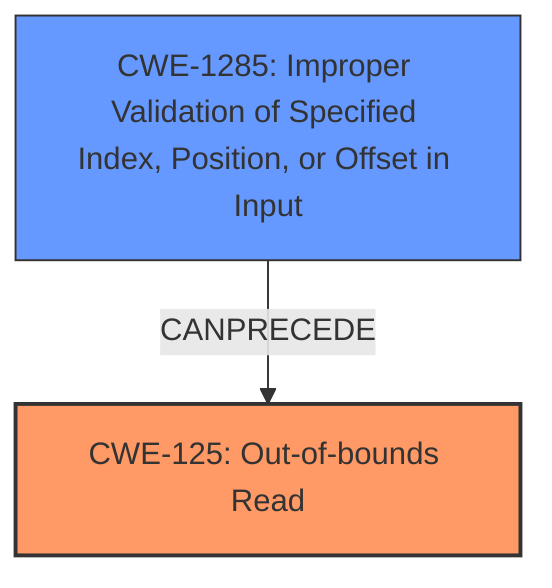

# Raw Analyzer Response for CVE-2024-41019

# Summary

| CWE ID  | CWE Name                                                     | Confidence | CWE Abstraction Level | CWE Vulnerability Mapping Label | CWE-Vulnerability Mapping Notes |
| :-------- | :----------------------------------------------------------- | :--------- | :---------------------- | :------------------------------ | :------------------------------ |
| CWE-125 | Out-of-bounds Read                                          | 1.0       | Base                    | Primary                        | Allowed                      |
| CWE-1285 | Improper Validation of Specified Index, Position, or Offset in Input | 0.75       | Base                    | Secondary                        | Allowed                      |

## Evidence and Confidence

*   **Confidence Score:** 0.85
*   **Evidence Strength:** HIGH

## Relationship Analysis

The primary CWE is CWE-125 (Out-of-bounds Read), which accurately reflects the direct consequence of the vulnerability. CWE-1285 (Improper Validation of Specified Index, Position, or Offset in Input) is a prerequisite to the **out-of-bounds read**, as the **lack of validation** on the `ff` offset allows the read to occur outside the intended memory region. The hierarchical relationship shows that CWE-125 is a specific type of memory access error, while CWE-1285 explains the **missing validation** leading to this error.

## Vulnerability Chain

The vulnerability chain starts with the **improper validation** of the `ff` offset (CWE-1285), which leads to an **out-of-bounds read** (CWE-125).

CWE-1285 (Root Cause) -> CWE-125 (Impact)

## Summary of Analysis

The analysis is based on the provided vulnerability description and the CVE reference content summary. The primary vulnerability is an **out-of-bounds read** (CWE-125) in the Linux kernel's ntfs3 filesystem driver. The root cause is the **lack of validation** on the `ff` offset when traversing the linked list of free areas in the restart table.

Evidence:

*   "There is a check on rt->first_free at first, but walking through by ff without any check. If the second ff is a large offset. We may encounter an **out-of-bound read**." (Vulnerability Description)
*   "The vulnerability lies in the ntfs3 filesystem driver's handling of the restart table (`RESTART_TABLE`). Specifically, when traversing the linked list of free areas using the `ff` (first free) offset, there is a **lack of proper bounds checking**...leading to a potential **out-of-bounds read**." (CVE Reference Links Content Summary)
*   "**Out-of-bounds read:** The vulnerability allows for reading memory outside the allocated buffer by providing a crafted `ff` offset within the `RESTART_TABLE`...allowing for a large `ff` offset to cause an **out-of-bounds read**." (CVE Reference Links Content Summary)

CWE-125 is the most direct and specific representation of the vulnerability. CWE-1285 is included as a secondary weakness, to capture the root cause.

I considered CWE-823 (Use of Out-of-range Pointer Offset), CWE-1284 (Improper Validation of Specified Quantity in Input), CWE-191 (Integer Underflow (Wrap or Wraparound)), and CWE-129 (Improper Validation of Array Index) but they are not as directly relevant as CWE-125 and CWE-1285. CWE-823 is similar to CWE-125 but is more specific to pointer arithmetic, which is not explicitly stated in the description. CWE-1284 could be related, but the issue is more about the position/offset than the quantity. CWE-191 and CWE-129 are less relevant to the given vulnerability description.

Relevant CWE Information:

# Enhanced Context (25 CWEs)

## CWE-125: Out-of-bounds Read
**Abstraction Level**: Base
**Similarity Score**: 0.76
**Source**: dense

**Description**:
The product reads data past the end, or before the beginning, of the intended buffer.

**Mapping Guidance**:
- Usage: Allowed
- Rationale: This CWE entry is at the Base level of abstraction, which is a preferred level of abstraction for mapping to the root causes of vulnerabilities.

**Justification:** The vulnerability description clearly indicates an **out-of-bounds read**, making this CWE the most appropriate primary classification.

## CWE-1285: Improper Validation of Specified Index, Position, or Offset in Input
**Abstraction Level**: Base
**Similarity Score**: 0.74
**Source**: dense

**Description**:
The product receives input that is expected to specify an index, position, or offset into an indexable resource such as a buffer or file, but it does not validate or incorrectly validates that the specified index/position/offset has the required properties.

**Mapping Guidance**:
- Usage: Allowed
- Rationale: This CWE entry is at the Base level of abstraction, which is a preferred level of abstraction for mapping to the root causes of vulnerabilities.

**Justification:** The description states that the `ff` offset is not checked, which directly relates to **improper validation** of an offset.