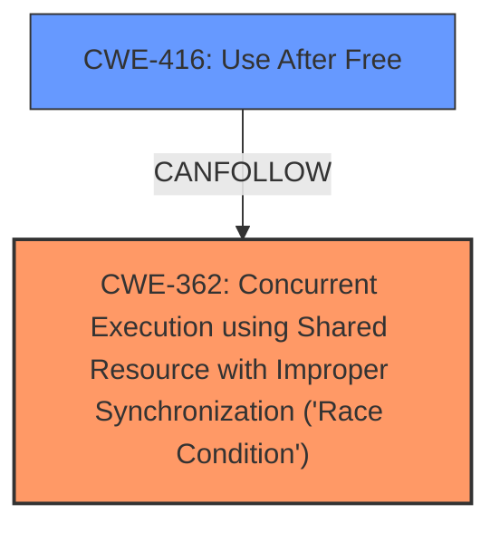

# Raw Analyzer Response for CVE-2024-41041

# Summary
| CWE ID | CWE Name | Confidence | CWE Abstraction Level | CWE Vulnerability Mapping Label | CWE-Vulnerability Mapping Notes |
|---|---|---|---|---|---|
| CWE-362 | Concurrent Execution using Shared Resource with Improper Synchronization ('Race Condition') | 0.9 | Class | Allowed-with-Review | Primary CWE. The vulnerability is caused by a race condition where the `SOCK_RCU_FREE` flag is set after the socket is added to the hash table.|
| CWE-416 | Use After Free | 0.7 | Variant | Allowed | Secondary candidate. The race condition can lead to a use-after-free vulnerability if the socket is accessed before the `SOCK_RCU_FREE` flag is set. |

## Evidence and Confidence

*   **Confidence Score:** 0.8
*   **Evidence Strength:** HIGH

## Relationship Analysis
The primary relationship that impacted my decision was the parent-child relationship between CWE-362 and more specific race condition CWEs. Although CWE-367 (Time-of-check Time-of-use (TOCTOU) Race Condition) was a strong candidate, the description better aligns with the general `Race Condition` scenario as the timing issue isn't specifically a TOCTOU.
The chain relationship comes into play, because the **race condition** can lead to a **use-after-free**. Thus CWE-416 is a secondary issue that stems from the race.

## Vulnerability Chain
The vulnerability chain begins with a **race condition** (**CWE-362**) where the `SOCK_RCU_FREE` flag is set too late. This can lead to a **use-after-free** (**CWE-416**) if another CPU accesses the socket during the race window.

## Summary of Analysis
The initial analysis identified a race condition related to setting the `SOCK_RCU_FREE` flag in the Linux kernel's UDP socket handling. The core issue is the **incorrect timing** of setting this flag, creating a window for potential use-after-free vulnerabilities.

The retriever results suggested several CWEs, with **CWE-362** (Concurrent Execution using Shared Resource with Improper Synchronization ('Race Condition')) being the most relevant. The vulnerability description key phrases, specifically "**UDP SOCK_RCU_FREE check too early**," supports this. The analysis of the CVE reference links content summary confirms this, stating: "The root cause of the vulnerability is a **race condition**... Specifically, the `SOCK_RCU_FREE` flag... was being set *after* the socket was added to the hash table."

While CWE-367 (Time-of-check Time-of-use (TOCTOU) Race Condition) was considered, the timing issue isn't specifically a TOCTOU, making CWE-362 a better fit. **CWE-416** (Use After Free) is added as a secondary issue as it can result from the race condition.

The selection of CWE-362 is at the Class level due to the lack of specifics to narrow it down to a Base or Variant level within the description. CWE-416 is a variant.

Relevant CWE Information:

# Enhanced Context (25 CWEs)
The following CWEs were identified as potentially relevant to this vulnerability:

## CWE-362: Concurrent Execution using Shared Resource with Improper Synchronization ('Race Condition')
**Abstraction Level**: Class
**Similarity Score**: 0.76
**Source**: dense

**Description**:
The product contains a concurrent code sequence that requires temporary, exclusive access to a shared resource, but a timing window exists in which the shared resource can be modified by another code sequence operating concurrently.

**Mapping Guidance**:
- Usage: Allowed-with-Review
- Rationale: This CWE entry is a Class and might have Base-level children that would be more appropriate

## CWE-366: Race Condition within a Thread
**Abstraction Level**: Base
**Similarity Score**: 0.73
**Source**: dense

**Description**:
If two threads of execution use a resource simultaneously, there exists the possibility that resources may be used while invalid, in turn making the state of execution undefined.

**Mapping Guidance**:
- Usage: Allowed
- Rationale: This CWE entry is at the Base level of abstraction, which is a preferred level of abstraction for mapping to the root causes of vulnerabilities.

## CWE-367: Time-of-check Time-of-use (TOCTOU) Race Condition
**Abstraction Level**: Base
**Similarity Score**: 0.72
**Source**: dense

**Description**:
The product checks the state of a resource before using that resource, but the resource's state can change between the check and the use in a way that invalidates the results of the check. This can cause the product to perform invalid actions when the resource is in an unexpected state.

**Mapping Guidance**:
- Usage: Allowed
- Rationale: This CWE entry is at the Base level of abstraction, which is a preferred level of abstraction for mapping to the root causes of vulnerabilities.

## CWE-416: Use After Free
**Abstraction Level**: variant
**Similarity Score**: 2.69
**Source**: graph

**Description**:
CWE-416: Use After Free

**Mapping Guidance**:
- Usage: Allowed
- Rationale: This CWE entry is at the Variant level of abstraction, which is a preferred level of abstraction for mapping to the root causes of vulnerabilities.