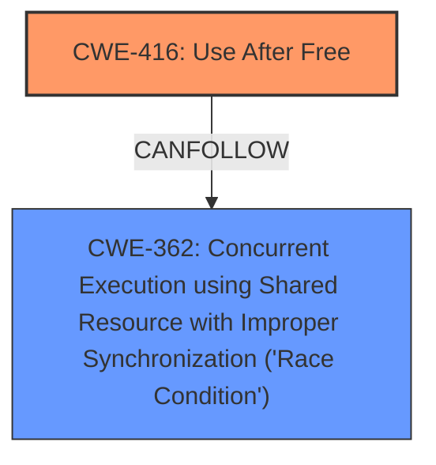

# Analysis Report for CVE-2024-41051

# Vulnerability Analysis Report: CVE-2024-41051

## Description

In the Linux kernel, the following vulnerability has been resolved cachefiles wait for ondemand_object_worker to finish when dropping object When queuing ondemand_object_worker() to re-open the object, cachefiles_object is not pinned. The cachefiles_object may be freed when the pending read request is completed intentionally and the related erofs is umounted. If ondemand_object_worker() runs after the object is freed, it will incur **use-after-free** problem as shown below. process A processs B process C process D cachefiles_ondemand_send_req() // send a read req X // wait for its completion // close ondemand fd cachefiles_ondemand_fd_release() // set object as CLOSE cachefiles_ondemand_daemon_read() // set object as REOPENING queue_work(fscache_wq, &info->ondemand_work) // close /dev/cachefiles cachefiles_daemon_release cachefiles_flush_reqs complete(&req->done) // read req X is completed // umount the erofs fs cachefiles_put_object() // object will be freed cachefiles_ondemand_deinit_obj_info() kmem_cache_free(object) // both info and object are freed ondemand_object_worker() When dropping an object, it is no longer necessary to reopen the object, so use cancel_work_sync() to cancel or wait fo

## Vulnerability Description Key Phrases

- **Rootcause:** race condition
- **Weakness:** use-after-free
- **Product:** Linux kernel

## Analysis (with Relationship Data)

# Summary
| CWE ID | CWE Name | Confidence | CWE Abstraction Level | CWE Vulnerability Mapping Label | CWE-Vulnerability Mapping Notes |
|---|---|---|---|---|---|
| CWE-416 | Use After Free | 1.0 | Variant | Allowed | Primary CWE: The root cause of the vulnerability is a use-after-free condition. |
| CWE-362 | Concurrent Execution using Shared Resource with Improper Synchronization ('Race Condition') | 0.8 | Class | Allowed-with-Review | Secondary CWE: A race condition allows the object to be freed while a worker thread attempts to access it. |

## Evidence and Confidence

*   **Confidence Score:** 0.9
*   **Evidence Strength:** HIGH

## Relationship Analysis
The primary weakness is CWE-416 Use After Free, a variant level CWE. The race condition, CWE-362 Concurrent Execution using Shared Resource with Improper Synchronization ('Race Condition'), allows the UAF to occur. CWE-362 is a class level CWE, and there may be more specific base level CWEs that could be used, but based on the information provided, CWE-362 adequately describes the vulnerability.



## Vulnerability Chain
The vulnerability chain starts with a race condition (CWE-362) where a `cachefiles_object` can be freed while `ondemand_object_worker()` is queued to access it. This leads to a use-after-free condition (CWE-416) when the worker attempts to access the freed memory, resulting in system instability or crashes.

## Summary of Analysis
The vulnerability is a use-after-free condition (CWE-416) caused by a race condition (CWE-362) in the `cachefiles` subsystem of the Linux kernel. The `cachefiles_object` is not pinned when `ondemand_object_worker()` is queued, leading to a race condition where the object can be freed before the worker executes.

The evidence for this assessment is primarily derived from the "CVE Reference Links Content Summary" section of the provided information, which explicitly states:

"The vulnerability is a **use-after-free** (UAF) condition in the `cachefiles` subsystem of the Linux kernel. Specifically, it arises when the `ondemand_object_worker()` function attempts to access a `cachefiles_object` after it has been freed."

and

"**Race Condition:** The race condition exists between the completion of a read request (which can lead to unmounting of the related filesystem and freeing of the `cachefiles_object`) and the execution of the `ondemand_object_worker()`."

The graph relationships influenced the selection by highlighting the connection between CWE-416 and CWE-362, where the race condition enables the use-after-free.

The selected CWEs are at the optimal level of specificity because CWE-416 is a variant that accurately describes the use-after-free condition, and CWE-362 describes the race condition that enables the UAF.

Relevant CWE Information:

# Enhanced Context (25 CWEs)
The following CWEs were identified as potentially relevant to this vulnerability:

## CWE-366: Race Condition within a Thread
**Abstraction Level**: Base
**Similarity Score**: 0.76
**Source**: dense

**Description**:
If two threads of execution use a resource simultaneously, there exists the possibility that resources may be used while invalid, in turn making the state of execution undefined.

**Mapping Guidance**:
- Usage: Allowed
- Rationale: This CWE entry is at the Base level of abstraction, which is a preferred level of abstraction for mapping to the root causes of vulnerabilities.

**Not Used:** While related to the race condition aspect, CWE-366 is less specific than CWE-362 which captures the broader context of concurrent execution using a shared resource.

## CWE-667: Improper Locking
**Abstraction Level**: Class
**Similarity Score**: 0.75
**Source**: dense

**Description**:
The product does not properly acquire or release a lock on a resource, leading to unexpected resource state changes and behaviors.

**Mapping Guidance**:
- Usage: Allowed-with-Review
- Rationale: This CWE entry is a Class and might have Base-level children that would be more appropriate

**Not Used:** While locking issues can be related to race conditions, the core issue here is that the object is freed prematurely, not that locking mechanisms are inherently flawed.

## CWE-362: Concurrent Execution using Shared Resource with Improper Synchronization ('Race Condition')
**Abstraction Level**: Class
**Similarity Score**: 0.75
**Source**: dense

**Description**:
The product contains a concurrent code sequence that requires temporary, exclusive access to a shared resource, but a timing window exists in which the shared resource can be modified by another code sequence operating concurrently.

**Mapping Guidance**:
- Usage: Allowed-with-Review
- Rationale: This CWE entry is a Class and might have Base-level children that would be more appropriate

**Used:** The product contains a concurrent code sequence that requires temporary, exclusive access to a shared resource, but a timing window exists in which the shared resource can be modified by another code sequence operating concurrently.

## CWE-367: Time-of-check Time-of-use (TOCTOU) Race Condition
**Abstraction Level**: Base
**Similarity Score**: 0.74
**Source**: dense

**Description**:
The product checks the state of a resource before using that resource, but the resource's state can change between the check and the use in a way that invalidates the results of the check. This can cause the product to perform invalid actions when the resource is in an unexpected state.

**Mapping Guidance**:
- Usage: Allowed
- Rationale: This CWE entry is at the Base level of abstraction, which is a preferred level of abstraction for mapping to the root causes of vulnerabilities.

**Not Used:** While TOCTOU is a type of race condition, the specific vulnerability here is that the object is freed, not that its state changes between check and use.

## CWE-404: Improper Resource Shutdown or Release
**Abstraction Level**: Class
**Similarity Score**: 0.73
**Source**: dense

**Description**:
The product does not release or incorrectly releases a resource before it is made available for re-use.

**Mapping Guidance**:
- Usage: Allowed-with-Review
- Rationale: This CWE entry is a Class and might have Base-level children that would be more appropriate

**Not Used:** While the object is released, the core issue is the use of the object after it has been freed, making CWE-416 a more precise match.

## CWE-193: Off-by-one Error
**Abstraction Level**: Base
**Similarity Score**: 0.71
**Source**: dense

**Description**:
A product calculates or uses an incorrect maximum or minimum value that is 1 more, or 1 less, than the correct value.

**Mapping Guidance**:
- Usage: Allowed
- Rationale: This CWE entry is at the Base level of abstraction, which is a preferred level of abstraction for mapping to the root causes of vulnerabilities.

**Not Used:** Not related to the vulnerability description

## CWE-252: Unchecked Return Value
**Abstraction Level**: Base
**Similarity Score**: 0.71
**Source**: dense

**Description**:
The product does not check the return value from a method or function, which can prevent it from detecting unexpected states and conditions.

**Mapping Guidance**:
- Usage: Allowed
- Rationale: This CWE entry is at the Base level of abstraction, which is a preferred level of abstraction for mapping to the root causes of vulnerabilities.

**Not Used:** Not related to the vulnerability description

## CWE-41: Improper Resolution of Path Equivalence
**Abstraction Level**: Base
**Similarity Score**: 0.71
**Source**: dense

**Description**:
The product is vulnerable to file system contents disclosure through path equivalence. Path equivalence involves the use of special characters in file and directory names. The associated manipulations are intended to generate multiple names for the same object.

**Mapping Guidance**:
- Usage: Allowed
- Rationale: This CWE entry is at the Base level of abstraction, which is a preferred level of abstraction for mapping to the root causes of vulnerabilities.

**Not Used:** Not related to the vulnerability description

## CWE-909: Missing Initialization of Resource
**Abstraction Level**: Class
**Similarity Score**: 0.71
**Source**: dense

**Description**:
The product does not initialize a critical resource.

**Mapping Guidance**:
- Usage: Allowed-with-Review
- Rationale: This CWE entry is a Class and might have Base-level children that would be more appropriate

**Not Used:** Not related to the vulnerability description

## CWE-908


## CWE Relationship Analysis

Current CWEs represent these abstraction levels: .


### Vulnerability Chain Analysis

**Chain starting from CWE-416:**
- 416 (Use After Free) - ROOT


**Chain starting from CWE-404:**
- 404 (Improper Resource Shutdown or Release) - ROOT


### CWE Relationship Diagram

```mermaid
graph TD
    classDef primary fill:#f96,stroke:#333,stroke-width:2px
    classDef secondary fill:#69f,stroke:#333
    classDef tertiary fill:#9e9,stroke:#333
```


*Report generated on 2025-07-13 12:51:23*
