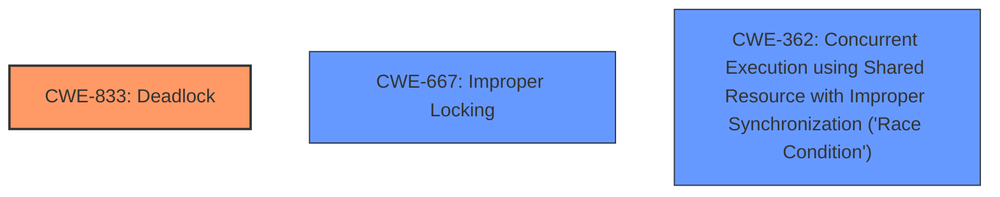

# Enhanced Analysis for CVE-2024-41063

# Summary
| CWE ID | CWE Name | Confidence | CWE Abstraction Level | CWE Vulnerability Mapping Label | CWE-Vulnerability Mapping Notes |
|---|---|---|---|---|---|
| CWE-833 | Deadlock | 1.0 | Base | Primary | Allowed |
| CWE-667 | Improper Locking | 0.7 | Class | Secondary Candidate | Allowed-with-Review |
| CWE-362 | Concurrent Execution using Shared Resource with Improper Synchronization ('Race Condition') | 0.6 | Class | Secondary Candidate | Allowed-with-Review |

## Evidence and Confidence

*   **Confidence Score:** 0.9
*   **Evidence Strength:** HIGH

## Relationship Analysis
The primary CWE, CWE-833 (Deadlock), is a Base-level CWE that directly describes the vulnerability. CWE-667 (Improper Locking) and CWE-362 (Race Condition) are Class-level CWEs that could be related to the deadlock situation, but are less specific. The hierarchical and chain relationships were not as influential as the direct match of the vulnerability description to the definition of CWE-833.



## Vulnerability Chain
The vulnerability chain starts with a race condition due to concurrent execution of tasks using shared resources (workqueues) without proper synchronization. This leads to a deadlock when the system tries to destroy the workqueues while tasks are still running in them, waiting for each other.
  - **Root Cause:** **Deadlock** due to race condition during workqueue destruction
  - **Weakness:** Improper handling of work items leading to tasks waiting for each other.
  - **Impact:** Denial of Service due to system unresponsiveness

## Summary of Analysis
The primary CWE is CWE-833 (Deadlock). The vulnerability description clearly states that the issue is a **deadlock** in the Linux kernel's Bluetooth HCI core driver. The evidence supports this with the description of how `hci_error_reset()` is called from `hdev->req_workqueue`, leading to a **deadlock** when `destroy_workqueue()` is called.

The Retriever Results also list CWE-833 as a highly relevant CWE.

Other CWEs like CWE-667 (Improper Locking) and CWE-362 (Race Condition) were considered, as they are often related to deadlocks, but they are less specific than CWE-833 in this context. CWE-667 could be considered as the locking was not handled correctly, but the end result was a **deadlock**.
The provided fix of calling `cancel_work_sync()` confirms that the issue was related to improper handling/synchronization of work items, which resulted in a deadlock.

Based on the evidence, the primary CWE is CWE-833, which is at the optimal level of specificity (Base).

Relevant CWE Information:

# Enhanced Context (25 CWEs)

## CWE-833: Deadlock
**Abstraction Level**: Base
**Similarity Score**: 0.78
**Source**: dense

**Description**:
The product contains multiple threads or executable segments that are waiting for each other to release a necessary lock, resulting in deadlock.

**Mapping Guidance**:
- Usage: Allowed
- Rationale: This CWE entry is at the Base level of abstraction, which is a preferred level of abstraction for mapping to the root causes of vulnerabilities.

## CWE-667: Improper Locking
**Abstraction Level**: Class
**Similarity Score**: 0.74
**Source**: dense

**Description**:
The product does not properly acquire or release a lock on a resource, leading to unexpected resource state changes and behaviors.

**Mapping Guidance**:
- Usage: Allowed-with-Review
- Rationale: This CWE entry is a Class and might have Base-level children that would be more appropriate

## CWE-362: Concurrent Execution using Shared Resource with Improper Synchronization ('Race Condition')
**Abstraction Level**: Class
**Similarity Score**: 0.72
**Source**: dense

**Description**:
The product contains a concurrent code sequence that requires temporary, exclusive access to a shared resource, but a timing window exists in which the shared resource can be modified by another code sequence operating concurrently.

**Mapping Guidance**:
- Usage: Allowed-with-Review
- Rationale: This CWE entry is a Class and might have Base-level children that would be more appropriate


## CWE Relationship Analysis

Current CWEs represent these abstraction levels: .


### Vulnerability Chain Analysis

**Chain starting from CWE-667:**
- 667 (Improper Locking) - ROOT


**Chain starting from CWE-833:**
- 833 (Deadlock) - ROOT


### CWE Relationship Diagram

```mermaid
graph TD
    classDef primary fill:#f96,stroke:#333,stroke-width:2px
    classDef secondary fill:#69f,stroke:#333
    classDef tertiary fill:#9e9,stroke:#333
```