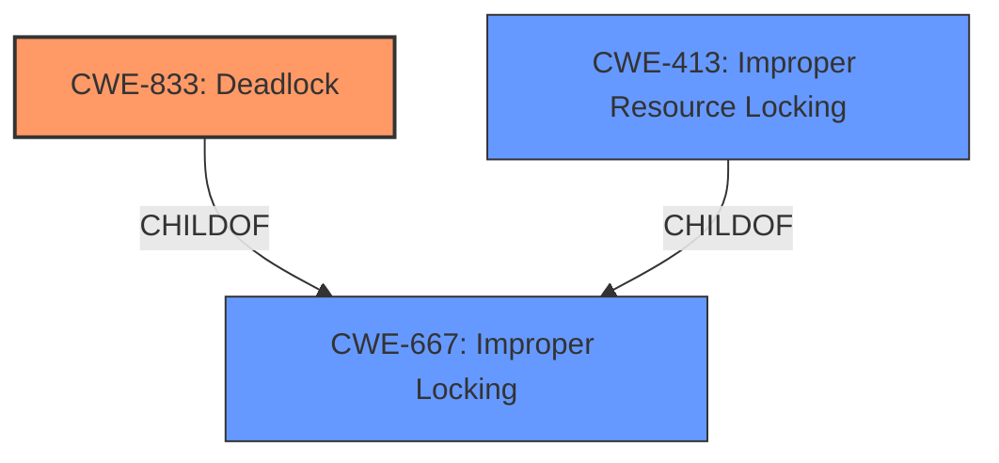

# Analysis Report for CVE-2024-41080

# Vulnerability Analysis Report: CVE-2024-41080

## Description

In the Linux kernel, the following vulnerability has been resolved io_uring fix possible deadlock in io_register_iowq_max_workers() The io_register_iowq_max_workers() function calls io_put_sq_data(), which acquires the sqd->lock without releasing the uring_lock. Similar to the commit 009ad9f0c6ee (io_uring drop ctx->uring_lock before acquiring sqd->lock), this can lead to a potential deadlock situation. To resolve this issue, the uring_lock is released before calling io_put_sq_data(), and then it is re-acquired after the function call. This change ensures that the locks are acquired in the correct order, preventing the possibility of a deadlock.

## Vulnerability Description Key Phrases

- **Rootcause:** improper lock order
- **Impact:** deadlock
- **Product:** Linux kernel
- **Component:** io_uring

## Analysis (with Relationship Data)

# Summary

| CWE ID | CWE Name | Confidence | CWE Abstraction Level | CWE Vulnerability Mapping Label | CWE-Vulnerability Mapping Notes |
|---|---|---|---|---|---|
| CWE-833 | Deadlock | 0.9 | Base | Primary CWE | Allowed |
| CWE-413 | Improper Resource Locking | 0.7 | Base | Secondary Candidate | Allowed |
| CWE-667 | Improper Locking | 0.6 | Class | Secondary Candidate | Allowed-with-Review |

## Evidence and Confidence

*   **Confidence Score:** 0.8
*   **Evidence Strength:** HIGH

## Relationship Analysis

The primary CWE is CWE-833 (Deadlock), which is caused by CWE-413 (Improper Resource Locking) or CWE-667 (Improper Locking).
CWE-833 is a child of CWE-667. CWE-413 is also a child of CWE-667. Thus, the improper locking leads to a deadlock situation. Choosing the base level CWEs provides more specific details about the vulnerability.



## Vulnerability Chain

The vulnerability chain starts with **improper lock order**, leading to **deadlock**.

Improper Lock Ordering -> Deadlock

CWE-413/CWE-667 -> CWE-833

## Summary of Analysis

The analysis indicates that the root cause of the vulnerability is a deadlock due to **improper lock order**. The `io_register_iowq_max_workers()` function acquires locks in the wrong order, leading to a potential deadlock.

The primary CWE is CWE-833 (Deadlock), which accurately describes the vulnerability's impact. The supporting evidence is strong, as the vulnerability description explicitly mentions a **deadlock** caused by **improper lock order**. The retriever results also support CWE-833 as a relevant CWE.

CWE-413 (Improper Resource Locking) and CWE-667 (Improper Locking) are considered as secondary candidates, as they describe the underlying cause of the deadlock. However, CWE-833 is more specific to the vulnerability's impact, making it the primary CWE.

The graph relationships influenced the selection by highlighting the connection between improper locking and deadlock. The abstraction levels were considered to ensure the selected CWEs are at the appropriate level of specificity.

Relevant CWE Information:

# Enhanced Context (25 CWEs)
The following CWEs were identified as potentially relevant to this vulnerability:

## CWE-833: Deadlock
**Abstraction Level**: Base
**Similarity Score**: 0.78
**Source**: dense

**Description**:
The product contains multiple threads or executable segments that are waiting for each other to release a necessary lock, resulting in deadlock.

**Mapping Guidance**:
- Usage: Allowed
- Rationale: This CWE entry is at the Base level of abstraction, which is a preferred level of abstraction for mapping to the root causes of vulnerabilities.

## CWE-667: Improper Locking
**Abstraction Level**: Class
**Similarity Score**: 0.76
**Source**: dense

**Description**:
The product does not properly acquire or release a lock on a resource, leading to unexpected resource state changes and behaviors.

**Mapping Guidance**:
- Usage: Allowed-with-Review
- Rationale: This CWE entry is a Class and might have Base-level children that would be more appropriate

## CWE-413: Improper Resource Locking
**Abstraction Level**: Base
**Similarity Score**: 0.72
**Source**: dense

**Description**:
The product does not lock or does not correctly lock a resource when the product must have exclusive access to the resource.

**Mapping Guidance**:
- Usage: Allowed
- Rationale: This CWE entry is at the Base level of abstraction, which is a preferred level of abstraction for mapping to the root causes of vulnerabilities.

CWE-362, CWE-755, CWE-1285, CWE-824, CWE-131, CWE-252, CWE-404, CWE-663, CWE-122, CWE-1265, CWE-911, CWE-476, CWE-772, CWE-306, CWE-416 and CWE-479 were considered but not used, as they do not directly relate to the **deadlock** caused by **improper lock order** described in the vulnerability description. These CWEs represent different types of weaknesses or are at a higher level of abstraction.

Here's a detailed breakdown of the selected CWEs:

*   **CWE-833 (Deadlock):** The vulnerability description explicitly states that the **improper lock order** can lead to a **deadlock**. This aligns perfectly with the definition of CWE-833, which describes a situation where multiple threads are waiting for each other to release locks, resulting in a system stall. The impact of exploiting this vulnerability is a denial of service (DoS).

*   **CWE-413 (Improper Resource Locking):** The **improper lock order** falls under the umbrella of **improper resource locking**, making it a relevant secondary CWE. It describes the specific mistake in acquiring the locks, without releasing the other locks.

*   **CWE-667 (Improper Locking):** This is a more general class of **improper resource locking**. Since CWE-413 provides a more detailed description, it is a better fit.


## CWE Relationship Analysis

Current CWEs represent these abstraction levels: .


### Vulnerability Chain Analysis

**Chain starting from CWE-476:**
- 476 (NULL Pointer Dereference) - ROOT


**Chain starting from CWE-416:**
- 416 (Use After Free) - ROOT


### CWE Relationship Diagram

```mermaid
graph TD
    classDef primary fill:#f96,stroke:#333,stroke-width:2px
    classDef secondary fill:#69f,stroke:#333
    classDef tertiary fill:#9e9,stroke:#333
```


*Report generated on 2025-07-13 12:52:29*
