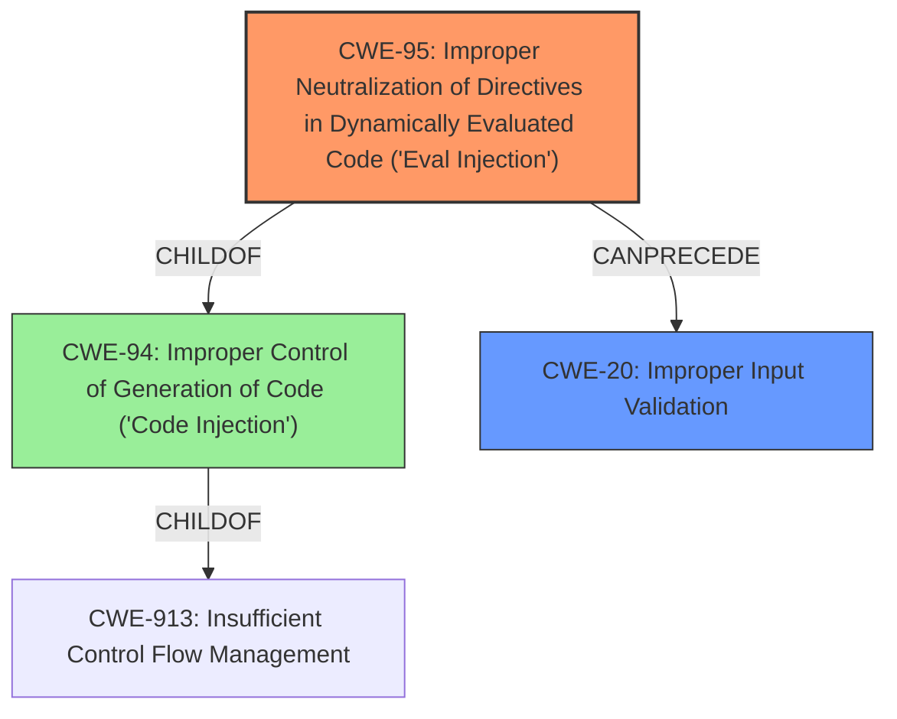

# Raw Analyzer Response for CVE-2024-41119

# Summary
| CWE ID | CWE Name | Confidence | CWE Abstraction Level | CWE Vulnerability Mapping Label | CWE-Vulnerability Mapping Notes |
|---|---|---|---|---|---|
| CWE-95 | Improper Neutralization of Directives in Dynamically Evaluated Code ('Eval Injection') | 1.0 | Variant | Allowed | Primary CWE. The `eval()` function is used on unsanitized user input. |
| CWE-20 | Improper Input Validation | 0.7 | Class | Discouraged | Secondary CWE. The **improper input validation** leads to the use of `eval()` on unsanitized input. |

## Evidence and Confidence

*   **Confidence Score:** 0.9
*   **Evidence Strength:** HIGH

## Relationship Analysis
The primary weakness is CWE-95, which is a variant of CWE-94 (Improper Control of Generation of Code) and a child of CWE-913 (Insufficient Control Flow Management). CWE-95 is directly related to the use of `eval()` on unsanitized input, making it a precise classification. CWE-20 is a more general classification that captures the **improper input validation** aspect, which allows the injection to occur.

## Vulnerability Chain
The vulnerability chain starts with **improper input validation** (CWE-20), which leads to the use of the `eval()` function on unsanitized user input (CWE-95), resulting in remote code execution.
  - Root Cause: CWE-20 Improper Input Validation
  - Weakness: CWE-95 Improper Neutralization of Directives in Dynamically Evaluated Code ('Eval Injection')
  - Impact: Remote Code Execution

## Summary of Analysis
The analysis is based on the provided evidence, including the vulnerability description, key phrases, and CVE reference links. The vulnerability involves using the `eval()` function on user-provided input without proper sanitization. The CVE reference link explicitly states: "The application uses the `eval()` function on user-provided input (`vis_params`) within the `pages/8_🏜️_Raster_Data_Visualization.py` file without proper sanitization." The fix replaces `eval()` with `json.loads()` after sanitizing single quotes.

CWE-95 is the most specific and accurate classification because it directly addresses the use of `eval()` for dynamic code evaluation with **improper neutralization**. CWE-20, while relevant, is a broader category.

Other CWEs Considered:

*   CWE-94 (Improper Control of Generation of Code): While related, CWE-95 is a more specific variant that directly applies to the use of `eval()`.
*   CWE-917 (Improper Neutralization of Special Elements used in an Expression Language Statement): This is similar to CWE-95, but CWE-95 is more directly applicable as it involves the `eval()` function.
*   CWE-116 (Improper Encoding or Escaping of Output): This CWE is not applicable because the vulnerability is not related to encoding or escaping output.
*   CWE-1284 (Improper Validation of Specified Quantity in Input): This CWE is not applicable because the vulnerability is not related to validating the quantity of input.
*   CWE-184 (Incomplete List of Disallowed Inputs): This CWE is not applicable because the vulnerability is not related to incomplete disallowed inputs.
*   CWE-1286 (Improper Validation of Syntactic Correctness of Input): This CWE is related to improper input validation, which is a cause of the vulnerability but not the core weakness of using `eval()` on unsanitized input.

The selected CWEs are at the optimal level of specificity because CWE-95 directly addresses the vulnerability, and CWE-20 captures the underlying **improper input validation**.