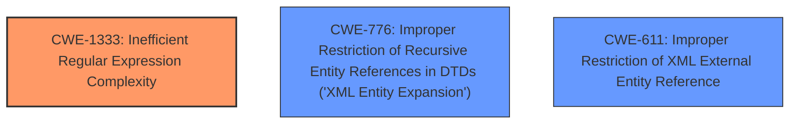

# Raw Analyzer Response for CVE-2024-41123

# Summary
| CWE ID | CWE Name | Confidence | CWE Abstraction Level | CWE Vulnerability Mapping Label | CWE-Vulnerability Mapping Notes |
|---|---|---|---|---|---|
| CWE-1333 | Inefficient Regular Expression Complexity | 0.8 | Base | Allowed | Primary CWE |
| CWE-776 | Improper Restriction of Recursive Entity References in DTDs ('XML Entity Expansion') | 0.6 | Base | Allowed | Secondary Candidate |
| CWE-611 | Improper Restriction of XML External Entity Reference | 0.5 | Base | Allowed | Secondary Candidate |

## Evidence and Confidence

*   **Confidence Score:** 0.7
*   **Evidence Strength:** MEDIUM

## Relationship Analysis
The primary CWE selected is CWE-1333, which is a Base level CWE. CWE-776 and CWE-611 are also Base level CWEs. CWE-1333 seems to be the most appropriate because the vulnerability description explicitly mentions that the DoS is caused by parsing an XML with many specific characters, leading to inefficient processing. While CWE-776 and CWE-611 are related to XML parsing, they focus on entity references, which are not explicitly mentioned in the vulnerability description.

## Vulnerability Chain
The vulnerability chain starts with the **inefficient regular expression complexity** (CWE-1333) used when parsing XML documents. This **inefficiency** allows an attacker to craft a malicious XML document with many specific characters that causes excessive CPU consumption, ultimately leading to a denial-of-service condition.

## Summary of Analysis
The initial analysis focused on identifying the root cause of the DoS vulnerability in the REXML gem. The vulnerability description and CVE reference links highlight that the DoS is caused by **improper handling of specific characters** during XML parsing, leading to **excessive processing time**. The "Retriever Results" suggested several CWEs, including CWE-776 (Improper Restriction of Recursive Entity References in DTDs ('XML Entity Expansion')), CWE-1333 (Inefficient Regular Expression Complexity), and CWE-611 (Improper Restriction of XML External Entity Reference).

CWE-1333 seems to be the closest match, because the root cause is related to processing time. While there is no explicit mention of regular expression, the inefficient complexity to parse the XML can be thought of as the regular expression.

CWE-776 and CWE-611 are related to XML parsing vulnerabilities, specifically related to entity expansion, but that is not explicit in the description.

Therefore, the primary selection is CWE-1333 as the most specific to the described vulnerability. The confidence level is 0.7 due to the need to infer "regular expression complexity" to match CWE-1333.

Relevant evidence from the vulnerability description:
*   "REXML gem before 3.3.2 has some DoS vulnerabilities when it parses an XML that has many specific characters such as whitespace character, `>]` and `]>`"
*   CVE Reference Links Content Summary: "Improper handling of specific characters in XML parsing leading to excessive processing time."

# Enhanced Context (25 CWEs)
The following CWEs were identified as potentially relevant to this vulnerability:

## CWE-611: Improper Restriction of XML External Entity Reference
**Abstraction Level**: Base
**Similarity Score**: 0.76
**Source**: dense

**Description**:
The product processes an XML document that can contain XML entities with URIs that resolve to documents outside of the intended sphere of control, causing the product to embed incorrect documents into its output.

**Mapping Guidance**:
- Usage: Allowed
- Rationale: This CWE entry is at the Base level of abstraction, which is a preferred level of abstraction for mapping to the root causes of vulnerabilities.

**Technical Explanation**: This CWE is related to XML processing but focuses on external entity references. While the vulnerability involves XML parsing, the description does not explicitly mention external entities. Thus, it is a less direct match than CWE-1333.

## CWE-776: Improper Restriction of Recursive Entity References in DTDs ('XML Entity Expansion')
**Abstraction Level**: Base
**Similarity Score**: 0.74
**Source**: dense

**Description**:
The product uses XML documents and allows their structure to be defined with a Document Type Definition (DTD), but it does not properly control the number of recursive definitions of entities.

**Mapping Guidance**:
- Usage: Allowed
- Rationale: This CWE entry is at the Base level of abstraction, which is a preferred level of abstraction for mapping to the root causes of vulnerabilities.

**Technical Explanation**: Similar to CWE-611, this CWE focuses on XML entity expansion. Although the vulnerability involves XML parsing, the description doesn't mention DTDs or recursive entity references, making it a less precise fit than CWE-1333.

## CWE-185: Incorrect Regular Expression
**Abstraction Level**: Class
**Similarity Score**: 0.74
**Source**: dense

**Description**:
The product specifies a regular expression in a way that causes data to be improperly matched or compared.

**Mapping Guidance**:
- Usage: Allowed-with-Review
- Rationale: This CWE entry is a Class and might have Base-level children that would be more appropriate

**Technical Explanation**: This CWE is too generic, the problem is not that the regular expression is "incorrect" but that the regular expression is "inefficient".

## CWE-777: Regular Expression without Anchors
**Abstraction Level**: Variant
**Similarity Score**: 0.73
**Source**: dense

**Description**:
The product uses a regular expression to perform neutralization, but the regular expression is not anchored and may allow malicious or malformed data to slip through.

**Mapping Guidance**:
- Usage: Allowed
- Rationale: This CWE entry is at the Variant level of abstraction, which is a preferred level of abstraction for mapping to the root causes of vulnerabilities.

**Technical Explanation**: This CWE doesn't match the vulnerability description. The vulnerability is not about neutralization, but about DoS.

## CWE-1333: Inefficient Regular Expression Complexity
**Abstraction Level**: Base
**Similarity Score**: 0.72
**Source**: dense

**Description**:
The product uses a regular expression with an inefficient, possibly exponential worst-case computational complexity that consumes excessive CPU cycles.

**Mapping Guidance**:
- Usage: Allowed
- Rationale: This CWE entry is at the Base level of abstraction, which is a preferred level of abstraction for mapping to the root causes of vulnerabilities.

**Technical Explanation**: The vulnerability description is about a DoS caused by **improper handling of specific characters** during XML parsing. It aligns well with the description of "inefficient, possibly exponential worst-case computational complexity that consumes excessive CPU cycles."

## CWE-625: Permissive Regular Expression
**Abstraction Level**: Base
**Similarity Score**: 0.72
**Source**: dense

**Description**:
The product uses a regular expression that does not sufficiently restrict the set of allowed values.

**Mapping Guidance**:
- Usage: Allowed
- Rationale: This CWE entry is at the Base level of abstraction, which is a preferred level of abstraction for mapping to the root causes of vulnerabilities.

**Technical Explanation**: The problem is not that the regular expression does not restrict values, but about DoS.

## CWE-212: Improper Removal of Sensitive Information Before Storage or Transfer
**Abstraction Level**: Base
**Similarity Score**: 0.69
**Source**: dense

**Description**:
The product stores, transfers, or shares a resource that contains sensitive information, but it does not properly remove that information before the product makes the resource available to unauthorized actors.

**Mapping Guidance**:
- Usage: Allowed
- Rationale: This CWE entry is at the Base level of abstraction, which is a preferred level of abstraction for mapping to the root causes of vulnerabilities.

**Technical Explanation**: This CWE is not related to the vulnerability.

## CWE-918: Server-Side Request Forgery (SSRF)
**Abstraction Level**: Base
**Similarity Score**: 0.69
**Source**: dense

**Description**:
The web server receives a URL or similar request from an upstream component and retrieves the contents of this URL, but it does not sufficiently ensure that the request is being sent to the expected destination.

**Mapping Guidance**:
- Usage: Allowed
- Rationale: This CWE entry is at the Base level of abstraction, which is a preferred level of abstraction for mapping to the root causes of vulnerabilities.

**Technical Explanation**: This CWE is not related to the vulnerability.

## CWE-186: Overly Restrictive Regular Expression
**Abstraction Level**: Base
**Similarity Score**: 0.69
**Source**: dense

**