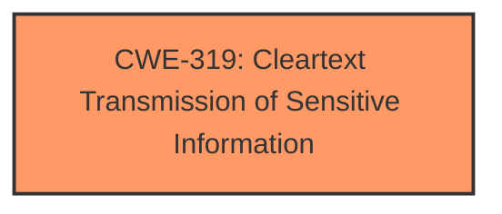

# Analysis for CVE-2024-41124

# Summary
| CWE ID | CWE Name | Confidence | CWE Abstraction Level | CWE Vulnerability Mapping Label | CWE-Vulnerability Mapping Notes |
|---|---|---|---|---|---|
| CWE-319 | Cleartext Transmission of Sensitive Information | 1.0 | Base | Allowed | Primary CWE |

## Evidence and Confidence

*   **Confidence Score:** 1.0
*   **Evidence Strength:** HIGH

## Relationship Analysis
The primary CWE is CWE-319, which is at the Base level of abstraction. No parent or child relationships were deemed relevant in further specifying the vulnerability.

## Vulnerability Chain
The vulnerability chain consists of a single weakness: the **utilization of HTTP instead of HTTPS**, leading directly to the impact of **cleartext transmission of sensitive information**.

## Summary of Analysis
The vulnerability description clearly states that the `API_URLS` were using HTTP instead of HTTPS, which is a **weakness** that directly leads to **cleartext transmission of sensitive information**. The CVE Reference Links Content Summary section reinforces this by stating that the root cause is the `API_URLS` using HTTP instead of HTTPS, allowing for cleartext transmission, and explicitly associating the vulnerability with CWE-319. The fix involved changing the URLs to HTTPS, further confirming this assessment. Given the direct evidence and the explicit mention of CWE-319 in the reference material, the confidence in this mapping is high.

CWE-20, CWE-22, CWE-73, CWE-88, CWE-201, CWE-204, CWE-212, CWE-226, CWE-306, CWE-639, CWE-770, CWE-918 were considered but were not the most appropriate. These CWEs describe different types of vulnerabilities that are not directly related to the **cleartext transmission of sensitive information** via HTTP.
CWE-863 and CWE-1333 were also considered but were not applicable as they describe authorization and regex issues respectively.

Relevant CWE Information: