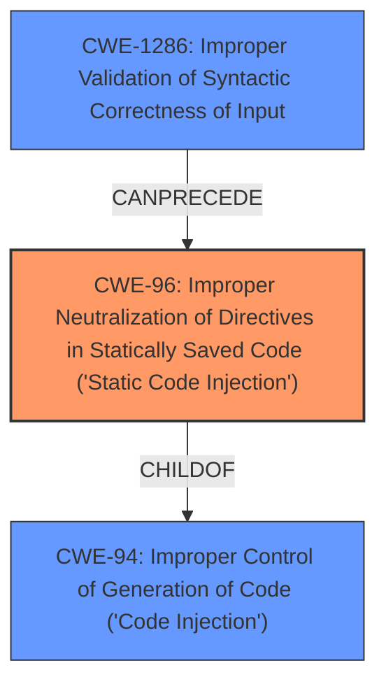

# Raw Analyzer Response for CVE-2024-41127

# Summary
| CWE ID | CWE Name | Confidence | CWE Abstraction Level | CWE Vulnerability Mapping Label | CWE-Vulnerability Mapping Notes |
|---|---|---|---|---|---|
| CWE-96 | Improper Neutralization of Directives in Statically Saved Code ('Static Code Injection') | 0.9 | Base | Primary | Allowed |
| CWE-1286 | Improper Validation of Syntactic Correctness of Input | 0.7 | Base | Secondary | Allowed |

## Evidence and Confidence

*   **Confidence Score:** 0.8
*   **Evidence Strength:** HIGH

## Relationship Analysis
The primary relationship influencing the decision is the hierarchical relationship between CWE-94 (Improper Control of Generation of Code ('Code Injection')) and its child CWE-96 (Improper Neutralization of Directives in Statically Saved Code ('Static Code Injection')). CWE-96 is more specific, as the vulnerability involves injecting code into a statically saved file (the GitHub workflow). The secondary relationship that influenced the decision is that CWE-96 can be preceded by CWE-1286, **Improper Validation of Syntactic Correctness of Input**, further mapping the lack of validation.

## Vulnerability Chain
The vulnerability chain starts with the **improper validation** of the input (`pr_num.txt`) leading to **code injection** into a statically saved file, and culminating in the attacker gaining pull request write access.

`CWE-1286` -> `CWE-96` -> Impact (Pull Request Write Access)

## Summary of Analysis
The vulnerability is clearly a **code injection** issue, as the description states. The `ci-failure-comment.yml` workflow downloads an artifact, reads the content of `pr_num.txt`, and assigns it to a workflow variable without validation. This variable is then interpolated into a JavaScript script, allowing an attacker to inject arbitrary code.

The choice of CWE-96 (Improper Neutralization of Directives in Statically Saved Code ('Static Code Injection')) over the more general CWE-94 (Improper Control of Generation of Code ('Code Injection')) is based on the fact that the code is injected into a statically saved file (the GitHub workflow). This makes CWE-96 a more specific and accurate representation of the vulnerability. The evidence is the description statement, "It is not validated that the variable is actually a number and later it is interpolated into a JS script allowing an attacker to change the code to be executed."

CWE-1286 is added as a secondary weakness because the root cause of the vulnerability is that the input is not validated.

CWE-79 (Improper Neutralization of Input During Web Page Generation ('Cross-site Scripting')) was considered because the input is not neutralized. However, the injection occurs in a GitHub workflow file, not a web page, making CWE-96 a more appropriate choice.

CWE-88 (Improper Neutralization of Argument Delimiters in a Command ('Argument Injection')) was considered because of the similarity of the term "injection", but the injected code is not being used as arguments to a command.

CWE-917 (Improper Neutralization of Special Elements used in an Expression Language Statement ('Expression Language Injection')) was considered because the injected code is an expression. However, the code is being injected into a JavaScript script, not an expression language statement.

CWE-78 (Improper Neutralization of Special Elements used in an OS Command ('OS Command Injection')) was considered because of the term "injection". However, the injected code is not being used as an OS command.

The selected CWEs are at the optimal level of specificity. CWE-96 accurately reflects the code injection into a statically saved file, and CWE-1286 highlights the lack of input validation that enables the vulnerability.