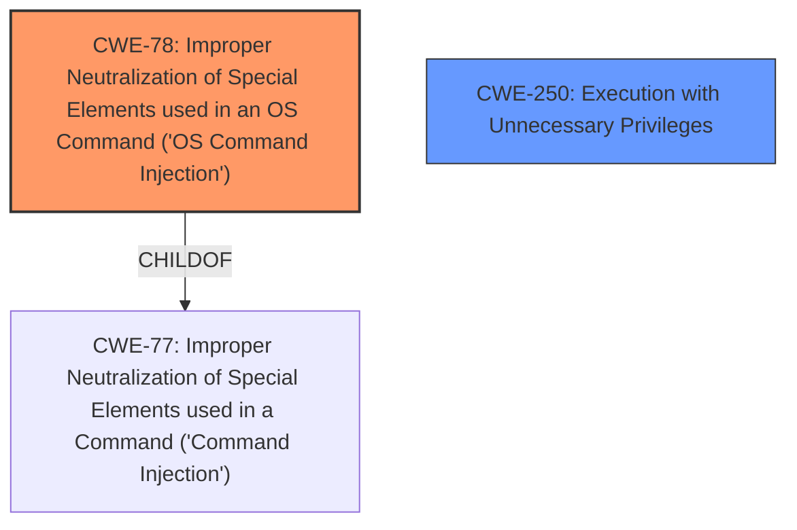

# Analysis Report for CVE-2024-41153

# Vulnerability Analysis Report: CVE-2024-41153

## Description

**Command injection** vulnerability in the Edge Computing UI for the TRO600 series radios that allows for the execution of arbitrary system commands. If exploited, an attacker with write access to the web UI can execute commands on the device with root privileges, far more extensive than what the write privilege intends.

## Vulnerability Description Key Phrases

- **Weakness:** Command injection
- **Impact:** execute commands on the device with root privileges
- **Attacker:** attacker with write access to the web UI
- **Product:** TRO600 series radios
- **Component:** Edge Computing UI

## Analysis (with Relationship Data)

# Summary
| CWE ID | CWE Name | Confidence | CWE Abstraction Level | CWE Vulnerability Mapping Label | CWE-Vulnerability Mapping Notes |
|---|---|---|---|---|---|
| CWE-78 | Improper Neutralization of Special Elements used in an OS Command ('Command Injection') | 1.0 | Base | Allowed | Primary CWE |
| CWE-250 | Execution with Unnecessary Privileges | 0.7 | Base | Allowed | Secondary Candidate |

## Evidence and Confidence

*   **Confidence Score:** 0.9
*   **Evidence Strength:** MEDIUM

## Relationship Analysis
The primary relationship is that CWE-78 is a child of CWE-77, which is a more general class. CWE-78 specifies that the command injection occurs within the operating system.
CWE-250 represents the fact that the web UI component has write access to execute commands on the device with root privileges.



## Vulnerability Chain
The **root cause** is the **Command injection** vulnerability, specifically CWE-78, where special elements in an OS command are not properly neutralized. This allows an attacker to execute arbitrary commands. The chain is that the attacker has write access to the web UI and exploits the **command injection** to execute commands on the device with root privileges.
The Privilege vs Permissions Guidance calls out that the access control issue of "Can access resource without correct role" could be due to CWE-285, 862, 863, but in this case the user *does* have write access to the web UI.
The additional element is that the vulnerability allows for the execution of arbitrary system commands *with root privileges*. This can be mapped to CWE-250.

## Summary of Analysis
The vulnerability description clearly states a **command injection** vulnerability. The Retriever Results confirm CWE-78 as a strong candidate with a score of 0.7. The fact that this leads to the execution of arbitrary system commands *with root privileges* suggests CWE-250.

The selection of CWE-78 is based on the explicit mention of **command injection** in the vulnerability description. This aligns with the CWE's description of "Improper Neutralization of Special Elements used in an OS Command."

The Privilege vs Permissions Guidance table maps "Code runs with elevated privileges it doesn’t need" to CWE-250. The attacker with write access to the web UI is able to execute commands with root privileges.

The evidence for CWE-78 is the explicit mention of "command injection" in the Vulnerability Description Key Phrases.
The evidence for CWE-250 is "attacker with write access to the web UI can execute commands on the device with root privileges, far more extensive than what the write privilege intends".

CWE-77 was considered, but CWE-78 is more specific since the commands are OS commands.
CWE-20 was considered but the vulnerability is more specific than general input validation.
CWE-269 was considered but it is discouraged, and the root cause is command injection.
CWE-120 was considered as a remote possibility, but the vulnerability description does not indicate a buffer overflow.

# Relevant CWE Information:

## CWE-280: Improper Handling of Insufficient Permissions or Privileges 
**Abstraction Level**: Base
**Similarity Score**: 0.78
**Source**: dense
## CWE-267: Privilege Defined With Unsafe Actions
**Abstraction Level**: Base
**Similarity Score**: 0.78
**Source**: dense
## CWE-266: Incorrect Privilege Assignment
**Abstraction Level**: Base
**Similarity Score**: 0.78
**Source**: dense
## CWE-274: Improper Handling of Insufficient Privileges
**Abstraction Level**: Base
**Similarity Score**: 0.77
**Source**: dense
## CWE-41: Improper Resolution of Path Equivalence
**Abstraction Level**: Base
**Similarity Score**: 0.77
**Source**: dense
## CWE-74: Improper Neutralization of Special Elements in Output Used by a Downstream Component ('Injection')
**Abstraction Level**: Class
**Similarity Score**: 0.76
**Source**: dense
## CWE-668: Exposure of Resource to Wrong Sphere
**Abstraction Level**: Class
**Similarity Score**: 0.76
**Source**: dense
## CWE-73: External Control of File Name or Path
**Abstraction Level**: Base
**Similarity Score**: 0.76
**Source**: dense
## CWE-497: Exposure of Sensitive System Information to an Unauthorized Control Sphere
**Abstraction Level**: Base
**Similarity Score**: 0.75
**Source**: dense
## CWE-754: Improper Check for Unusual or Exceptional Conditions
**Abstraction Level**: Class
**Similarity Score**: 0.75
**Source**: dense
## CWE-269: Improper Privilege Management
**Abstraction Level**: Class
**Similarity Score**: 1469.89
**Source**: sparse
## CWE-863: Incorrect Authorization
**Abstraction Level**: Class
**Similarity Score**: 1423.42
**Source**: sparse
## CWE-285: Improper Authorization
**Abstraction Level**: Class
**Similarity Score**: 1377.48
**Source**: sparse
## CWE-267: Privilege Defined With Unsafe Actions
**Abstraction Level**: Base
**Similarity Score**: 1372.13
**Source**: sparse
## CWE-266: Incorrect Privilege Assignment
**Abstraction Level**: Base
**Similarity Score**: 1343.75
**Source**: sparse
## CWE-22: Improper Limitation of a Pathname to a Restricted Directory ('Path Traversal')
**Abstraction Level**: base
**Similarity Score**: 4.33
**Source**: graph
## CWE-78: Improper Neutralization of Special Elements used in an OS Command ('OS Command Injection')
**Abstraction Level**: base
**Similarity Score**: 4.31
**Source**: graph
## CWE-88: Improper Neutralization of Argument Delimiters in a Command ('Argument Injection')
**Abstraction Level**: base
**Similarity Score**: 3.64
**Source**: graph
## CWE-94: Improper Control of Generation of Code ('Code Injection')
**Abstraction Level**: base
**Similarity Score**: 3.49
**Source**: graph
## CWE-120: Buffer Copy without Checking Size of Input ('Classic Buffer Overflow')
**Abstraction Level**: base
**Similarity Score**: 3.14
**Source**: graph
## CWE-41: Improper Resolution of Path Equivalence
**Abstraction Level**: Base
**Similarity Score**: 2.91
**Source**: graph
## CWE-170: Improper Null Termination
**Abstraction Level**: base
**Similarity Score**: 2.87
**Source**: graph
## CWE-20: Improper Input Validation
**Abstraction Level**: class
**Similarity Score**: 2.55
**Source**: graph
## CWE-280: Improper Handling of Insufficient Permissions or Privileges 
**Abstraction Level**: Base
**Similarity Score**: 2.50
**Source**: graph
## CWE-274: Improper Handling of Insufficient Privileges
**Abstraction Level**: Base
**Similarity Score**: 2.49
**Source**: graph


## CWE Relationship Analysis

Current CWEs represent these abstraction levels: .


### Vulnerability Chain Analysis

**Chain starting from CWE-274:**
- 274 (Improper Handling of Insufficient Privileges) - ROOT


**Chain starting from CWE-94:**
- 94 (Improper Control of Generation of Code ('Code Injection')) - ROOT


### CWE Relationship Diagram

```mermaid
graph TD
    classDef primary fill:#f96,stroke:#333,stroke-width:2px
    classDef secondary fill:#69f,stroke:#333
    classDef tertiary fill:#9e9,stroke:#333
```


*Report generated on 2025-07-13 13:00:09*
