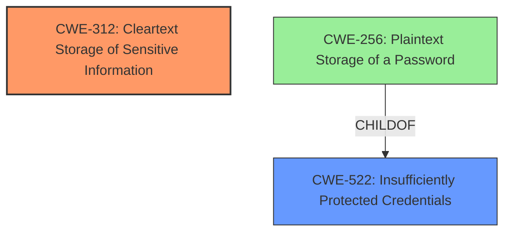

# Raw Analyzer Response for CVE-2024-41156

# Summary
| CWE ID | CWE Name | Confidence | CWE Abstraction Level | CWE Vulnerability Mapping Label | CWE-Vulnerability Mapping Notes |
|---|---|---|---|---|---|
| CWE-312 | Cleartext Storage of Sensitive Information | 0.9 | Base | Allowed | Primary CWE. The profile files are extracted in plain text. |
| CWE-522 | Insufficiently Protected Credentials | 0.6 | Class | Allowed-with-Review | Secondary CWE. Although authenticated users are required, the profile files are extracted in plain-text. |

## Evidence and Confidence

*   **Confidence Score:** 0.8
*   **Evidence Strength:** MEDIUM

## Relationship Analysis
The primary relationship identified is that CWE-312 [CWE-312: Cleartext Storage of Sensitive Information] is a base CWE, while CWE-522 [CWE-522: Insufficiently Protected Credentials] is a class CWE. CWE-256 [CWE-256: Plaintext Storage of a Password] is a child of CWE-522 [CWE-522: Insufficiently Protected Credentials]. CWE-312 [CWE-312: Cleartext Storage of Sensitive Information] describes the **root cause** of the vulnerability, which is the storage of sensitive information in cleartext.

## Vulnerability Chain
The vulnerability chain starts with the **Cleartext Storage of Sensitive Information** (CWE-312), which leads to potential exposure of sensitive configuration information. While authenticated users are required to export the profile files, the fact that they are stored in plain text negates the security benefit of authentication.

## Summary of Analysis
The primary weakness is the **storage of sensitive information in cleartext** (CWE-312). This is directly supported by the vulnerability description: "Profile files from TRO600 series radios are extracted in plain-text and encrypted file formats." The retriever results also list CWE-312 [CWE-312: Cleartext Storage of Sensitive Information] with a high score, and the description matches the vulnerability. While authentication is required, the **insufficient protection of credentials** (CWE-522) due to the cleartext storage is a secondary concern.

Other CWEs Considered:

*   CWE-532 [CWE-532: Insertion of Sensitive Information into Log File]: This was considered because profile files provide potential attackers valuable configuration information about the Tropos network, but the description does not indicate it is logged, so it was not used.
*   CWE-256 [CWE-256: Plaintext Storage of a Password] and CWE-257 [CWE-257: Storing Passwords in a Recoverable Format]: These were not chosen because the vulnerability description refers to the entire profile file being in plaintext, not just passwords.
*   CWE-321 [CWE-321: Use of Hard-coded Cryptographic Key]: Not applicable as there is no mention of cryptographic keys in the description.
*   CWE-59 [CWE-59: Improper Link Resolution Before File Access ('Link Following')], CWE-639 [CWE-639: Authorization Bypass Through User-Controlled Key], CWE-276 [CWE-276: Incorrect Default Permissions], CWE-306 [CWE-306: Missing Authentication for Critical Function]: Not applicable, as they do not align with the vulnerability description.

The chosen CWEs are at the optimal level of specificity. CWE-312 [CWE-312: Cleartext Storage of Sensitive Information] accurately captures the root cause, and CWE-522 [CWE-522: Insufficiently Protected Credentials] represents a secondary aspect related to credential protection.