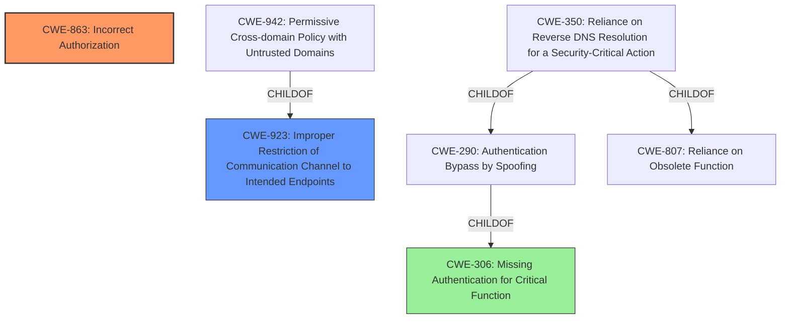

# Enhanced Analysis for CVE-2024-41162

# Summary
| CWE ID    | CWE Name                                                        | Confidence | CWE Abstraction Level | CWE Vulnerability Mapping Label | CWE-Vulnerability Mapping Notes |
| :---------- | :-------------------------------------------------------------- | :--------- | :-------------------- | :------------------------------ | :------------------------------ |
| CWE-863     | Incorrect Authorization (Primary CWE)                           | 0.9        | Class                 | Allowed-with-Review             |                                 |
| CWE-923     | Improper Restriction of Communication Channel to Intended Endpoints | 0.7        | Class                 | Allowed-with-Review             | Secondary Candidate               |

## Evidence and Confidence

*   **Confidence Score:** 0.9
*   **Evidence Strength:** MEDIUM

## Relationship Analysis
The primary CWE is CWE-863, "Incorrect Authorization," which is a Class-level CWE. Several other CWEs were considered, including CWE-923, "Improper Restriction of Communication Channel to Intended Endpoints" and CWE-306, "Missing Authentication for Critical Function". The decision to use CWE-863 was based on the presence of an authorization check that was incorrectly performed, rather than a complete lack of authorization or a missing authentication step. While CWE-923 relates to communication channels, CWE-863 directly addresses the authorization **rootcause** of the vulnerability where a remote user could modify local channels due to **improper access control**.



## Vulnerability Chain
The vulnerability chain starts with **improper access control** (CWE-863), which allows a malicious remote user to modify local channels. This modification leads to the impact of making a local channel read-only for legitimate users.

## Summary of Analysis
The initial analysis focused on identifying the **rootcause** of the vulnerability, which is **improper access control**. The vulnerability description clearly states that the system fails to disallow modification of local channels by a remote user, indicating an authorization issue.

The Retriever Results suggested CWE-923, "Improper Restriction of Communication Channel to Intended Endpoints", but this CWE is more related to ensuring communication occurs with the correct endpoint, which is not the primary issue here. The primary issue is that the authorization check is incorrectly performed.

The "Authentication vs Authorization vs Access Control Guidance" document also led me to choose CWE-863 over CWE-306, as the problem isn't a missing authentication step but rather an incorrect authorization process after authentication.

The final decision is based on the evidence of **improper access control**, which aligns with CWE-863's description of an authorization check being incorrectly performed. The chosen CWE is at the Class level, which is appropriate given the available information.

Relevant CWE Information:

# Enhanced Context (25 CWEs)

## CWE-863: Incorrect Authorization
**Abstraction Level**: Class
**Similarity Score**: 1367.91
**Source**: sparse

**Description**:
The product performs an authorization check when an actor attempts to access a resource or perform an action, but it does not correctly perform the check.

**Mapping Guidance**:
- Usage: Allowed-with-Review
- Rationale: This CWE entry is a Class and might have Base-level children that would be more appropriate


## CWE Relationship Analysis

Current CWEs represent these abstraction levels: .


### Vulnerability Chain Analysis

**Chain starting from CWE-863:**
- 863 (Incorrect Authorization) - ROOT


**Chain starting from CWE-807:**
- 807 (Reliance on Untrusted Inputs in a Security Decision) - ROOT


### CWE Relationship Diagram

```mermaid
graph TD
    classDef primary fill:#f96,stroke:#333,stroke-width:2px
    classDef secondary fill:#69f,stroke:#333
    classDef tertiary fill:#9e9,stroke:#333
```