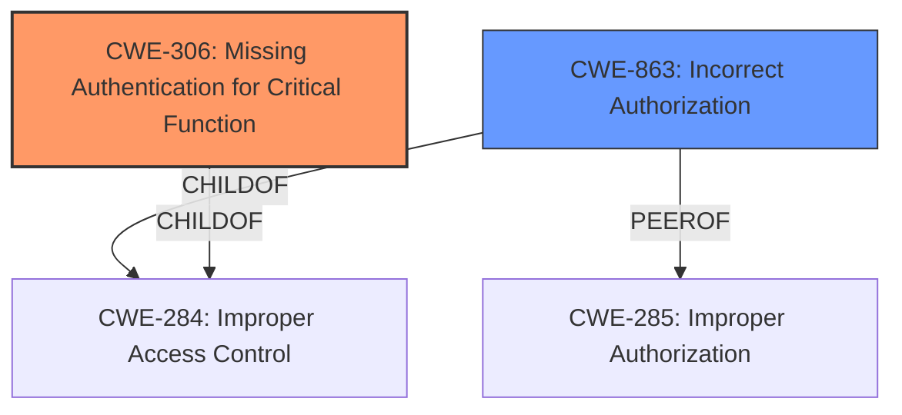

# Raw Analyzer Response for CVE-2024-41197

# Summary
| CWE ID | CWE Name | Confidence | CWE Abstraction Level | CWE Vulnerability Mapping Label | CWE-Vulnerability Mapping Notes |
|---|---|---|---|---|---|
| CWE-306 | Missing Authentication for Critical Function | 0.9 | Base | Primary CWE | Allowed |
| CWE-863 | Incorrect Authorization | 0.7 | Class | Secondary Candidate | Allowed-with-Review |

## Evidence and Confidence

*   **Confidence Score:** 0.8
*   **Evidence Strength:** MEDIUM

## Relationship Analysis
The primary relationship that influenced the decision was the distinction between authentication and authorization. CWE-306 is related to missing authentication, while CWE-863 deals with incorrect authorization. The vulnerability description indicates a bypass of authentication, making CWE-306 the more appropriate primary classification.

## Vulnerability Chain
The vulnerability chain starts with the **missing authentication** (CWE-306) for a critical function, leading to the ability to **bypass access controls** and ultimately **escalate privileges to Administrator**. The root cause is the absence of proper authentication, which allows attackers to manipulate TCP packets and gain unauthorized access.
- The vulnerability chain is: Missing Authentication (CWE-306) -> Authorization Bypass -> Privilege Escalation.

## Summary of Analysis
The initial analysis focused on identifying the root cause of the vulnerability: the ability to bypass authentication and escalate privileges. The CVE description and supporting information clearly indicate that the **INVCLIENT.EXE software lacks proper authentication** mechanisms, allowing attackers to gain unauthorized access by manipulating TCP packets.

The guidance on Authentication vs Authorization vs Access Control was instrumental in distinguishing between CWE-306 (Missing Authentication) and CWE-863 (Incorrect Authorization). The evidence clearly points to a **missing authentication** check, making CWE-306 the primary CWE.

The other CWEs considered were not as directly relevant. While **privilege escalation** is an impact of the vulnerability, the root cause lies in the missing authentication. Therefore, CWEs related to privilege management were deemed secondary.

The selected CWEs are at the optimal level of specificity because they accurately represent the weakness (CWE-306) and a contributing factor/consequence (CWE-863). CWE-306 is a Base level CWE and accurately describes the root cause.

Relevant CWE Information:
- Vulnerability Description Key Phrases:
  - **vector:** crafted TCP packet
  - **product:** Ocuco Innovation - INVCLIENT.EXE
  - **impact:** **authentication bypass**, escalate privileges to Administrator
  - **attacker:** attackers
  - **version:** v2.10.24.5

- CVE Reference Links Content Summary:
  - "This vulnerability allows users to gain unauthorized administrative access to the software **without proper authentication**."
  - "By intercepting and modifying TCP packets, an attacker can manipulate the software's login process and access the Application Manager function **without authorization checks.**"

**CWE-306: Missing Authentication for Critical Function**
- How the vulnerability's details match the CWE's characteristics: The vulnerability involves a lack of authentication for the "Inventory Manager" software, allowing attackers to bypass login requirements by crafting TCP packets. This directly aligns with CWE-306, which describes situations where a product does not perform any authentication for functionality that requires a provable user identity.
- The security implications and potential impact: Without authentication, unauthorized users can access sensitive functions and data, leading to potential data breaches, manipulation, and other security risks. In this case, attackers can escalate privileges to Administrator, gaining full control over the software.
- Any parent-child relationships or chain patterns that influenced your mapping: CWE-306 is a child of CWE-284 (Improper Access Control), but is more specific because it directly addresses the lack of authentication.
- Whether the weakness is primary or secondary in the vulnerability: This is the primary weakness, as the lack of authentication is the root cause of the vulnerability.
- How the official MITRE mapping guidance influenced your decision: The MITRE mapping guidance for Authentication vs Authorization vs Access Control specifically highlights CWE-306 for cases where no identity validation is enforced for sensitive functionality.

**CWE-863: Incorrect Authorization**
- How the vulnerability's details match the CWE's characteristics: While the primary issue is missing authentication, the description also mentions accessing the "Application Manager function without authorization checks." This suggests that even if authentication were present, the authorization checks might be insufficient or bypassed. Therefore, CWE-863 is a potential secondary contributing factor.
- The security implications and potential impact: If authorization checks are incorrect, even authenticated users may be able to access resources or perform actions beyond their intended privileges.
- Any parent-child relationships or chain patterns that influenced your mapping: CWE-863 is a child of CWE-284 (Improper Access Control).
- Whether the weakness is primary or secondary in the vulnerability: This is a secondary weakness, as it contributes to the overall impact of unauthorized access.
- How the official MITRE mapping guidance influenced your decision: The MITRE mapping guidance suggests using CWE-863 when the application checks authorization, but does it incorrectly. In this case, it's not clear if authorization checks exist, but the bypass suggests a potential flaw in authorization as well.

**CWEs considered but not used:**
- CWE-285 (Improper Authorization): Considered, but less specific than CWE-863, which implies a flawed authorization check.
- CWE-266 (Incorrect Privilege Assignment): Considered, but privilege assignment is a downstream effect of the authentication bypass, not the root cause.
- CWE-269 (Improper Privilege Management): Considered, but the vulnerability is more about the missing authentication than the management of privileges.
- CWE-20 (Improper Input Validation): Input validation could be a contributing factor, but the primary issue is the missing authentication.
- CWE-120 (Buffer Copy without Checking Size of Input ('Classic Buffer Overflow')): The description mentions manipulating TCP packets, which might suggest a buffer overflow. However, this is not the primary weakness, and there is no direct evidence of a buffer overflow vulnerability.