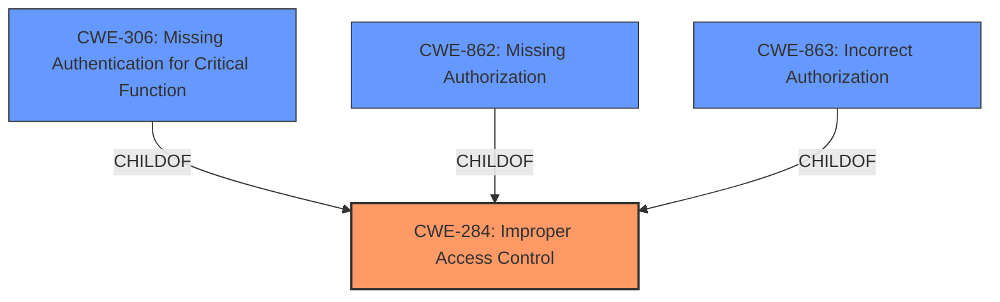

# Analysis Report for CVE-2024-41243

# Vulnerability Analysis Report: CVE-2024-41243

## Description

An **Incorrect Access Control** vulnerability was found in /smsa/view_marks.php in Kashipara Responsive School Management System v3.2.0, which allows remote unauthenticated attackers to view MARKS details.

## Vulnerability Description Key Phrases

- **Rootcause:** Incorrect Access Control
- **Impact:** view MARKS details
- **Attacker:** remote unauthenticated attackers
- **Product:** Kashipara Responsive School Management System
- **Version:** v3.2.0
- **Component:** /smsa/view_marks.php

## Analysis (with Relationship Data)

# Summary
| CWE ID   | CWE Name                                                           | Confidence | CWE Abstraction Level | CWE Vulnerability Mapping Label | CWE-Vulnerability Mapping Notes |
| :-------- | :----------------------------------------------------------------- | :--------- | :---------------------- | :------------------------------ | :----------------------------- |
| CWE-284 | Improper Access Control                                            | 0.75      | Pillar                  |                                 | Discouraged                    |

## Evidence and Confidence

*   **Confidence Score:** 0.75
*   **Evidence Strength:** MEDIUM

## Relationship Analysis
The primary identified weakness is CWE-284, Improper Access Control, which is a high-level category. The analysis considered the relationships between various CWEs, specifically focusing on the hierarchical relationships (ParentOf, ChildOf) and chain relationships (CanPrecede, CanFollow). Given the description indicates **Incorrect Access Control** without specifying whether it's an authentication or authorization issue, the high-level CWE-284 is the most suitable. Alternatives like CWE-306 (Missing Authentication) or CWE-862 (Missing Authorization) would be more specific, but the available information does not definitively point to either. The mermaid diagram illustrates this relationship.



## Vulnerability Chain
The vulnerability chain begins with **Incorrect Access Control** (CWE-284). The impact is that remote unauthenticated attackers can view MARKS details. The missing link here is whether authentication or authorization is the issue. Therefore, we can map this as:
CWE-284 (Improper Access Control) -> Impact: View MARKS Details

## Summary of Analysis
The initial analysis identified a vulnerability related to **Incorrect Access Control** in Kashipara Responsive School Management System v3.2.0. The primary challenge was to pinpoint the most accurate CWE based on the limited information provided. The selection of CWE-284 is heavily influenced by the "Authentication vs Authorization vs Access Control Guidance", because the root cause is listed as **Incorrect Access Control** without specifically identifying whether the problem lies in authentication or authorization. The guidance states that CWE-284 should be reserved for general access control issues when it’s unclear whether the issue lies in authn or authz.

The evidence for this decision comes directly from the "Vulnerability Description Key Phrases", which identifies **Incorrect Access Control** as the root cause. Further, the "CVE Reference Links Content Summary" indicates broken access control, supporting this assessment.

The graph relationships influenced the decision by highlighting the hierarchical relationship between CWE-284 and more specific CWEs like CWE-306, CWE-862, and CWE-863. However, without more specific evidence, choosing a more specific child CWE would not be justified.

The selected CWE is at the optimal level of specificity given the available evidence. While more specific CWEs might be applicable, the current description does not provide enough detail to confidently select one. The confidence score reflects this uncertainty.

Relevant CWE Information:
- CWE-284: Improper Access Control
- CWE-306: Missing Authentication for Critical Function
- CWE-425: Direct Request ('Forced Browsing')
- CWE-639: Authorization Bypass Through User-Controlled Key
- CWE-285: Improper Authorization
- CWE-287: Improper Authentication
- CWE-1390: Weak Authentication
- CWE-863: Incorrect Authorization
- CWE-89: Improper Neutralization of Special Elements used in an SQL Command ('SQL Injection')
- CWE-471: Modification of Assumed-Immutable Data (MAID)


## CWE Relationship Analysis

Current CWEs represent these abstraction levels: .


### Vulnerability Chain Analysis

**Chain starting from CWE-1390:**
- 1390 (Weak Authentication) - ROOT


**Chain starting from CWE-863:**
- 863 (Incorrect Authorization) - ROOT


### CWE Relationship Diagram

```mermaid
graph TD
    classDef primary fill:#f96,stroke:#333,stroke-width:2px
    classDef secondary fill:#69f,stroke:#333
    classDef tertiary fill:#9e9,stroke:#333
```


*Report generated on 2025-07-13 13:04:17*
