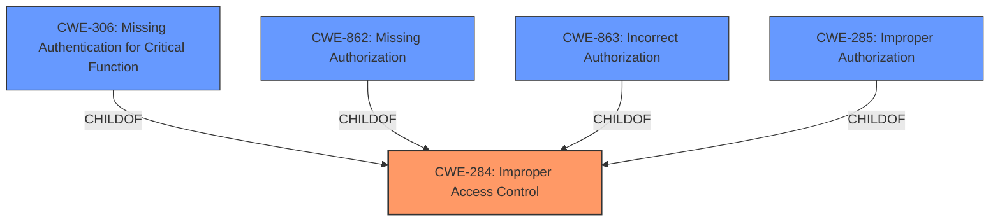

# Enhanced Analysis for CVE-2024-41246

# Summary
| CWE ID | CWE Name | Confidence | CWE Abstraction Level | CWE Vulnerability Mapping Label | CWE-Vulnerability Mapping Notes |
|---|---|---|---|---|---|
| CWE-284 | Improper Access Control | 0.75 | Pillar | Allowed | Primary CWE. Although discouraged, it is the best high-level match because the root cause is simply described as "**incorrect access control**." More specific CWEs require more detailed root cause information which is not available. |

## Evidence and Confidence

*   **Confidence Score:** 0.75
*   **Evidence Strength:** LOW

## Relationship Analysis
The primary relationship that influenced the decision was the parent-child relationship. CWE-284 is a parent CWE (Pillar) of several more specific CWEs like CWE-306, CWE-862, CWE-863, and CWE-285. However, due to the limited information in the vulnerability description, it's difficult to pinpoint the exact cause of the **incorrect access control**. Hence, the broader CWE-284 is chosen.



## Vulnerability Chain
The vulnerability chain here is simple: **incorrect access control** (CWE-284) leads to the ability for remote unauthenticated attackers to view the administrator dashboard.

## Summary of Analysis
The initial assessment considered more specific CWEs like CWE-306 (Missing Authentication for Critical Function), CWE-862 (Missing Authorization), and CWE-863 (Incorrect Authorization). However, the vulnerability description only mentions "**incorrect access control**" without providing specific details about whether the issue is related to authentication, authorization, or some other aspect of access control. Due to this lack of detail, I am selecting the broader CWE-284.

The decision is heavily based on the limited evidence provided in the vulnerability description. While the retriever results suggest other potential CWEs, the absence of detailed information makes it difficult to confidently choose a more specific CWE.

The selection of CWE-284 is at a high level of abstraction (Pillar) because the available information is insufficient to determine the precise nature of the access control issue.


## CWE Relationship Analysis

Current CWEs represent these abstraction levels: .


### Vulnerability Chain Analysis

**Chain starting from CWE-863:**
- 863 (Incorrect Authorization) - ROOT


**Chain starting from CWE-862:**
- 862 (Missing Authorization) - ROOT


### CWE Relationship Diagram

```mermaid
graph TD
    classDef primary fill:#f96,stroke:#333,stroke-width:2px
    classDef secondary fill:#69f,stroke:#333
    classDef tertiary fill:#9e9,stroke:#333
```