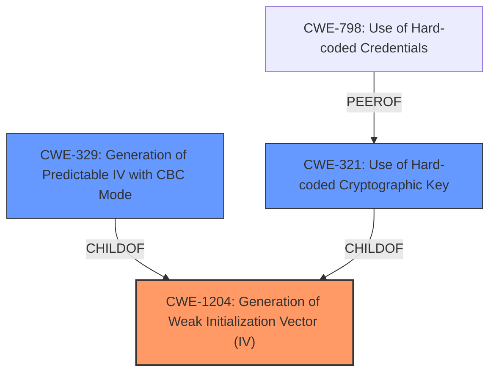

# Analysis for CVE-2024-41260

# Summary
| CWE ID   | CWE Name                                    | Confidence | CWE Abstraction Level | CWE Vulnerability Mapping Label | CWE-Vulnerability Mapping Notes |
| -------- | ------------------------------------------- | ---------- | --------------------- | ------------------------------- | ------------------------------- |
| CWE-1204 | Generation of Weak Initialization Vector (IV) | 0.9        | Base                  | Primary                         | Allowed                         |

## Evidence and Confidence

*   **Confidence Score:** 0.9
*   **Evidence Strength:** HIGH

## Relationship Analysis
The primary CWE identified is CWE-1204, which is a base-level CWE. Other CWEs considered were variants of CWE-1204, such as CWE-329 (Generation of Predictable IV with CBC Mode) and CWE-321 (Use of Hard-coded Cryptographic Key). However, the description indicates a **static initialization vector**, which more broadly falls under the category of weak IV generation rather than specifically predictable IV with CBC mode or a hardcoded cryptographic key. Therefore, CWE-1204 is the most appropriate base CWE.

## Vulnerability Chain
The vulnerability chain is straightforward:
1.  **Root Cause:** **Static Initialization Vector (IV)** (CWE-1204)
2.  Impact: Potential information disclosure due to predictable encryption.

## Summary of Analysis
The primary weakness is the use of a **static initialization vector**, which directly leads to CWE-1204 (Generation of Weak Initialization Vector (IV)). The evidence from the vulnerability description and CVE reference links clearly points to this.

The CVE Reference Links Content Summary states:
-   "The vulnerability stems from the use of a static Initialization Vector (IV) in the `Encrypt` function of the `netbird` software."
-   "Static IV: The encryption process uses a hardcoded, static IV instead of a randomly generated one. This makes the encryption predictable."
-   "CWE-330 (Use of Insufficiently Random Values): This is the identified CWE, highlighting the flaw in generating the encryption IV." However, CWE-330 is a class, and more specific CWEs exist, such as CWE-1204.

CWE-1204 is preferred because it is a Base level CWE and directly addresses the weakness of using a weak IV.

CWE-329 (Generation of Predictable IV with CBC Mode) was considered but is too specific, as the description doesn't explicitly mention CBC mode. CWE-321 (Use of Hard-coded Cryptographic Key) and CWE-798 (Use of Hard-coded Credentials) were also considered but are less relevant as the issue is with the IV, not the cryptographic key itself.

The final selection is CWE-1204, as it is the most accurate and specific representation of the vulnerability based on the provided evidence.