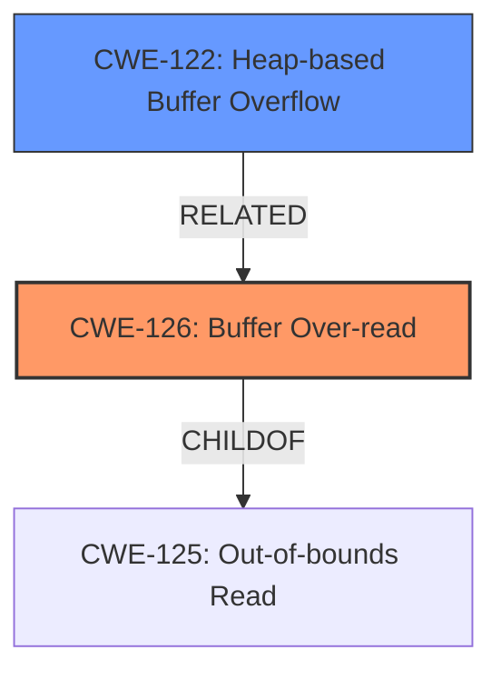

# Analysis for CVE-2024-41445

# Summary
| CWE ID | CWE Name | Confidence | CWE Abstraction Level | CWE Vulnerability Mapping Label | CWE-Vulnerability Mapping Notes |
|---|---|---|---|---|---|
| CWE-126 | Buffer Over-read | 1.0 | Variant | Allowed | Primary CWE. The vulnerability description clearly states "**heap-based buffer overread**". |
| CWE-122 | Heap-based Buffer Overflow | 0.7 | Variant | Allowed | Secondary candidate. While the description mentions "heap-based buffer overread", a buffer overflow could lead to an overread. |

## Evidence and Confidence

*   **Confidence Score:** 0.9
*   **Evidence Strength:** HIGH

## Relationship Analysis
The primary CWE is CWE-126 (Buffer Over-read). While CWE-122 (Heap-based Buffer Overflow) is related and also mentioned in the description, the core issue is the over-read, making CWE-126 more specific.

## Vulnerability Chain
The vulnerability chain starts with a crafted `mdf4` file, leading to a **heap-based buffer overread** when parsed by the `ReadData` function, and potentially resulting in arbitrary memory read and information disclosure.

## Summary of Analysis
The vulnerability is a **heap-based buffer overread** in the MDF library when parsing a crafted `mdf4` file. The primary CWE is CWE-126 (Buffer Over-read), which directly matches the vulnerability description. CWE-122 (Heap-based Buffer Overflow) is a related but less specific CWE. The selection is based on the evidence from the vulnerability description and the retriever results. The "Vulnerability Description Key Phrases" clearly identify the "**heap-based buffer overread**" as the **weakness**. The "CVE Reference Links Content Summary" confirms this, stating "The core issue is a heap buffer overflow, which means the program reads beyond the allocated buffer in the heap."

Relevant CWE Information:

# Enhanced Context (25 CWEs)
The following CWEs were identified as potentially relevant to this vulnerability:

## CWE-126: Buffer Over-read
**Abstraction Level**: Variant
**Similarity Score**: 0.72
**Source**: dense

**Description**:
The product reads from a buffer using buffer access mechanisms such as indexes or pointers that reference memory locations after the targeted buffer.

**Mapping Guidance**:
- Usage: Allowed
- Rationale: This CWE entry is at the Variant level of abstraction, which is a preferred level of abstraction for mapping to the root causes of vulnerabilities.

## CWE-122: Heap-based Buffer Overflow
**Abstraction Level**: Variant
**Similarity Score**: 760.08
**Source**: sparse

**Description**:
A heap overflow condition is a buffer overflow, where the buffer that can be overwritten is allocated in the heap portion of memory, generally meaning that the buffer was allocated using a routine such as malloc().

**Mapping Guidance**:
- Usage: Allowed
- Rationale: This CWE entry is at the Variant level of abstraction, which is a preferred level of abstraction for mapping to the root causes of vulnerabilities.

## CWE-125: Out-of-bounds Read
**Abstraction Level**: Base
**Similarity Score**: 0.69
**Source**: dense

**Description**:
The product reads data past the end, or before the beginning, of the intended buffer.

**Mapping Guidance**:
- Usage: Allowed
- Rationale: This CWE entry is at the Base level of abstraction, which is a preferred level of abstraction for mapping to the root causes of vulnerabilities.

### Considered but not Used
*   CWE-125 (Out-of-bounds Read): While related, CWE-126 (Buffer Over-read) is more specific because it explicitly mentions reading *after* the buffer, whereas CWE-125 is a more general case of reading out of bounds.
*   CWE-127 (Buffer Under-read): This CWE was not chosen because the vulnerability description specifically mentions an *overread*, not an under-read.
*   CWE-1284 (Improper Validation of Specified Quantity in Input): This was not chosen because there's no explicit mention of the input quantity being validated.
*   CWE-190 (Integer Overflow or Wraparound), CWE-193 (Off-by-one Error), CWE-197 (Numeric Truncation Error): These CWEs are not directly related to the **buffer overread** described in the vulnerability.