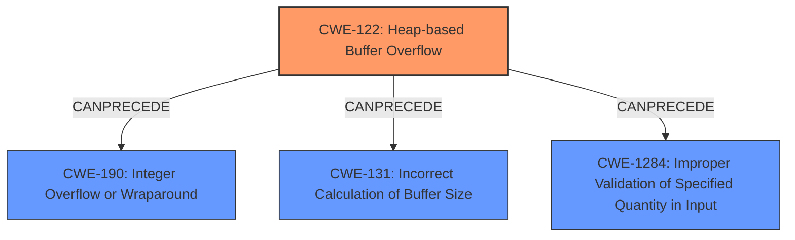

# Enhanced Analysis for CVE-2024-41593

# Summary
| CWE ID  | CWE Name  | Confidence | CWE Abstraction Level | CWE Vulnerability Mapping Label | CWE-Vulnerability Mapping Notes |
|----------------|-------------------------------------------------------------------------|-------------------|-------------------------|-----------------------------------|-------------------------------------|
| **CWE-122** | Heap-based Buffer Overflow | 0.9 | Variant | Allowed | Primary CWE: Root Cause of the vulnerability is a heap-based buffer overflow due to a sign extension issue when handling length arguments, leading to out-of-bounds writes. |
| CWE-190 | Integer Overflow or Wraparound | 0.7 | Base | Allowed | Secondary Candidate:  A signed char variable, var_len, is used to store the length of a domain name fragment. When a domain name fragment's length exceeds 127 (0x7f), it's interpreted as a negative value due to sign extension.|
| CWE-131 | Incorrect Calculation of Buffer Size | 0.6 | Base | Allowed | Secondary Candidate: The product does not correctly calculate the size to be used when allocating a buffer, which could lead to a buffer overflow.|
| CWE-1284 | Improper Validation of Specified Quantity in Input | 0.6 | Base | Allowed | Secondary Candidate: The code fails to properly validate the length of domain name fragments before using them in the `_memcpy()` function.|

## Evidence and Confidence

*   **Confidence Score:** 0.8
*   **Evidence Strength:** HIGH

## Relationship Analysis
The primary weakness is a heap-based buffer overflow (CWE-122), which is a specific type of buffer overflow. This overflow stems from a sign extension issue when handling length arguments passed to the memcpy function. This sign extension can be seen as an integer overflow or wraparound (CWE-190). The incorrect buffer size calculation (CWE-131) and improper validation of the specified quantity in the input (CWE-1284) contribute to this vulnerability. CWE-122 is a variant of CWE-119. The integer overflow can precede the heap overflow. The improper validation can also precede the heap overflow.



## Vulnerability Chain
1.  **Improper Input Validation (CWE-1284):** The application **fails to properly validate the length** of domain name fragments.
2.  **Integer Overflow/Wraparound (CWE-190):** A signed char is used to store the length, leading to a **sign extension** when the length exceeds 127, resulting in a negative value.
3.  **Incorrect Buffer Size Calculation (CWE-131):** The negative length is then used in the `_memcpy` which results in an **incorrect buffer size** calculation.
4.  **Heap-based Buffer Overflow (CWE-122):** The `_memcpy` writes beyond the allocated buffer on the heap due to the incorrect size calculation.
5.  **Arbitrary Code Execution (Impact):** The out-of-bounds write corrupts memory, potentially leading to arbitrary code execution.

CWE-122, Heap-based Buffer Overflow, is the primary weakness as it directly leads to the exploitable condition. CWE-190, CWE-131, and CWE-1284 are contributing factors.

## Summary of Analysis
The initial assessment focused on identifying the **rootcause** and the resulting **weakness**. The evidence strongly suggests a **heap-based buffer overflow (CWE-122)** as the primary weakness, triggered by a **byte sign-extension operation for length argument of _memcpy call**. This aligns with the vulnerability description and the detailed explanation in the CVE reference link content summary. The vulnerability chain shows that the improper input validation (CWE-1284), integer overflow (CWE-190), and incorrect buffer calculation (CWE-131) all lead to the heap-based buffer overflow (CWE-122).

The graph relationships helped to visualize the chain of events, confirming that the integer overflow and improper validation precede the heap overflow. The selection of CWE-122 is at the optimal level of specificity (Variant) as it accurately describes the type of buffer overflow.

The selected CWEs are based on the following evidence:

*   **CWE-122 (Heap-based Buffer Overflow):** "**heap-based buffer overflow**" from the Vulnerability Description Key Phrases and "**_memcpy call, leading to a very large out-of-bounds write that corrupts memory**" and "**Heap-based buffer overflow:** The `_memcpy()` operation writes beyond the allocated buffer on the heap due to the sign extension issue." from the CVE Reference Links Content Summary
*   **CWE-190 (Integer Overflow or Wraparound):** "**A signed `char` variable, `var_len`, is used to store the length of a domain name fragment. When a domain name fragment's length exceeds 127 (0x7f), it's interpreted as a negative value due to sign extension.**" from the CVE Reference Links Content Summary
*   **CWE-131 (Incorrect Calculation of Buffer Size):** The product does not correctly calculate the size to be used when allocating a buffer, which could lead to a buffer overflow.
*   **CWE-1284 (Improper Validation of Specified Quantity in Input):** The code fails to properly validate the length of domain name fragments before using them in the `_memcpy()` function.

CWE-119 was considered but not used because CWE-122 is a more specific variant and better describes the heap-based nature of the buffer overflow.


## CWE Relationship Analysis

Current CWEs represent these abstraction levels: .


### Vulnerability Chain Analysis

**Chain starting from CWE-1284:**
- 1284 (Improper Validation of Specified Quantity in Input) - ROOT


**Chain starting from CWE-131:**
- 131 (Incorrect Calculation of Buffer Size) - ROOT


### CWE Relationship Diagram

```mermaid
graph TD
    classDef primary fill:#f96,stroke:#333,stroke-width:2px
    classDef secondary fill:#69f,stroke:#333
    classDef tertiary fill:#9e9,stroke:#333
```