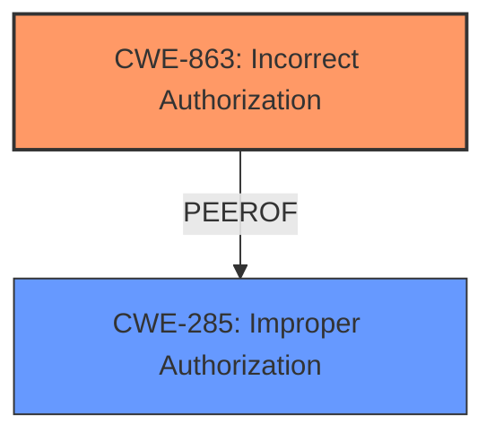

# Analysis for CVE-2024-41666

# Summary
| CWE ID | CWE Name | Confidence | CWE Abstraction Level | CWE Vulnerability Mapping Label | CWE-Vulnerability Mapping Notes |
|---|---|---|---|---|---|
| CWE-863 | Incorrect Authorization | 0.9 | Class | Primary | Allowed-with-Review |
| CWE-285 | Improper Authorization | 0.7 | Class | Secondary | Discouraged |

## Evidence and Confidence

*   **Confidence Score:** 0.9
*   **Evidence Strength:** HIGH

## Relationship Analysis
The primary relationship influencing the selection is that CWE-863 (Incorrect Authorization) is a more specific class-level CWE than the discouraged CWE-285 (Improper Authorization). CWE-863 is chosen as the primary because the vulnerability stems from a flawed authorization check, rather than a complete lack of authorization.

## Vulnerability Chain
The vulnerability chain starts with a user having initial `exec` permissions, then those permissions being revoked. However, due to **incorrect authorization** (CWE-863) during the WebSocket connection lifecycle, the user retains access and can perform unauthorized operations. This leads to potential sensitive information disclosure.

## Summary of Analysis
The analysis is based on the provided evidence, which is quite detailed. The vulnerability lies in the **insufficient permission checks** after the initial WebSocket handshake. Although the user's permissions are revoked, the existing terminal session does not re-validate these permissions, allowing continued access. This aligns well with CWE-863 (Incorrect Authorization), as the authorization check is present, but **incorrectly** implemented, failing to validate permissions on subsequent messages. The fix implements `validatePermissions` function to enforce permissions on each read, implying the previous implementation was flawed.

CWE-285 (Improper Authorization) was considered, but it's a more general case where authorization is either missing or improperly performed. In this case, there's an authorization check, but it's flawed, making CWE-863 a better fit. The decision is also influenced by the MITRE guidance which discourages the use of CWE-285 and suggests more specific CWEs when available.

The selected CWEs are at the optimal level of specificity, as they represent the root cause of the vulnerability based on the available information.

Relevant CWE Information:

# Enhanced Context (2 CWEs)
The following CWEs were identified as potentially relevant to this vulnerability:

## CWE-863: Incorrect Authorization
**Abstraction Level**: Class
**Similarity Score**: 2289.86
**Source**: sparse

**Description**:
The product performs an authorization check when an actor attempts to access a resource or perform an action, but it does not correctly perform the check.

**Mapping Guidance**:
- Usage: Allowed-with-Review
- Rationale: This CWE entry is a Class and might have Base-level children that would be more appropriate

## CWE-285: Improper Authorization
**Abstraction Level**: Class
**Similarity Score**: 2177.84
**Source**: sparse

**Description**:
The product does not perform or incorrectly performs an authorization check when an actor attempts to access a resource or perform an action.

**Mapping Guidance**:
- Usage: Discouraged
- Rationale: CWE-285 is high-level and lower-level CWEs can frequently be used instead. It is a level-1 Class (i.e., a child of a Pillar).