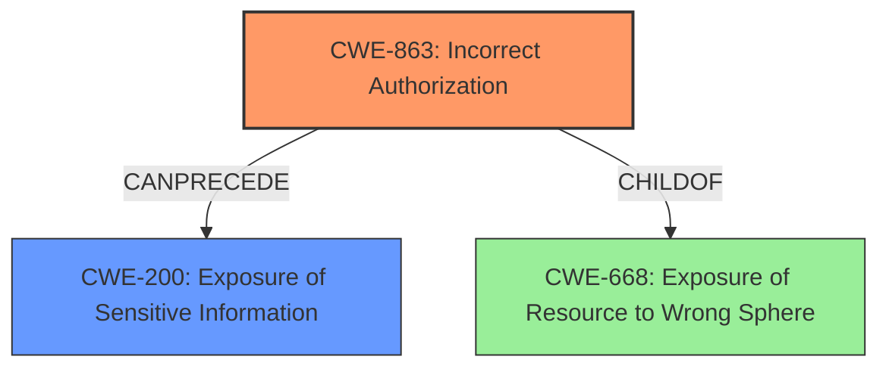

# Analysis Report for CVE-2024-41672

# Vulnerability Analysis Report: CVE-2024-41672

## Description

DuckDB is a SQL database management system. In versions 1.0.0 and prior, content in filesystem is accessible for reading using `sniff_csv`, even with `enable_external_access=false`. This vulnerability provides an attacker with access to filesystem even when access is expected to be disabled and other similar functions do NOT provide access. There seem to be two vectors to this vulnerability. First, access to files that should otherwise not be allowed. Second, the content from a file can be read (e.g. `/etc/hosts`, `proc/self/environ`, etc) even though that doesnt seem to be the intent of the sniff_csv function. A fix for this issue is available in commit c9b7c98aa0e1cd7363fe8bb8543a95f38e980d8a and is expected to be part of version 1.1.0.

## Vulnerability Description Key Phrases

- **Impact:** access to filesystem
- **Product:** DuckDB
- **Version:** 1.0.0 and prior
- **Component:** sniff_csv

## Analysis (with Relationship Data)

# Summary
| CWE ID | CWE Name | Confidence | CWE Abstraction Level | CWE Vulnerability Mapping Label | CWE-Vulnerability Mapping Notes |
|---|---|---|---|---|---|
| CWE-863 | Incorrect Authorization | 0.9 | Class | Allowed-with-Review | Primary CWE. The `sniff_csv` function **incorrectly authorizes** access to files when `enable_external_access` is set to false. |
| CWE-200 | Exposure of Sensitive Information | 0.7 | Class | Allowed | Secondary. This is due to the **impact** of the vulnerability which gives an attacker access to sensitive information. |

## Evidence and Confidence

*   **Confidence Score:** 0.8
*   **Evidence Strength:** HIGH

## Relationship Analysis
The primary CWE is CWE-863, which is a Class-level CWE. There isn't a more specific Base or Variant CWE that fits the description. CWE-863 relates to the product performing authorization checks incorrectly. The secondary CWE is CWE-200 which is a Class-level CWE that indicates there is sensitive information exposed.



## Vulnerability Chain
The vulnerability chain begins with the **incorrect authorization** in `sniff_csv` function (CWE-863), which allows access to the filesystem despite `enable_external_access` being set to false. This leads to **exposure of sensitive information** (CWE-200) through the ability to read arbitrary files.

## Summary of Analysis
The primary weakness is that the `sniff_csv` function **bypasses access controls** which leads to **information disclosure**. This aligns with CWE-863 (Incorrect Authorization), where authorization checks are performed, but incorrectly. The **impact** of the authorization bypass leads to the exposure of sensitive information.

The evidence for this is:
- "The `sniff_csv` function in DuckDB was not respecting the `enable_external_access` configuration setting. Even when external access was disabled, `sniff_csv` could still access and read files from the filesystem." (CVE Reference Links Content Summary)

The CWE-863 is a more accurate and specific representation of the vulnerability than other candidate CWEs (like CWE-306 or CWE-923). While CWE-306 (Missing Authentication for Critical Function) could be considered, the function isn't completely missing authentication/authorization, but is instead doing it incorrectly. Similarly, CWE-923 (Improper Restriction of Communication Channel to Intended Endpoints) doesn't accurately capture the authorization issue.

The selection of CWE-863 is at the appropriate level of specificity because it captures the root cause. A more general CWE like CWE-668 (Exposure of Resource to Wrong Sphere) would not be specific enough.

Relevant CWE Information:

# Enhanced Context (25 CWEs)
The following CWEs were identified as potentially relevant to this vulnerability:

## CWE-212: Improper Removal of Sensitive Information Before Storage or Transfer
**Abstraction Level**: Base
**Similarity Score**: 0.72
**Source**: dense

**Description**:
The product stores, transfers, or shares a resource that contains sensitive information, but it does not properly remove that information before the product makes the resource available to unauthorized actors.

**Mapping Guidance**:
- Usage: Allowed
- Rationale: This CWE entry is at the Base level of abstraction, which is a preferred level of abstraction for mapping to the root causes of vulnerabilities.


## CWE-204: Observable Response Discrepancy
**Abstraction Level**: Base
**Similarity Score**: 0.72
**Source**: dense

**Description**:
The product provides different responses to incoming requests in a way that reveals internal state information to an unauthorized actor outside of the intended control sphere.

**Mapping Guidance**:
- Usage: Allowed
- Rationale: This CWE entry is at the Base level of abstraction, which is a preferred level of abstraction for mapping to the root causes of vulnerabilities.


## CWE-497: Exposure of Sensitive System Information to an Unauthorized Control Sphere
**Abstraction Level**: Base
**Similarity Score**: 0.72
**Source**: dense

**Description**:
The product does not properly prevent sensitive system-level information from being accessed by unauthorized actors who do not have the same level of access to the underlying system as the product does.

**Mapping Guidance**:
- Usage: Allowed
- Rationale: This CWE entry is at the Base level of abstraction, which is a preferred level of abstraction for mapping to the root causes of vulnerabilities.


## CWE-538: Insertion of Sensitive Information into Externally-Accessible File or Directory
**Abstraction Level**: Base
**Similarity Score**: 0.71
**Source**: dense

**Description**:
The product places sensitive information into files or directories that are accessible to actors who are allowed to have access to the files, but not to the sensitive information.

**Mapping Guidance**:
- Usage: Allowed
- Rationale: This CWE entry is at the Base level of abstraction, which is a preferred level of abstraction for mapping to the root causes of vulnerabilities.


## CWE-201: Insertion of Sensitive Information Into Sent Data
**Abstraction Level**: Base
**Similarity Score**: 0.71
**Source**: dense

**Description**:
The code transmits data to another actor, but a portion of the data includes sensitive information that should not be accessible to that actor.

**Mapping Guidance**:
- Usage: Allowed
- Rationale: This CWE entry is at the Base level of abstraction, which is a preferred level of abstraction for mapping to the root causes of vulnerabilities.


## CWE-617: Reachable Assertion
**Abstraction Level**: Base
**Similarity Score**: 0.71
**Source**: dense

**Description**:
The product contains an assert() or similar statement that can be triggered by an attacker, which leads to an application exit or other behavior that is more severe than necessary.

**Mapping Guidance**:
- Usage: Allowed
- Rationale: This CWE entry is at the Base level of abstraction, which is a preferred level of abstraction for mapping to the root causes of vulnerabilities.


## CWE-923: Improper Restriction of Communication Channel to Intended Endpoints
**Abstraction Level**: Class
**Similarity Score**: 0.71
**Source**: dense

**Description**:
The product establishes a communication channel to (or from) an endpoint for privileged or protected operations, but it does not properly ensure that it is communicating with the correct endpoint.

**Mapping Guidance**:
- Usage: Allowed-with-Review
- Rationale: This CWE entry is a Class and might have Base-level children that would be more appropriate


## CWE-319: Cleartext Transmission of Sensitive Information
**Abstraction Level**: Base
**Similarity Score**: 0.70
**Source**: dense

**Description**:
The product transmits sensitive or security-critical data in cleartext in a communication channel that can be sniffed by unauthorized actors.

**Mapping Guidance**:
- Usage: Allowed
- Rationale: This CWE entry is at the Base level of abstraction, which is a preferred level of abstraction for mapping to the root causes of vulnerabilities.


## CWE-668: Exposure of Resource to Wrong Sphere
**Abstraction Level**: Class
**Similarity Score**: 0.70
**Source**: dense

**Description**:
The product exposes a resource to the wrong control sphere, providing unintended actors with inappropriate access to the resource.

**Mapping Guidance**:
- Usage: Discouraged
- Rationale: CWE-668 is high-level and is often misused as a catch-all when lower-level CWE IDs might be applicable. It is sometimes used for low-information vulnerability reports [REF-1287]. It is a level-1 Class (i.e., a child of a Pillar). It is not useful for trend analysis.


## CWE-209: Generation of Error Message Containing Sensitive Information
**Abstraction Level**: Base
**Similarity Score**: 0.70
**Source**: dense

**Description**:
The product generates an error message that includes sensitive information about its environment, users, or associated data.

**Mapping Guidance**:
- Usage: Allowed
- Rationale: This CWE entry is at the Base level of abstraction, which is a preferred level of abstraction for mapping to the root causes of vulnerabilities.


## CWE-923: Improper Restriction of Communication Channel to Intended Endpoints
**Abstraction Level**: Class
**Similarity Score**: 938.74
**Source**: sparse

**Description**:
The product establishes a communication channel to (or from) an endpoint for privileged or protected operations, but


## CWE Relationship Analysis

Current CWEs represent these abstraction levels: .


### Vulnerability Chain Analysis

**Chain starting from CWE-863:**
- 863 (Incorrect Authorization) - ROOT


**Chain starting from CWE-319:**
- 319 (Cleartext Transmission of Sensitive Information) - ROOT


### CWE Relationship Diagram

```mermaid
graph TD
    classDef primary fill:#f96,stroke:#333,stroke-width:2px
    classDef secondary fill:#69f,stroke:#333
    classDef tertiary fill:#9e9,stroke:#333
```


*Report generated on 2025-07-13 13:17:54*
