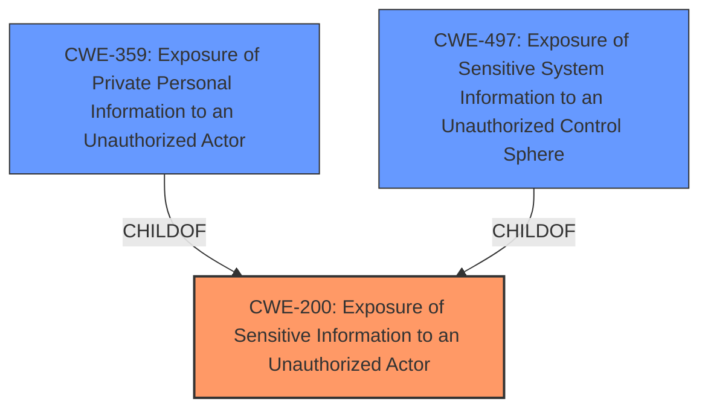

# Raw Analyzer Response for CVE-2024-41701

# Summary
| CWE ID | CWE Name | Confidence | CWE Abstraction Level | CWE Vulnerability Mapping Label | CWE-Vulnerability Mapping Notes |
|---|---|---|---|---|---|
| CWE-200 | Exposure of Sensitive Information to an Unauthorized Actor | 0.75 | Class | Primary | Discouraged: While the description states "Exposure of Sensitive Information to an Unauthorized Actor", it describes the impact rather than the root cause. More information would be needed to identify the root cause. |
| CWE-359 | Exposure of Private Personal Information to an Unauthorized Actor | 0.5 | Base | Secondary Candidate | Allowed: Potentially applicable if the exposed sensitive information is private personal information, but requires further investigation. |
| CWE-497 | Exposure of Sensitive System Information to an Unauthorized Control Sphere | 0.5 | Base | Secondary Candidate | Allowed: Potentially applicable if the exposed sensitive information is system-level information, but requires further investigation. |

## Evidence and Confidence

*   **Confidence Score:** 0.7
*   **Evidence Strength:** LOW

## Relationship Analysis
The primary relationship considered was the hierarchical relationship, particularly the parent-child relationship between CWE-200 (Exposure of Sensitive Information to an Unauthorized Actor) and its more specific children like CWE-359 (Exposure of Private Personal Information to an Unauthorized Actor) and CWE-497 (Exposure of Sensitive System Information to an Unauthorized Control Sphere). The decision to primarily map to CWE-200 was influenced by the lack of specific details in the description, making a more precise mapping challenging. However, the possibility of CWE-359 and CWE-497 being more accurate representations is acknowledged, pending further investigation.

## Vulnerability Chain
The vulnerability chain is relatively simple, focusing on the exposure of sensitive information.
  - The root cause is currently unknown due to lack of information.
  - The impact is the **exposure of sensitive information to an unauthorized actor**.

## Summary of Analysis
The initial analysis focused on identifying the most appropriate CWE based on the provided vulnerability description, **Vulnerability Description Key Phrases**, and **Retriever Results**. The vulnerability description indicates an **impact** of "Exposure of Sensitive Information to an Unauthorized Actor."

The primary challenge was the high-level nature of the description, which lacks specific details about the root cause or the type of sensitive information exposed. As a result, CWE-200 (Exposure of Sensitive Information to an Unauthorized Actor) was selected as the primary CWE. However, the "Discouraged" usage for CWE-200 was noted, since it is better to identify the root cause when possible.

The retriever results suggested more specific CWEs, such as CWE-359 (Exposure of Private Personal Information to an Unauthorized Actor) and CWE-497 (Exposure of Sensitive System Information to an Unauthorized Control Sphere). These were considered as secondary candidates but could not be definitively selected without additional information.

The final decision to map primarily to CWE-200 reflects the limited evidence available. While more specific CWEs might be applicable, they cannot be confirmed based on the current description. Further investigation is needed to determine the underlying cause of the exposure and the specific type of information involved.

The selection of CWE-200 is at a Class level of abstraction because the information provided does not allow for selection of a more specific Base or Variant level CWE.