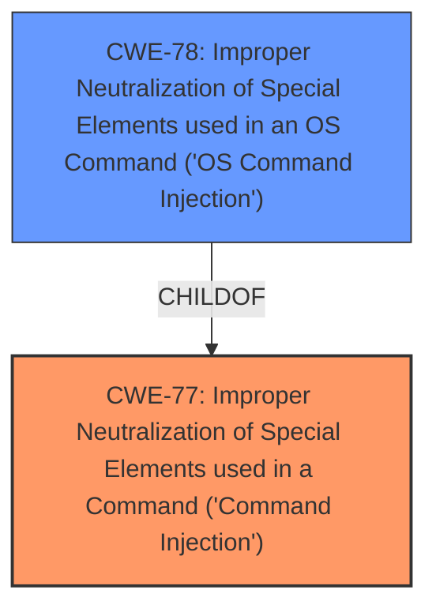

# Raw Analyzer Response for CVE-2024-41714

# Summary
| CWE ID | CWE Name | Confidence | CWE Abstraction Level | CWE Vulnerability Mapping Label | CWE-Vulnerability Mapping Notes |
|---|---|---|---|---|---|
| CWE-77 | Improper Neutralization of Special Elements used in a Command ('Command Injection') | 1.0 | Class | Primary | Allowed-with-Review |
| CWE-78 | Improper Neutralization of Special Elements used in an OS Command ('OS Command Injection') | 0.7 | Secondary | Allowed |  |

## Evidence and Confidence

*   **Confidence Score:** 0.9
*   **Evidence Strength:** HIGH

## Relationship Analysis
The primary relationship influencing the decision is the hierarchical relationship between CWE-77 and CWE-78. CWE-78 is a base variant of CWE-77, specifically focusing on OS commands. The vulnerability description mentions "command injection" and execution of "arbitrary commands with elevated privileges," which aligns well with CWE-77. The description doesn't explicitly mention the commands are OS commands, so CWE-77 is preferred although CWE-78 is related and also applicable.

## Vulnerability Chain
The chain of events is as follows:
1.  **Root Cause:** **Insufficient parameter sanitization**.
2.  **Weakness:** **Command injection**.
3.  **Impact:** Execution of arbitrary commands with elevated privileges.

The vulnerability chain starts with **insufficient parameter sanitization** which leads to the **command injection** vulnerability, ultimately allowing an attacker to execute arbitrary commands.

## Summary of Analysis
The analysis strongly supports CWE-77 as the primary CWE. The vulnerability description explicitly mentions "command injection" and **insufficient parameter sanitization**, which are key indicators for this CWE. The CVE Reference Links Content Summary also confirms the presence of a command injection vulnerability. While CWE-78 (OS Command Injection) is a valid candidate, the evidence doesn't specifically state that the injected commands are OS commands, making CWE-77 a more appropriate, albeit slightly more general, classification.

The decision is based on direct evidence from the vulnerability description: "A vulnerability...could allow an authenticated attacker to conduct a **command injection** attack, due to **insufficient parameter sanitization**."

The graph relationships influenced the selection by highlighting the connection between CWE-77 and its child, CWE-78. While both are relevant, the lack of specific evidence pointing to OS commands favored the more general CWE-77.

CWE-77 is at the Class level of abstraction, which is appropriate given the available information. A more specific (Base or Variant) CWE could be considered if more details about the command injection mechanism were available.

Relevant CWE Information:
# Enhanced Context (25 CWEs)
The following CWEs were identified as potentially relevant to this vulnerability:

## CWE-267: Privilege Defined With Unsafe Actions
**Abstraction Level**: Base
**Similarity Score**: 0.78
**Source**: dense

**Description**:
A particular privilege, role, capability, or right can be used to perform unsafe actions that were not intended, even when it is assigned to the correct entity.

**Mapping Guidance**:
- Usage: Allowed
- Rationale: This CWE entry is at the Base level of abstraction, which is a preferred level of abstraction for mapping to the root causes of vulnerabilities.

*Rationale for not selecting*: This CWE focuses on unsafe actions associated with privileges, which is not the primary issue. The core vulnerability lies in the command injection itself.

## CWE-74: Improper Neutralization of Special Elements in Output Used by a Downstream Component ('Injection')
**Abstraction Level**: Class
**Similarity Score**: 0.78
**Source**: dense

**Description**:
The product constructs all or part of a command, data structure, or record using externally-influenced input from an upstream component, but it does not neutralize or incorrectly neutralizes special elements that could modify how it is parsed or interpreted when it is sent to a downstream component.

**Mapping Guidance**:
- Usage: Discouraged
- Rationale: CWE-74 is high-level and often misused when lower-level weaknesses are more appropriate.

*Rationale for not selecting*: This CWE is a more generic "Injection" class. CWE-77 (Command Injection) is more specific and relevant.

## CWE-266: Incorrect Privilege Assignment
**Abstraction Level**: Base
**Similarity Score**: 0.78
**Source**: dense

**Description**:
A product incorrectly assigns a privilege to a particular actor, creating an unintended sphere of control for that actor.

**Mapping Guidance**:
- Usage: Allowed
- Rationale: This CWE entry is at the Base level of abstraction, which is a preferred level of abstraction for mapping to the root causes of vulnerabilities.

*Rationale for not selecting*: The vulnerability is not about incorrect privilege assignment but rather about the ability to inject commands due to **insufficient parameter sanitization**.

## CWE-274: Improper Handling of Insufficient Privileges
**Abstraction Level**: Base
**Similarity Score**: 0.77
**Source**: dense

**Description**:
The product does not handle or incorrectly handles when it has insufficient privileges to perform an operation, leading to resultant weaknesses.

**Mapping Guidance**:
- Usage: Discouraged
- Rationale: This CWE entry could be deprecated in a future version of CWE.

*Rationale for not selecting*: This is not about handling insufficient privileges, but about injecting commands.

## CWE-280: Improper Handling of Insufficient Permissions or Privileges
**Abstraction Level**: Base
**Similarity Score**: 0.77
**Source**: dense

**Description**:
The product does not handle or incorrectly handles when it has insufficient privileges to access resources or functionality as specified by their permissions. This may cause it to follow unexpected code paths that may leave the product in an invalid state.

**Mapping Guidance**:
- Usage: Allowed
- Rationale: This CWE entry is at the Base level of abstraction, which is a preferred level of abstraction for mapping to the root causes of vulnerabilities.

*Rationale for not selecting*: Similar to CWE-274, this is not directly related to the command injection vulnerability.

## CWE-41: Improper Resolution of Path Equivalence
**Abstraction Level**: Base
**Similarity Score**: 0.77
**Source**: dense

**Description**:
The product is vulnerable to file system contents disclosure through path equivalence. Path equivalence involves the use of special characters in file and directory names. The associated manipulations are intended to generate multiple names for the same object.

**Mapping Guidance**:
- Usage: Allowed
- Rationale: This CWE entry is at the Base level of abstraction, which is a preferred level of abstraction for mapping to the root causes of vulnerabilities.

*Rationale for not selecting*: This CWE is specific to path equivalence issues, which is not the core vulnerability.

## CWE-472: External Control of Assumed-Immutable Web Parameter
**Abstraction Level**: Base
**Similarity Score**: 0.77
**Source**: dense

**Description**:
The web application does not sufficiently verify inputs that are assumed to be immutable but are actually externally controllable, such as hidden form fields.

**Mapping Guidance**:
- Usage: Allowed
- Rationale: This CWE entry is at the Base level of abstraction, which is a preferred level of abstraction for mapping to the root causes of vulnerabilities.

*Rationale for not selecting*: While the vulnerability is in the Web Interface component, this CWE is focused on parameters that are assumed immutable. The problem is not immutability, it's the lack of sanitization of parameters leading to command injection.

## CWE-138: Improper Neutralization of Special Elements
**Abstraction Level**: Class
**Similarity Score**: 0.77
**Source**: dense

**Description**:
The product receives input from an upstream component, but it does not neutralize or incorrectly neutralizes special elements that could be interpreted as control elements or syntactic markers when they are sent to a downstream component.

**Mapping Guidance**:
- Usage: Discouraged
- Rationale: This CWE entry is a level-1 Class (i.e., a child of a Pillar). It might have lower-level children that would be more appropriate

*Rationale for not selecting*: While generally applicable, CWE-77 (Command Injection) is a more specific and accurate fit.

## CWE-668: Exposure of Resource to Wrong Sphere
**Abstraction Level**: Class
**Similarity Score**: 0.76
**Source**: dense

**Description**:
The product exposes a resource to the wrong control sphere, providing unintended actors with inappropriate access to the resource.

**Mapping Guidance**:
- Usage: Discouraged
- Rationale: CWE-668 is high-level and is often misused as a catch-all when lower-level CWE IDs might be applicable. It is sometimes used for low-information vulnerability reports [REF-1287]. It is a level-