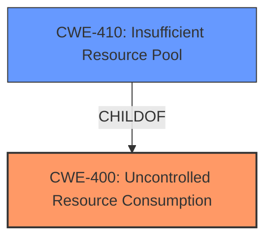

# Raw Analyzer Response for CVE-2024-41727

# Summary
| CWE ID | CWE Name | Confidence | CWE Abstraction Level | CWE Vulnerability Mapping Label | CWE-Vulnerability Mapping Notes |
|---|---|---|---|---|---|
| CWE-400 | Uncontrolled Resource Consumption | 0.7 | Class | Allowed-with-Review | Primary CWE |
| CWE-410 | Insufficient Resource Pool | 0.5 | Base | Allowed | Secondary Candidate |

## Evidence and Confidence

*   **Confidence Score:** 0.7
*   **Evidence Strength:** LOW

## Relationship Analysis
The primary relationship considered was the hierarchical relationship between CWE-400 and potential child CWEs, especially CWE-410. CWE-400 is a Class-level CWE, while CWE-410 is a Base-level CWE, providing more specific details. The description indicates an increase in memory resource utilization due to undisclosed traffic, pointing towards resource consumption issues. While the information is limited, the resource pool might be insufficient to handle the increased demand, linking CWE-410 as a more granular alternative.

## Vulnerability Chain
The vulnerability chain starts with undisclosed traffic which leads to increased memory resource utilization. The root cause is that the system does not properly handle the resource consumption, leading to a potential exhaustion of resources.

Undisclosed Traffic -> **Uncontrolled Resource Consumption** -> Increased Memory Utilization

## Summary of Analysis
The initial assessment focused on identifying the root cause of the vulnerability described. The vulnerability description mentions that undisclosed traffic can cause an increase in memory resource utilization. This points to a potential problem with how the system manages its resources when handling specific types of traffic.

Given the limited information, CWE-400 (Uncontrolled Resource Consumption) appears to be the most appropriate primary CWE. It aligns with the general description of resource utilization issues.

CWE-410 (Insufficient Resource Pool) was considered as a more specific alternative. However, without further evidence indicating that the resource pool's size is inherently insufficient, CWE-400 is chosen as the primary weakness.

The evidence is weak because the CVE summary says "UNRELATED". Therefore a confidence level of 0.7 is assigned.

Relevant CWE Information:

# Enhanced Context (25 CWEs)
The following CWEs were identified as potentially relevant to this vulnerability:

## CWE-400: Uncontrolled Resource Consumption
**Abstraction Level**: Class
**Similarity Score**: 0.74
**Source**: dense

**Description**:
The product does not properly control the allocation and maintenance of a limited resource, thereby enabling an actor to influence the amount of resources consumed, eventually leading to the exhaustion of available resources.

**Mapping Guidance**:
- Usage: Discouraged
- Rationale: CWE-400 is intended for incorrect behaviors in which the product is expected to track and restrict how many resources it consumes, but CWE-400 is often misused because it is conflated with the "technical impact" of vulnerabilities in which resource consumption occurs. It is sometimes used for low-information vulnerability reports. It is a level-1 Class (i.e., a child of a Pillar).

*Technical Explanation:* The vulnerability description states that undisclosed traffic causes an increase in memory resource utilization. This aligns directly with CWE-400, where the product does not properly control the allocation and maintenance of a limited resource (memory).
*Security Implications:* An attacker could potentially exploit this by sending large amounts of undisclosed traffic, leading to denial of service due to memory exhaustion.
*Relationship Analysis:* CWE-400 is a class-level CWE.

## CWE-410: Insufficient Resource Pool
**Abstraction Level**: Base
**Similarity Score**: 0.72
**Source**: dense

**Description**:
The product's resource pool is not large enough to handle peak demand, which allows an attacker to prevent others from accessing the resource by using a (relatively) large number of requests for resources.

**Mapping Guidance**:
- Usage: Allowed
- Rationale: This CWE entry is at the Base level of abstraction, which is a preferred level of abstraction for mapping to the root causes of vulnerabilities.

*Technical Explanation:* The product's resource pool is not large enough to handle peak demand triggered by the "undisclosed traffic".
*Security Implications:* An attacker could prevent others from accessing the resource by using a (relatively) large number of requests for resources.
*Relationship Analysis:* CWE-410 is a base-level CWE and a child of CWE-664 (Improper Control of Resource Consumption). It can also be related to CWE-400.
*Why Not Chosen as Primary:* While a possibility, there isn't enough evidence to confirm the root cause is specifically an insufficient resource pool versus a general failure to control resource consumption.

## Other CWEs Considered:

*   **CWE-20 (Improper Input Validation):** While improper input validation could be a contributing factor, the primary issue appears to be resource consumption rather than input validation. Therefore, CWE-20 is not selected.
*   **CWE-119 (Improper Restriction of Operations within the Bounds of a Memory Buffer):** There's no indication of memory buffer issues in the description, so this is not applicable.
*   **CWE-789 (Memory Allocation with Excessive Size Value):** There's no indication of a direct memory allocation issue with excessive size, making this less relevant than CWE-400.
*   **CWE-1284 (Improper Validation of Specified Quantity in Input):** There is not enough evidence to suggest that the quantity of input isn't validated, so this is not applicable.