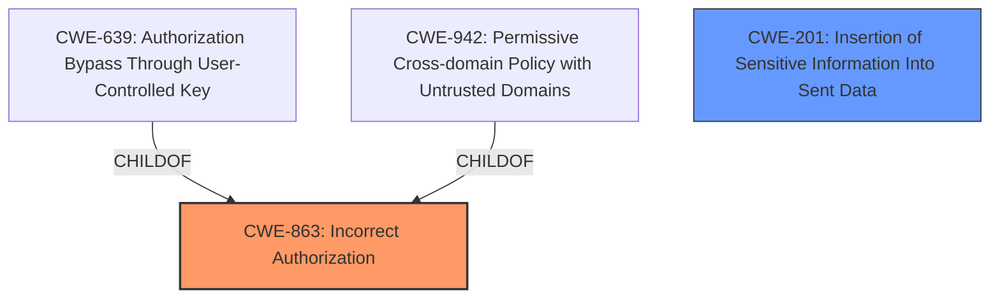

# Analysis Report for CVE-2024-41949

# Vulnerability Analysis Report: CVE-2024-41949

## Description

biscuit-rust is the Rust implementation of Biscuit, an authentication and authorization token for microservices architectures. Third-party blocks can be generated without transferring the whole token to the third-party authority. Instead, a ThirdPartyBlock request can be sent, providing only the necessary info to generate a third-party block and to sign it, which includes the public key of the previous block (used in the signature) and the public keys part of the token symbol table (for public key interning in datalog expressions). A third-part block request forged by a malicious user can trick the third-party authority into generating datalog trusting the wrong keypair.

## Vulnerability Description Key Phrases

- **Weakness:** generating Third-party blocks without transferring the whole token
- **Impact:** generate datalog trusting the wrong keypair
- **Vector:** ThirdPartyBlock request forgery
- **Attacker:** malicious user
- **Product:** biscuit-rust

## Analysis (with Relationship Data)

# Summary
| CWE ID  | CWE Name                                                              | Confidence | CWE Abstraction Level | CWE Vulnerability Mapping Label | CWE-Vulnerability Mapping Notes |
| :-------- | :-------------------------------------------------------------------- | :--------- | :-------------------- | :------------------------------ | :------------------------------ |
| CWE-863   | Incorrect Authorization                                               | 0.85       | Class                 | Primary                         | Allowed-with-Review           |
| CWE-201   | Insertion of Sensitive Information Into Sent Data                       | 0.65       | Base                  | Secondary                       | Allowed                       |

## Evidence and Confidence

*   **Confidence Score:** 0.75
*   **Evidence Strength:** MEDIUM

## Relationship Analysis
The primary CWE is CWE-863 (Incorrect Authorization), which is a class-level CWE. It is related to its child CWEs like CWE-639 (Authorization Bypass Through User-Controlled Key) and CWE-942 (Permissive Cross-domain Policy with Untrusted Domains). The secondary CWE is CWE-201 (Insertion of Sensitive Information Into Sent Data), which is at the Base level. The relationship between authorization and information handling influenced the selection, highlighting the importance of proper authorization in this context.



## Vulnerability Chain
The vulnerability chain starts with the **incorrect handling of public keys** in the `ThirdPartyBlockRequest`, leading to an **incorrect authorization** decision by the third-party authority. The ability to **forge requests** allows a malicious user to **insert incorrect keys** into the symbol table, resulting in the generation of a datalog rule that trusts the wrong keypair. This ultimately leads to **bypassing intended access control** and **unauthorized access to resources**.

## Summary of Analysis
The initial analysis focused on the ability of a malicious user to **forge ThirdPartyBlock requests** and **trick a third-party authority into generating datalog trusting the wrong keypair**. The primary concern is related to **incorrect authorization**, as the third-party authority is making an authorization decision based on falsified data.

The evidence supporting this analysis includes:
- "A third-part block request forged by a malicious user can trick the third-party authority into generating datalog trusting the wrong keypair."
- "The primary weakness is the lack of proper validation or integrity checks on the `publicKeys` field within the `ThirdPartyBlockRequest`."
- "By manipulating the request, the holder may bypass a required authorization."

Based on the evidence, CWE-863 (Incorrect Authorization) is the most appropriate primary CWE because the vulnerability's core lies in the third-party authority making an incorrect authorization decision due to the forged public keys. CWE-201 (Insertion of Sensitive Information Into Sent Data) is a secondary CWE since the vulnerability involves the insertion of falsified public keys into the symbol table. Both CWEs are at an appropriate level of specificity, with CWE-863 being a Class and CWE-201 being a Base.

Relevant CWE Information:

# Enhanced Context (25 CWEs)
The following CWEs were identified as potentially relevant to this vulnerability:

## CWE-330: Use of Insufficiently Random Values
**Abstraction Level**: Class
**Similarity Score**: 0.76
**Source**: dense

**Description**:
The product uses insufficiently random numbers or values in a security context that depends on unpredictable numbers.

**Mapping Guidance**:
- Usage: Discouraged
- Rationale: This CWE entry is a level-1 Class (i.e., a child of a Pillar). It might have lower-level children that would be more appropriate

## CWE-1391: Use of Weak Credentials
**Abstraction Level**: Class
**Similarity Score**: 0.76
**Source**: dense

**Description**:
The product uses weak credentials (such as a default key or hard-coded password) that can be calculated, derived, reused, or guessed by an attacker.

**Mapping Guidance**:
- Usage: Allowed-with-Review
- Rationale: This CWE entry is a Class and might have Base-level children that would be more appropriate

## CWE-703: Improper Check or Handling of Exceptional Conditions
**Abstraction Level**: Pillar
**Similarity Score**: 0.76
**Source**: dense

**Description**:
The product does not properly anticipate or handle exceptional conditions that rarely occur during normal operation of the product.

**Mapping Guidance**:
- Usage: Discouraged
- Rationale: This CWE entry is extremely high-level, a Pillar.

## CWE-668: Exposure of Resource to Wrong Sphere
**Abstraction Level**: Class
**Similarity Score**: 0.75
**Source**: dense

**Description**:
The product exposes a resource to the wrong control sphere, providing unintended actors with inappropriate access to the resource.

**Mapping Guidance**:
- Usage: Discouraged
- Rationale: CWE-668 is high-level and is often misused as a catch-all when lower-level CWE IDs might be applicable. It is sometimes used for low-information vulnerability reports [REF-1287]. It is a level-1 Class (i.e., a child of a Pillar). It is not useful for trend analysis.

## CWE-345: Insufficient Verification of Data Authenticity
**Abstraction Level**: Class
**Similarity Score**: 0.75
**Source**: dense

**Description**:
The product does not sufficiently verify the origin or authenticity of data, in a way that causes it to accept invalid data.

**Mapping Guidance**:
- Usage: Discouraged
- Rationale: This CWE entry is a level-1 Class (i.e., a child of a Pillar). It might have lower-level children that would be more appropriate

## CWE-212: Improper Removal of Sensitive Information Before Storage or Transfer
**Abstraction Level**: Base
**Similarity Score**: 0.75
**Source**: dense

**Description**:
The product stores, transfers, or shares a resource that contains sensitive information, but it does not properly remove that information before the product makes the resource available to unauthorized actors.

**Mapping Guidance**:
- Usage: Allowed
- Rationale: This CWE entry is at the Base level of abstraction, which is a preferred level of abstraction for mapping to the root causes of vulnerabilities.

## CWE-807: Reliance on Untrusted Inputs in a Security Decision
**Abstraction Level**: Base
**Similarity Score**: 0.74
**Source**: dense

**Description**:
The product uses a protection mechanism that relies on the existence or values of an input, but the input can be modified by an untrusted actor in a way that bypasses the protection mechanism.

**Mapping Guidance**:
- Usage: Allowed
- Rationale: This CWE entry is at the Base level of abstraction, which is a preferred level of abstraction for mapping to the root causes of vulnerabilities.

## CWE-303: Incorrect Implementation of Authentication Algorithm
**Abstraction Level**: Base
**Similarity Score**: 0.74
**Source**: dense

**Description**:
The requirements for the product dictate the use of an established authentication algorithm, but the implementation of the algorithm is incorrect.

**Mapping Guidance**:
- Usage: Allowed
- Rationale: This CWE entry is at the Base level of abstraction, which is a preferred level of abstraction for mapping to the root causes of vulnerabilities.

## CWE-41: Improper Resolution of Path Equivalence
**Abstraction Level**: Base
**Similarity Score**: 0.74
**Source**: dense

**Description**:
The product is vulnerable to file system contents disclosure through path equivalence. Path equivalence involves the use of special characters in file and directory names. The associated manipulations are intended to generate multiple names for the same object.

**Mapping Guidance**:
- Usage: Allowed
- Rationale: This CWE entry is at the Base level of abstraction, which is a preferred level of abstraction for mapping to the root causes of vulnerabilities.

## CWE-754: Improper Check for Unusual or Exceptional Conditions
**Abstraction Level**: Class
**Similarity Score**: 0.74
**Source**: dense

**Description**:
The product does not check or incorrectly checks for unusual or exceptional conditions that are not expected to occur frequently during day to day operation of the product.

**Mapping Guidance**:
- Usage: Allowed-with-Review
- Rationale: This CWE entry is a Class and might have Base-level children that would be more appropriate

## CWE-863: Incorrect Authorization
**Abstraction Level**: Class
**Similarity Score**: 1805.71
**


## CWE Relationship Analysis

Current CWEs represent these abstraction levels: .


### Vulnerability Chain Analysis

**Chain starting from CWE-863:**
- 863 (Incorrect Authorization) - ROOT


**Chain starting from CWE-807:**
- 807 (Reliance on Untrusted Inputs in a Security Decision) - ROOT


### CWE Relationship Diagram

```mermaid
graph TD
    classDef primary fill:#f96,stroke:#333,stroke-width:2px
    classDef secondary fill:#69f,stroke:#333
    classDef tertiary fill:#9e9,stroke:#333
```


*Report generated on 2025-07-13 13:32:43*
