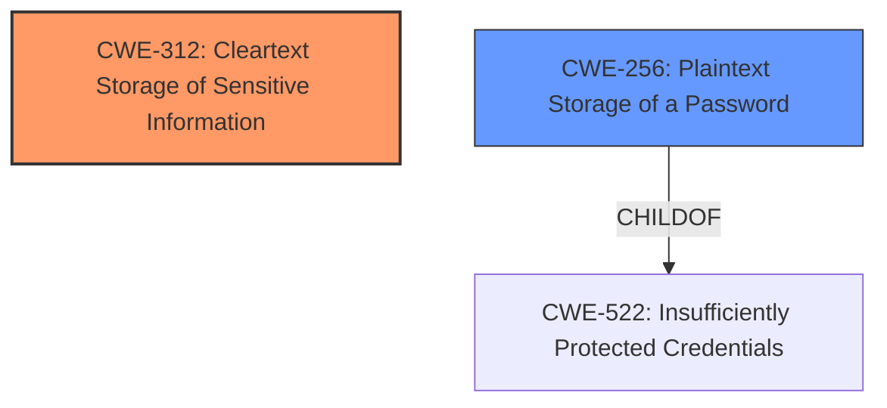

# Analysis Report for CVE-2024-41954

# Vulnerability Analysis Report: CVE-2024-41954

## Description

FOG is a cloning/imaging/rescue suite/inventory management system. The application stores **plaintext service account credentials** in the /opt/fog/.fogsettings file. This file is by default readable by all users on the host. By exploiting these credentials, a malicious user could create new accounts for the web application and much more. The vulnerability is fixed in 1.5.10.41.

## Vulnerability Description Key Phrases

- **Rootcause:** plaintext service account credentials
- **Impact:** ['create new accounts for the web application', 'much more']
- **Attacker:** malicious user
- **Product:** FOG
- **Version:** prior to 1.5.10.41
- **Component:** /opt/fog/.fogsettings file

## Analysis (with Relationship Data)

# Summary
| CWE ID | CWE Name | Confidence | CWE Abstraction Level | CWE Vulnerability Mapping Label | CWE-Vulnerability Mapping Notes |
|---|---|---|---|---|---|
| CWE-312 | Cleartext Storage of Sensitive Information | 1.0 | Base | Allowed | Primary CWE. Credentials stored in plaintext. |
| CWE-256 | Plaintext Storage of a Password | 0.75 | Base | Allowed | Secondary candidate. Because the **plaintext service account credentials** are passwords. |

## Evidence and Confidence

*   **Confidence Score:** 0.9
*   **Evidence Strength:** HIGH

## Relationship Analysis
The primary CWE is CWE-312, which describes the **root cause** of storing sensitive information in cleartext. CWE-256 is a child of CWE-522 (Insufficiently Protected Credentials), focusing specifically on passwords. While CWE-256 is applicable, CWE-312 more broadly covers the storage of sensitive information, encompassing the scenario described.


## Vulnerability Chain
The vulnerability chain starts with the **root cause**, the storage of **plaintext service account credentials** (CWE-312). A malicious user with local access can then exploit these credentials to create new accounts for the web application, leading to potential compromise of the application.

## Summary of Analysis
The initial assessment strongly points to CWE-312 as the primary weakness. The vulnerability description explicitly states that the application stores **plaintext service account credentials** in a file readable by all users. This directly matches the definition of CWE-312: "The product stores sensitive information in cleartext within a resource that might be accessible to another control sphere."

The evidence supporting this decision is clear and comes directly from the vulnerability description and the CVE Reference Links Content Summary. The CVE summary states: "Sensitive credentials (database username/password) were stored in plaintext within a configuration file."

The graph relationships further solidify this choice. While CWE-256 (Plaintext Storage of a Password) is a related CWE, it is more specific and applies only when the sensitive information is a password. In this case, the stored information includes usernames and other service account details, making CWE-312 a more accurate and broader classification.

The selected CWEs are at the optimal level of specificity. CWE-312 is a Base-level CWE, representing the fundamental flaw. While more specific Variant-level CWEs might exist for particular types of sensitive information, CWE-312 adequately captures the general weakness of storing sensitive data in cleartext.

Relevant CWE Information:

# Enhanced Context (25 CWEs)
The following CWEs were identified as potentially relevant to this vulnerability:

## CWE-303: Incorrect Implementation of Authentication Algorithm
**Abstraction Level**: Base
**Similarity Score**: 0.68
**Source**: dense

**Description**:
The requirements for the product dictate the use of an established authentication algorithm, but the implementation of the algorithm is incorrect.

**Mapping Guidance**:
- Usage: Allowed
- Rationale: This CWE entry is at the Base level of abstraction, which is a preferred level of abstraction for mapping to the root causes of vulnerabilities.

*Not Selected*: This CWE does not apply because the issue isn't with the implementation of the authentication algorithm, but the **plaintext storage of credentials**.

## CWE-212: Improper Removal of Sensitive Information Before Storage or Transfer
**Abstraction Level**: Base
**Similarity Score**: 0.68
**Source**: dense

**Description**:
The product stores, transfers, or shares a resource that contains sensitive information, but it does not properly remove that information before the product makes the resource available to unauthorized actors.

**Mapping Guidance**:
- Usage: Allowed
- Rationale: This CWE entry is at the Base level of abstraction, which is a preferred level of abstraction for mapping to the root causes of vulnerabilities.

*Not Selected*: This CWE does not apply because the issue isn't with the removal of sensitive information before storage, but the **plaintext storage of credentials**.

## CWE-497: Exposure of Sensitive System Information to an Unauthorized Control Sphere
**Abstraction Level**: Base
**Similarity Score**: 0.68
**Source**: dense

**Description**:
The product does not properly prevent sensitive system-level information from being accessed by unauthorized actors who do not have the same level of access to the underlying system as the product does.

**Mapping Guidance**:
- Usage: Allowed
- Rationale: This CWE entry is at the Base level of abstraction, which is a preferred level of abstraction for mapping to the root causes of vulnerabilities.

*Not Selected*: This CWE does not apply because the issue isn't about the system not preventing access, but about the fact that the credentials are in **plaintext**.

## CWE-1391: Use of Weak Credentials
**Abstraction Level**: Class
**Similarity Score**: 0.68
**Source**: dense

**Description**:
The product uses weak credentials (such as a default key or hard-coded password) that can be calculated, derived, reused, or guessed by an attacker.

**Mapping Guidance**:
- Usage: Allowed-with-Review
- Rationale: This CWE entry is a Class and might have Base-level children that would be more appropriate

*Not Selected*: This CWE is too general and does not capture the specific problem of **plaintext storage**.

## CWE-346: Origin Validation Error
**Abstraction Level**: Class
**Similarity Score**: 0.67
**Source**: dense

**Description**:
The product does not properly verify that the source of data or communication is valid.

**Mapping Guidance**:
- Usage: Allowed-with-Review
- Rationale: This CWE entry is a Class and might have Base-level children that would be more appropriate

*Not Selected*: This CWE does not apply. There is no origin validation error.

## CWE-319: Cleartext Transmission of Sensitive Information
**Abstraction Level**: Base
**Similarity Score**: 0.67
**Source**: dense

**Description**:
The product transmits sensitive or security-critical data in cleartext in a communication channel that can be sniffed by unauthorized actors.

**Mapping Guidance**:
- Usage: Allowed
- Rationale: This CWE entry is at the Base level of abstraction, which is a preferred level of abstraction for mapping to the root causes of vulnerabilities.

*Not Selected*: This CWE does not apply because the issue isn't with transmission, but with **storage**.

## CWE-798: Use of Hard-coded Credentials
**Abstraction Level**: Base
**Similarity Score**: 0.67
**Source**: dense

**Description**:
The product contains hard-coded credentials, such as a password or cryptographic key.

**Mapping Guidance**:
- Usage: Allowed
- Rationale: This CWE entry is at the Base level of abstraction, which is a preferred level of abstraction for mapping to the root causes of vulnerabilities.

*Not Selected*: This CWE does not apply because the issue isn't with hard-coded credentials, but with **plaintext storage**.

## CWE-522: Insufficiently Protected Credentials
**Abstraction Level**: Class
**Similarity Score**: 0.67
**Source**: dense

**Description**:
The product transmits or stores authentication credentials, but it uses an insecure method that is susceptible to unauthorized interception and/or retrieval.

**Mapping Guidance**:
- Usage: Allowed-with-Review
- Rationale: This CWE entry is a Class and might have Base-level children that would be more appropriate

*Not Selected*: This CWE is too general. The credentials are not just insufficiently protected, they are stored in **plaintext**.

## CWE-288: Authentication Bypass Using an Alternate Path or Channel
**Abstraction Level**: Base
**Similarity Score**: 0.67
**Source**: dense

**Description**:
The product requires authentication, but the product has an alternate path or channel that does not require authentication.

**Mapping Guidance**:
- Usage: Allowed
- Rationale: This CWE entry is at the Base level of abstraction, which is a preferred level of abstraction for mapping to the root causes of vulnerabilities.

*Not Selected*: This CWE does not apply because there is no authentication bypass.

## CWE-532: Insertion of Sensitive Information into Log File
**Abstraction Level**: Base
**Similarity Score**: 806.74
**Source**: sparse

**Description**:
The product writes sensitive information to a log file.

**Mapping Guidance**:
- Usage: Allowed
- Rationale: This CWE entry is at the Base level of abstraction, which is a preferred level of abstraction for mapping to the root causes of vulnerabilities.

*Not Selected*: This CWE does not apply because the sensitive information isn't in a log file.

## CWE-259:


## CWE Relationship Analysis

Current CWEs represent these abstraction levels: .


### Vulnerability Chain Analysis

**Chain starting from CWE-288:**
- 288 (Authentication Bypass Using an Alternate Path or Channel) - ROOT


**Chain starting from CWE-346:**
- 346 (Origin Validation Error) - ROOT


### CWE Relationship Diagram

```mermaid
graph TD
    classDef primary fill:#f96,stroke:#333,stroke-width:2px
    classDef secondary fill:#69f,stroke:#333
    classDef tertiary fill:#9e9,stroke:#333
```


*Report generated on 2025-07-13 13:33:24*
