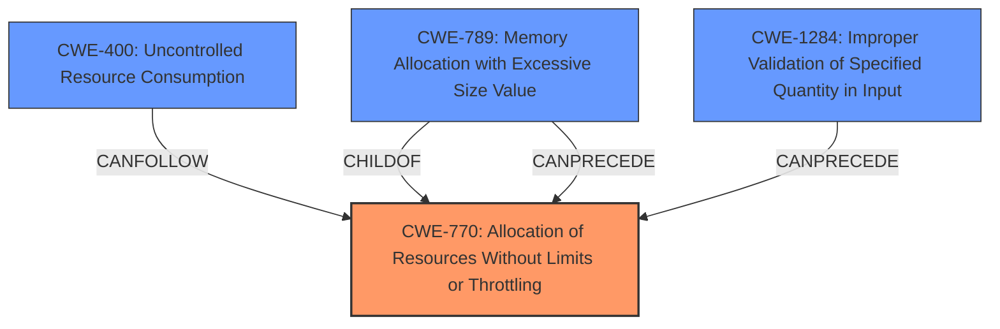

# Analysis Report for CVE-2024-41989

# Vulnerability Analysis Report: CVE-2024-41989

## Description

An issue was discovered in Django 5.0 before 5.0.8 and 4.2 before 4.2.15. The floatformat template filter is subject to significant memory consumption when given a string representation of a number in scientific notation with a large exponent.

## Vulnerability Description Key Phrases

- **Impact:** significant memory consumption
- **Product:** Django
- **Version:** 5.0 before 5.0.8, 4.2 before 4.2.15
- **Component:** floatformat template filter

## Analysis (with Relationship Data)

# Summary

| CWE ID  | CWE Name                                                        | Confidence | CWE Abstraction Level | CWE Vulnerability Mapping Label | CWE-Vulnerability Mapping Notes |
| :-------- | :-------------------------------------------------------------- | :--------- | :-------------------- | :------------------------------ | :------------------------------ |
| CWE-770   | Allocation of Resources Without Limits or Throttling            | 0.9        | Base                  | Primary CWE                    | Allowed                       |
| CWE-400   | Uncontrolled Resource Consumption                             | 0.7        | Class                 | Secondary Candidate              | Discouraged                    |
| CWE-789   | Memory Allocation with Excessive Size Value                    | 0.7        | Variant               | Secondary Candidate              | Allowed                       |
| CWE-1284  | Improper Validation of Specified Quantity in Input            | 0.6        | Base                  | Secondary Candidate              | Allowed                       |

## Evidence and Confidence

*   **Confidence Score:** 0.8
*   **Evidence Strength:** HIGH

## Relationship Analysis

The primary weakness is **CWE-770 Allocation of Resources Without Limits or Throttling** because the `floatformat` template filter does not impose restrictions on the size or number of resources (memory) it allocates, leading to potential memory exhaustion.

CWE-770 is a parent of CWE-789, which indicates that allocating memory with an excessive size value can stem from a lack of limits or throttling.

CWE-400 represents the broader impact of uncontrolled resource consumption, which can be a consequence of CWE-770.

CWE-1284 is related as improper validation of input can lead to excessive resource allocation.



## Vulnerability Chain

The vulnerability chain starts with the **lack of limits or throttling** on resource allocation in the `floatformat` filter (**CWE-770**). This leads to the possibility of allocating memory with an **excessive size value** (**CWE-789**). Consequently, this results in **uncontrolled resource consumption** (**CWE-400**), eventually causing a denial-of-service (DoS) due to **memory exhaustion**. There's also an element of **improper input validation** (**CWE-1284**) because the filter doesn't validate the size of the exponent.

## Summary of Analysis

The primary assessment is based on the provided evidence, specifically the "CVE Reference Links Content Summary," which states that the `floatformat` filter is susceptible to excessive memory consumption due to not properly handling large exponents. This aligns directly with **CWE-770 Allocation of Resources Without Limits or Throttling**, as the root cause is the **lack of restrictions** on resource allocation.

The retriever results also support this, with CWE-770 being a top candidate. The graph relationships show that CWE-789 (Memory Allocation with Excessive Size Value) is a child of CWE-770, further supporting the connection. The classification is at the Base level (CWE-770), which is an appropriate level of specificity. **CWE-770** is the first step in the "Vulnerability Chain".

Other CWEs Considered:

*   **CWE-400 Uncontrolled Resource Consumption:** While this is a consequence of the vulnerability, it's not the root cause. Therefore, it's a secondary consideration.
*   **CWE-789 Memory Allocation with Excessive Size Value:** While related, it's more specific than the general lack of resource control. It is a child of CWE-770.
*   **CWE-1284 Improper Validation of Specified Quantity in Input:** Partially related because the size of the exponent is not validated, but the core issue is the lack of resource limits.
*   **CWE-1333 Inefficient Regular Expression Complexity**: This was considered due to the `floatformat` filter likely employing some form of string processing (potentially involving regular expressions) but it doesn't align directly with the memory consumption issue described.
*   **CWE-407 Inefficient Algorithmic Complexity**: This was considered due to the potential for algorithmic inefficiencies in the `floatformat` filter leading to high memory consumption, but the root cause is more directly related to resource allocation without limits rather than the algorithm's efficiency itself.


## CWE Relationship Analysis

Current CWEs represent these abstraction levels: .


### Vulnerability Chain Analysis

**Chain starting from CWE-1284:**
- 1284 (Improper Validation of Specified Quantity in Input) - ROOT


**Chain starting from CWE-400:**
- 400 (Uncontrolled Resource Consumption) - ROOT


### CWE Relationship Diagram

```mermaid
graph TD
    classDef primary fill:#f96,stroke:#333,stroke-width:2px
    classDef secondary fill:#69f,stroke:#333
    classDef tertiary fill:#9e9,stroke:#333
```


*Report generated on 2025-07-13 13:35:19*
