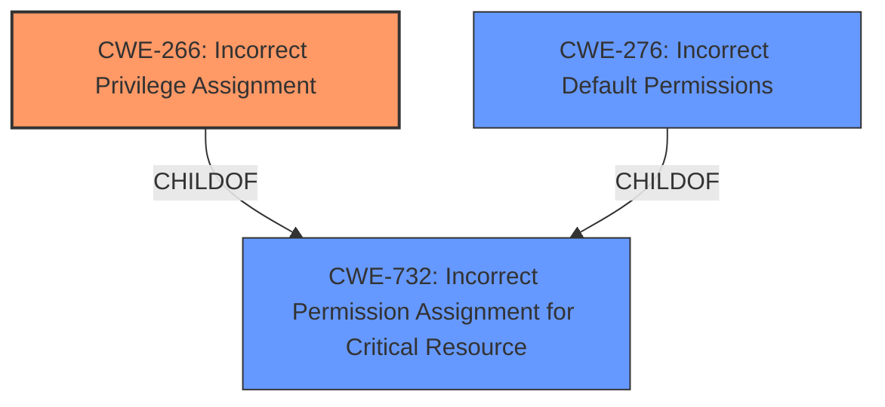

# Raw Analyzer Response for CVE-2024-42022

# Summary
| CWE ID  | CWE Name                                                    | Confidence | CWE Abstraction Level | CWE Vulnerability Mapping Label | CWE-Vulnerability Mapping Notes |
| :-------- | :---------------------------------------------------------- | :--------- | :-------------------- | :------------------------------ | :------------------------------ |
| CWE-266 | Incorrect Privilege Assignment                              | 0.9        | Base                  | Primary CWE                     | Allowed                       |
| CWE-732 | Incorrect Permission Assignment for Critical Resource       | 0.7        | Class                 | Secondary Candidate             | Allowed-with-Review           |
| CWE-276 | Incorrect Default Permissions                               | 0.6        | Base                  | Secondary Candidate             | Allowed                       |

## Evidence and Confidence

*   **Confidence Score:** 0.8
*   **Evidence Strength:** HIGH

## Relationship Analysis
The primary CWE identified is CWE-266, which represents the **incorrect privilege assignment**. This is a base-level CWE, providing a specific description of the vulnerability. CWE-732 (Incorrect Permission Assignment for Critical Resource) is a class-level CWE and a potential parent. CWE-276 (Incorrect Default Permissions) is also a base-level CWE.

## Vulnerability Chain
The vulnerability chain starts with the **incorrect permission assignment** (CWE-266), leading to the ability to modify product configuration files. The chain can be represented as:

CWE-266 (Incorrect Privilege Assignment) -> Impact: Modification of configuration files.

## Summary of Analysis
The analysis is based on the provided vulnerability description and CVE reference links. The key phrase "**incorrect permission assignment**" directly points to a privilege/permission-related CWE. The evidence from the Veeam Security Bulletin confirms that the vulnerability allows modification of product configuration files due to improper access control.

CWE-266 (Incorrect Privilege Assignment) is selected as the primary CWE because the root cause is the **incorrect assignment** of privileges that leads to the vulnerability. This is more specific than CWE-732 (Incorrect Permission Assignment for Critical Resource), which is a class-level CWE and could be a consequence of **incorrect privilege assignment**.

CWE-276 (Incorrect Default Permissions) could be a possible cause if the default permissions were set incorrectly during installation.

The selection is based on the evidence that an attacker can modify configuration files, which is a direct result of the **incorrect privilege assignment**. The selected CWEs are at the optimal level of specificity.

Relevant CWE Information:

# Enhanced Context (25 CWEs)
The following CWEs were identified as potentially relevant to this vulnerability:

## CWE-266: Incorrect Privilege Assignment
**Abstraction Level**: Base
**Similarity Score**: 0.80
**Source**: dense

**Description**:
A product incorrectly assigns a privilege to a particular actor, creating an unintended sphere of control for that actor.

**Mapping Guidance**:
- Usage: Allowed
- Rationale: This CWE entry is at the Base level of abstraction, which is a preferred level of abstraction for mapping to the root causes of vulnerabilities.

**Technical Explanation:**
The vulnerability description states that the root cause is an **incorrect permission assignment** that allows an attacker to modify product configuration files. This aligns directly with the description of CWE-266, which involves the **incorrect assignment** of a privilege to an actor, leading to unintended control.
**Security Implications:**
An attacker who can modify product configuration files can potentially alter the behavior of the application, leading to privilege escalation, data corruption, or denial of service.
**Relationship Analysis:**
CWE-266 is a base-level CWE. It is related to higher-level CWEs such as CWE-269 (Improper Privilege Management), but CWE-266 provides a more specific description of the vulnerability.
**Mapping Guidance Analysis:**
The MITRE mapping guidance allows the use of CWE-266.
**Mitigation Analysis:**
Mitigation would involve ensuring that privileges are correctly assigned to actors.
**Confidence:** 0.9

## CWE-732: Incorrect Permission Assignment for Critical Resource
**Abstraction Level**: Class
**Similarity Score**: 0.73
**Source**: dense

**Description**:
The product specifies permissions for a security-critical resource in a way that allows that resource to be read or modified by unintended actors.

**Mapping Guidance**:
- Usage: Allowed-with-Review
- Rationale: While the name itself indicates an assignment of permissions for resources, this is often misused for vulnerabilities in which "permissions" are not checked, which is an "authorization" weakness (CWE-285 or descendants) within CWE's model [REF-1287].

**Technical Explanation:**
CWE-732 describes an **incorrect assignment** of permissions for critical resources. While the vulnerability allows an attacker to modify configuration files (critical resources), the root cause is more precisely the **incorrect assignment** of privileges.
**Security Implications:**
An attacker who can modify critical resources can potentially alter the behavior of the application, leading to privilege escalation, data corruption, or denial of service.
**Relationship Analysis:**
CWE-732 is a class-level CWE, and it is a parent of more specific CWEs.
**Mapping Guidance Analysis:**
The MITRE mapping guidance allows the use of CWE-732 with review.
**Mitigation Analysis:**
Mitigation would involve ensuring that permissions are correctly assigned to critical resources.
**Confidence:** 0.7

## CWE-276: Incorrect Default Permissions
**Abstraction Level**: Base
**Similarity Score**: 0.76
**Source**: dense

**Description**:
During installation, installed file permissions are set to allow anyone to modify those files.

**Mapping Guidance**:
- Usage: Allowed
- Rationale: This CWE entry is at the Base level of abstraction, which is a preferred level of abstraction for mapping to the root causes of vulnerabilities.

**Technical Explanation:**
CWE-276 describes **incorrect default permissions** set during installation. This could be a contributing factor to the vulnerability.
**Security Implications:**
An attacker who can leverage **incorrect default permissions** can potentially alter the behavior of the application, leading to privilege escalation, data corruption, or denial of service.
**Relationship Analysis:**
CWE-276 is a base-level CWE.
**Mapping Guidance Analysis:**
The MITRE mapping guidance allows the use of CWE-276.
**Mitigation Analysis:**
Mitigation would involve ensuring that default permissions are correctly set during installation.
**Confidence:** 0.6

## Other CWEs Considered:
- CWE-863: Incorrect Authorization - While authorization issues could be related, the root cause is described as an **incorrect assignment**, not a flawed authorization check.
- CWE-862: Missing Authorization - As with CWE-863, the issue isn't about missing authorization but rather about the initial **incorrect assignment**.
- CWE-269: Improper Privilege Management - This is a higher-level class and less specific than CWE-266.
- CWE-285: Improper Authorization - the description indicates an **incorrect assignment** issue, so CWE-285 does not fit.