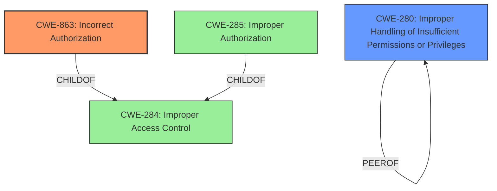

# Enhanced Analysis for CVE-2024-42031

# Summary
| CWE ID | CWE Name | Confidence | CWE Abstraction Level | CWE Vulnerability Mapping Label | CWE-Vulnerability Mapping Notes |
|---|---|---|---|---|---|
| CWE-863 | Incorrect Authorization | 0.9 | Class | Primary | Allowed-with-Review |
| CWE-280 | Improper Handling of Insufficient Permissions or Privileges | 0.5 | Base | Secondary | Allowed |

## Evidence and Confidence

*   **Confidence Score:** 0.7
*   **Evidence Strength:** MEDIUM

## Relationship Analysis
The primary relationship influencing the selection was the hierarchical relationship, specifically that CWE-863 Incorrect Authorization is a more specific Class-level CWE related to authorization issues, while CWE-284 Improper Access Control is a more generic Pillar-level CWE. The retriever results also included CWE-862 Missing Authorization, which is related but not as fitting. CWE-863 was chosen due to the description mentioning an "Access permission verification vulnerability", implying that some authorization mechanism existed but was flawed, rather than completely missing. CWE-280, although less directly supported by the evidence, was included as a secondary CWE because insufficient permissions could contribute to incorrect authorization.



## Vulnerability Chain
The vulnerability chain starts with an **incorrect access permission verification**, leading to the potential for unauthorized access and ultimately affecting service confidentiality.

Incorrect Authorization (CWE-863) -> Unauthorized Access -> Affect Service Confidentiality

## Summary of Analysis
The initial assessment focused on identifying the root cause of the vulnerability based on the provided description. The phrase "**Access permission verification vulnerability**" strongly suggests a problem with how permissions are verified, leading to the selection of CWE-863 Incorrect Authorization as the primary CWE. The retriever results and CWE specifications further support this choice. The guidance on privileges vs. permissions was also considered. Although CWE-285 Improper Authorization was also a candidate, CWE-863 was selected as it implies the presence of an authorization mechanism that is flawed, rather than completely absent. CWE-280 was added as a secondary consideration because the **improper handling of insufficient permissions** could contribute to the **incorrect authorization**. The confidence score is 0.7, reflecting that while the evidence strongly supports CWE-863, there is some uncertainty due to the limited details in the vulnerability description. The selection of CWE-863 is at the optimal level of specificity, as it directly addresses the identified **root cause** of the flawed authorization mechanism.

# Relevant CWE Information:

## CWE-863: Incorrect Authorization
**Abstraction Level**: Class
**Similarity Score**: 1410.47
**Source**: sparse

**Description**:
The product performs an authorization check when an actor attempts to access a resource or perform an action, but it does not correctly perform the check.

**Mapping Guidance**:
- Usage: Allowed-with-Review
- Rationale: This CWE entry is a Class and might have Base-level children that would be more appropriate

## CWE-280: Improper Handling of Insufficient Permissions or Privileges
**Abstraction Level**: Base
**Similarity Score**: 2.50
**Source**: graph

**Description**:
The product does not handle or incorrectly handles when it has insufficient privileges to access resources or functionality as specified by their permissions. This may cause it to follow unexpected code paths that may leave the product in an invalid state.

**Mapping Guidance**:
- Usage: Allowed
- Rationale: This CWE entry is at the Base level of abstraction, which is a preferred level of abstraction for mapping to the root causes of vulnerabilities.


## CWE Relationship Analysis

Current CWEs represent these abstraction levels: .


### Vulnerability Chain Analysis

**Chain starting from CWE-863:**
- 863 (Incorrect Authorization) - ROOT


**Chain starting from CWE-280:**
- 280 (Improper Handling of Insufficient Permissions or Privileges ) - ROOT


### CWE Relationship Diagram

```mermaid
graph TD
    classDef primary fill:#f96,stroke:#333,stroke-width:2px
    classDef secondary fill:#69f,stroke:#333
    classDef tertiary fill:#9e9,stroke:#333
```