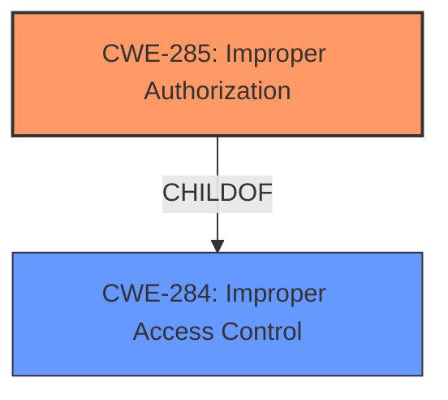

# Raw Analyzer Response for CVE-2024-42033

# Summary
| CWE ID | CWE Name | Confidence | CWE Abstraction Level | CWE Vulnerability Mapping Label | CWE-Vulnerability Mapping Notes |
|---|---|---|---|---|---|
| CWE-285 | Improper Authorization | 0.85 | Class | Primary | Discouraged |
| CWE-284 | Improper Access Control | 0.75 | Pillar | Secondary Candidate | Discouraged |

## Evidence and Confidence

*   **Confidence Score:** 0.80
*   **Evidence Strength:** MEDIUM

## Relationship Analysis
The primary relationship influencing my decision is the hierarchical relationship between CWE-284 (Improper Access Control) and CWE-285 (Improper Authorization). CWE-285 is a child of CWE-284, making it a more specific classification if the vulnerability is related to authorization. The vulnerability description indicates a problem with access control, but the summary in CVE Reference Links Content Summary specifies that this is due to flaws in how the system manages access permissions during security verifications. This leans towards authorization issues, making CWE-285 a better fit.

## Vulnerability Chain
The vulnerability chain begins with an **access control vulnerability** in the security verification module. This **weakness** leads to the impact of affecting both integrity and confidentiality. The chain is:
1.  **Root Cause:** **Access control vulnerability** (CWE-285)
2.  **Impact:** Affects integrity and confidentiality.

## Summary of Analysis
The initial assessment pointed towards a general access control issue, but the detailed summary indicates a problem with authorization. The selection of CWE-285 is based on the evidence from the CVE Reference Links Content Summary, which identifies a flaw in how the system manages access permissions during security verifications. While CWE-285 is a Class-level CWE, and the mapping guidance discourages its use when more specific CWEs are available, the provided information does not offer enough detail to pinpoint a more specific Base-level CWE.

The relationship analysis further supports the choice of CWE-285 over its parent, CWE-284, due to the authorization-specific nature of the vulnerability.

The evidence is based on the following excerpts:

*   "**Vulnerability Description:** Access control vulnerability in the security verification module"
*   "**Root Cause:** The document specifies an "Access control vulnerability" within the security verification module. While not providing the exact technical details, this points to a flaw in how the system manages access permissions during security verifications."
*   "**Impact of Exploitation:** Successful exploitation of this vulnerability will affect integrity and confidentiality."

Relevant CWE Information:

## CWE-285: Improper Authorization
**Technical Explanation:** CWE-285 (Improper Authorization) describes a situation where a product does not perform or incorrectly performs an authorization check when an actor attempts to access a resource or perform an action. In this case, the security verification module contains an **access control vulnerability** which could allow unauthorized access or manipulation.
**Security Implications:** This can lead to unauthorized access to sensitive data or functionality, potentially allowing attackers to compromise the system's **integrity and confidentiality**.
**Relationship to Other CWEs:** CWE-285 is a child of CWE-284 (Improper Access Control), but it's more specific to authorization issues.
**MITRE Mapping Guidance:** CWE-285 is discouraged because more specific CWEs can frequently be used instead.

## CWE-284: Improper Access Control
**Technical Explanation:** CWE-284 (Improper Access Control) is a more general CWE that describes a failure to properly restrict access to resources. It would be applicable if the vulnerability stemmed from a broader access control issue that wasn't specifically related to authentication or authorization.
**Security Implications:** Similar to CWE-285, this can lead to unauthorized access, but the root cause is less clear.
**Relationship to Other CWEs:** CWE-284 is a parent of CWE-285.
**MITRE Mapping Guidance:** CWE-284 is a top-level category used when the access control failure exists but the root cause is unclear.

Other CWEs Considered:

*   CWE-306 (Missing Authentication for Critical Function): This was considered, but the description indicates the issue is related to authorization, not authentication. The system likely requires some form of authentication but fails to properly authorize actions.
*   CWE-862 (Missing Authorization): This is similar to CWE-285, but CWE-862 describes cases where authorization checks are completely missing. The provided information suggests that authorization checks might be present but incorrect, making CWE-285 a slightly better fit.
*   CWE-863 (Incorrect Authorization): This is a peer of CWE-862 and a child of CWE-285 and describes cases where authorization checks exist, but are performed incorrectly. Without additional details, it is difficult to choose between CWE-863 and CWE-285.