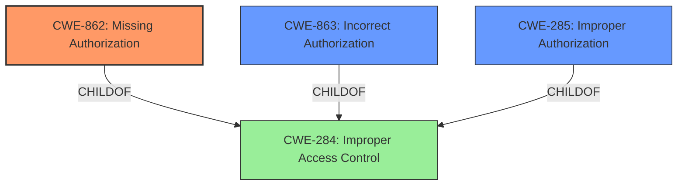

# Analysis for CVE-2024-42036

# Summary
| CWE ID | CWE Name | Confidence | CWE Abstraction Level | CWE Vulnerability Mapping Label | CWE-Vulnerability Mapping Notes |
|---|---|---|---|---|---|
| CWE-862 | Missing Authorization | 0.8 | Class |  | Allowed-with-Review, Primary CWE |
| CWE-285 | Improper Authorization | 0.6 | Class |  | Discouraged, Secondary Candidate |
| CWE-863 | Incorrect Authorization | 0.6 | Class |  | Allowed-with-Review, Secondary Candidate |

## Evidence and Confidence

*   **Confidence Score:** 0.8
*   **Evidence Strength:** MEDIUM

## Relationship Analysis
The primary relationship influencing the selection is the parent-child relationship between CWE-284 (Improper Access Control) and its children like CWE-862 (Missing Authorization), CWE-863 (Incorrect Authorization) and CWE-285 (Improper Authorization). Since the vulnerability description indicates a problem with **access permission verification**, I considered these child CWEs more specific and relevant than the generic CWE-284. I chose CWE-862 as the primary CWE because the description focuses on a **missing access permission verification**, suggesting the authorization mechanism might be entirely absent rather than just incorrectly implemented. If the authorization logic was present but flawed I would have selected CWE-863.

## Vulnerability Chain
The vulnerability chain starts with the **missing access permission verification** (CWE-862), which then leads to the impact of potentially affecting service confidentiality.

## Summary of Analysis
My analysis is based on the vulnerability description stating an "**Access permission verification vulnerability**" in the Notepad module. The description highlights a **missing** or **improper** check leading to potential service confidentiality impact. Given the evidence, I selected CWE-862 (Missing Authorization) as the primary CWE. The retriever results listed several authorization-related CWEs like CWE-285 (Improper Authorization) and CWE-863 (Incorrect Authorization), which were considered but deemed less accurate because the root cause is a **missing** verification, not an incorrect one. The complete CWE specifications and the relationship analysis with parent CWEs like CWE-284 (Improper Access Control) further supported this decision. The provided guidance on privileges vs. permissions helped narrow down the options, focusing on authorization-related issues. The CWE-862, Missing Authorization, is at the optimal level of specificity as it precisely represents the absence of an authorization mechanism, leading to the vulnerability.

Relevant CWE Information:

# Enhanced Context (25 CWEs)
The following CWEs were identified as potentially relevant to this vulnerability:

## CWE-285: Improper Authorization
**Abstraction Level**: Class
**Similarity Score**: 1412.70
**Source**: sparse

**Description**:
The product does not perform or incorrectly performs an authorization check when an actor attempts to access a resource or perform an action.

**Mapping Guidance**:
- Usage: Discouraged
- Rationale: CWE-285 is high-level and lower-level CWEs can frequently be used instead. It is a level-1 Class (i.e., a child of a Pillar).

## CWE-862: Missing Authorization
**Abstraction Level**: Class
**Similarity Score**: 130
**Source**: sparse

**Description**:
The product does not perform an authorization check when it should.

**Mapping Guidance**:
- Usage: Allowed-with-Review
- Rationale: This CWE entry is a Class and might have Base-level children that would be more appropriate

## CWE-863: Incorrect Authorization
**Abstraction Level**: Class
**Similarity Score**: 130
**Source**: sparse

**Description**:
The product performs an authorization check when an actor attempts to access a resource or perform an action, but it does not correctly perform the check.

**Mapping Guidance**:
- Usage: Allowed-with-Review
- Rationale: This CWE entry is a Class and might have Base-level children that would be more appropriate