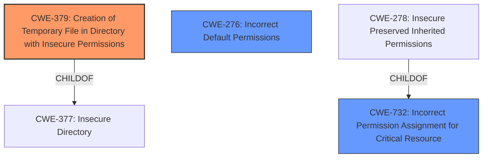

# Analysis for CVE-2024-42051

# Summary
| CWE ID    | CWE Name                                                        | Confidence | CWE Abstraction Level | CWE Vulnerability Mapping Label | CWE-Vulnerability Mapping Notes |
| --------- | --------------------------------------------------------------- | ---------- | --------------------- | ------------------------------- | ------------------------------- |
| CWE-379   | Creation of Temporary File in Directory with Insecure Permissions | 0.9        | Base                  | Allowed                         | Primary CWE                     |
| CWE-732   | Incorrect Permission Assignment for Critical Resource         | 0.7        | Class                 | Allowed-with-Review             | Secondary Candidate             |
| CWE-276   | Incorrect Default Permissions                                   | 0.6        | Base                  | Allowed                         | Secondary Candidate             |

## Evidence and Confidence

*   **Confidence Score:** 0.8
*   **Evidence Strength:** HIGH

## Relationship Analysis
The primary CWE is CWE-379, which describes the creation of a temporary file in a directory with insecure permissions. The secondary CWEs, CWE-732 and CWE-276, are related to permission assignment. CWE-732 is a class-level CWE, while CWE-276 is a base-level CWE. The choice of CWE-379 as primary and the others as secondary reflects the specific details of the vulnerability description where the creation of a temporary file is a critical part of the exploit, and insecure permissions allowed the exploit to work.

## Vulnerability Chain
The vulnerability chain starts with the creation of a temporary directory with **weak permissions**. This leads to a local user being able to replace a critical file (InstRegExp.reg) within that directory. Because the installer executes with SYSTEM privileges, the malicious `.reg` file is loaded, allowing the local user to escalate privileges to SYSTEM.

*   **Root Cause:** CWE-379: Creation of Temporary File in Directory with Insecure Permissions
*   **Weakness:** **Weak permissions** on the temporary folder
*   **Impact:** Privilege escalation to SYSTEM

## Summary of Analysis
The analysis is based on the provided evidence, specifically the vulnerability description and the CVE reference links content summary. The key phrase "weak permissions during installation" directly points to a permission-related issue. The retriever results and complete CWE specifications were used to narrow down the most appropriate CWE.

The description states that the MSI installer uses a temporary folder with **weak permissions during installation**. A local user can exploit this to escalate privileges to SYSTEM by replacing InstRegExp.reg. The CVE reference links content summary reinforces this by stating the root cause is the Splashtop Streamer MSI installer using a temporary folder with weak permissions during installation.

CWE-379 is the most accurate because it explicitly describes the creation of a temporary file in a directory with insecure permissions, which aligns perfectly with the vulnerability.

CWE-732 was considered because it relates to incorrect permission assignments. However, it is a Class-level CWE and less specific than CWE-379. It describes "The product specifies permissions for a security-critical resource in a way that allows that resource to be read or modified by unintended actors." While this is related, the core issue is the creation of the temporary directory with weak permissions, not necessarily a specific resource.

CWE-276 was considered because it refers to incorrect default permissions. However, the vulnerability specifically involves a temporary directory created with insecure permissions, making CWE-379 a more precise fit.

Relevant CWE Information:

# Enhanced Context (25 CWEs)
The following CWEs were identified as potentially relevant to this vulnerability:

## CWE-266: Incorrect Privilege Assignment
**Abstraction Level**: Base
**Similarity Score**: 0.79
**Source**: dense

**Description**:
A product incorrectly assigns a privilege to a particular actor, creating an unintended sphere of control for that actor.

**Mapping Guidance**:
- Usage: Allowed
- Rationale: This CWE entry is at the Base level of abstraction, which is a preferred level of abstraction for mapping to the root causes of vulnerabilities.

## CWE-59: Improper Link Resolution Before File Access ('Link Following')
**Abstraction Level**: Base
**Similarity Score**: 0.78
**Source**: dense

**Description**:
The product attempts to access a file based on the filename, but it does not properly prevent that filename from identifying a link or shortcut that resolves to an unintended resource.

**Mapping Guidance**:
- Usage: Allowed
- Rationale: This CWE entry is at the Base level of abstraction, which is a preferred level of abstraction for mapping to the root causes of vulnerabilities.

## CWE-276: Incorrect Default Permissions
**Abstraction Level**: Base
**Similarity Score**: 0.77
**Source**: dense

**Description**:
During installation, installed file permissions are set to allow anyone to modify those files.

**Mapping Guidance**:
- Usage: Allowed
- Rationale: This CWE entry is at the Base level of abstraction, which is a preferred level of abstraction for mapping to the root causes of vulnerabilities.

## CWE-267: Privilege Defined With Unsafe Actions
**Abstraction Level**: Base
**Similarity Score**: 0.76
**Source**: dense

**Description**:
A particular privilege, role, capability, or right can be used to perform unsafe actions that were not intended, even when it is assigned to the correct entity.

**Mapping Guidance**:
- Usage: Allowed
- Rationale: This CWE entry is at the Base level of abstraction, which is a preferred level of abstraction for mapping to the root causes of vulnerabilities.

## CWE-280: Improper Handling of Insufficient Permissions or Privileges 
**Abstraction Level**: Base
**Similarity Score**: 0.76
**Source**: dense

**Description**:
The product does not handle or incorrectly handles when it has insufficient privileges to access resources or functionality as specified by their permissions. This may cause it to follow unexpected code paths that may leave the product in an invalid state.

**Mapping Guidance**:
- Usage: Allowed
- Rationale: This CWE entry is at the Base level of abstraction, which is a preferred level of abstraction for mapping to the root causes of vulnerabilities.

## CWE-427: Uncontrolled Search Path Element
**Abstraction Level**: Base
**Similarity Score**: 0.75
**Source**: dense

**Description**:
The product uses a fixed or controlled search path to find resources, but one or more locations in that path can be under the control of unintended actors.

**Mapping Guidance**:
- Usage: Allowed
- Rationale: This CWE entry is at the Base level of abstraction, which is a preferred level of abstraction for mapping to the root causes of vulnerabilities.

## CWE-274: Improper Handling of Insufficient Privileges
**Abstraction Level**: Base
**Similarity Score**: 0.75
**Source**: dense

**Description**:
The product does not handle or incorrectly handles when it has insufficient privileges to perform an operation, leading to resultant weaknesses.

**Mapping Guidance**:
- Usage: Discouraged
- Rationale: This CWE entry could be deprecated in a future version of CWE.

## CWE-73: External Control of File Name or Path
**Abstraction Level**: Base
**Similarity Score**: 0.74
**Source**: dense

**Description**:
The product allows user input to control or influence paths or file names that are used in filesystem operations.

**Mapping Guidance**:
- Usage: Allowed
- Rationale: This CWE entry is at the Base level of abstraction, which is a preferred level of abstraction for mapping to the root causes of vulnerabilities.

## CWE-41: Improper Resolution of Path Equivalence
**Abstraction Level**: Base
**Similarity Score**: 0.74
**Source**: dense

**Description**:
The product is vulnerable to file system contents disclosure through path equivalence. Path equivalence involves the use of special characters in file and directory names. The associated manipulations are intended to generate multiple names for the same object.

**Mapping Guidance**:
- Usage: Allowed
- Rationale: This CWE entry is at the Base level of abstraction, which is a preferred level of abstraction for mapping to the root causes of vulnerabilities.

## CWE-668: Exposure of Resource to Wrong Sphere
**Abstraction Level**: Class
**Similarity Score**: 0.74
**Source**: dense

**Description**:
The product exposes a resource to the wrong control sphere, providing unintended actors with inappropriate access to the resource.

**Mapping Guidance**:
- Usage: Discouraged
- Rationale: CWE-668 is high-level and is often misused as a catch-all when