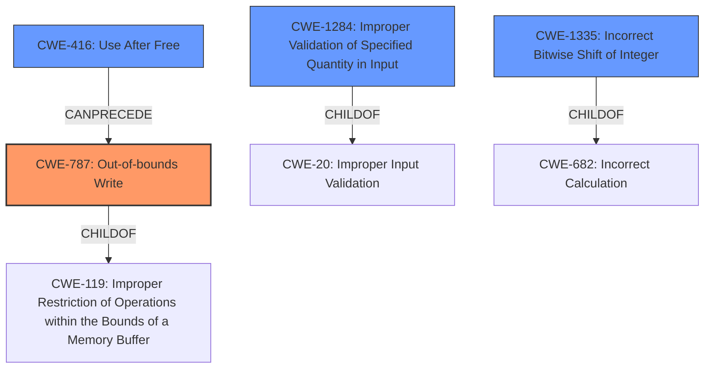

# Raw Analyzer Response for CVE-2024-42105

# Summary
| CWE ID    | CWE Name                                                         | Confidence | CWE Abstraction Level | CWE Vulnerability Mapping Label | CWE-Vulnerability Mapping Notes |
| :---------- | :--------------------------------------------------------------- | :--------- | :---------------------- | :------------------------------ | :------------------------------ |
| CWE-787     | Out-of-bounds Write                                              | 0.7        | Base                    | Primary                         | Allowed                       |
| CWE-416     | Use After Free                                                   | 0.6        | Base                    | Secondary                         | Allowed                       |
| CWE-1284    | Improper Validation of Specified Quantity in Input              | 0.6        | Base                    | Secondary                         | Allowed                       |
| CWE-1335    | Incorrect Bitwise Shift of Integer                               | 0.5        | Base                    | Secondary                         | Allowed                       |

## Evidence and Confidence

*   **Confidence Score:** 0.7
*   **Evidence Strength:** MEDIUM

## Relationship Analysis
The primary weakness appears to be an out-of-bounds write (CWE-787) that is preceeded by a **use-after-free** (CWE-416) and triggered by **improper input validation** (CWE-1284) and incorrect bitwise shift of integer (CWE-1335). The relationship shows how invalid inode numbers from the superblock can lead to memory corruption during bit shift operations. The base level CWEs were chosen for specificity.

## Vulnerability Chain
The vulnerability chain starts with **improper validation** of the first non-reserved inode number read from the superblock (CWE-1284). If this number is invalid, it can lead to an **incorrect bitwise shift** (CWE-1335) during inode number tests. This can then lead to a **use-after-free** (CWE-416) condition if an internal inode is exposed in the namespace on a corrupted filesystem. Ultimately, this triggers an **out-of-bounds write** (CWE-787) when the system attempts to access memory outside the intended buffer.

## Summary of Analysis
The initial assessment identified multiple potential CWEs based on the key phrases provided in the vulnerability description. The primary focus was on **use-after-free**, **improper input validation**, integer overflow/wraparound, and incorrect bitwise shift of integer. After carefully considering the vulnerability details and the relationships between the key phrases, the primary CWE was determined to be CWE-787 (Out-of-bounds Write), as the ultimate impact of the vulnerability is writing to memory outside the intended buffer. CWE-416 (Use After Free), CWE-1284 (Improper Validation of Specified Quantity in Input), and CWE-1335 (Incorrect Bitwise Shift of Integer) are secondary CWEs that contribute to the vulnerability chain.

The selection of CWE-787 as the primary CWE is based on the fact that the vulnerability ultimately results in writing to memory outside of the intended buffer. This is supported by the vulnerability description, which states that the issue is caused by nilfs2s internal inode being exposed in the namespace on a corrupted filesystem.

The secondary CWEs were selected based on their contribution to the vulnerability chain. CWE-416 (Use After Free) is a result of the improper handling of the inode. CWE-1284 (Improper Validation of Specified Quantity in Input) is due to the **lack of validation** of the first non-reserved inode number read from the superblock. CWE-1335 (Incorrect Bitwise Shift of Integer) is a result of using the invalid inode number in left bit-shift calculations.

The chosen CWEs are at the optimal level of specificity because they accurately represent the root cause and impact of the vulnerability. CWE-787 is a base-level CWE that directly describes the out-of-bounds write. CWE-416 is a base-level CWE that describes the use-after-free condition. CWE-1284 is a base-level CWE that describes the **improper validation** of the input. CWE-1335 is a base-level CWE that describes the incorrect bitwise shift of integer.

The confidence in this assessment is relatively high (0.7) due to the clear evidence in the vulnerability description that supports the selected CWEs. The vulnerability description specifically mentions the **use-after-free** condition, the **lack of validation** of the inode number, and the out-of-bounds write.

CWEs considered but not used:

*   CWE-190 (Integer Overflow or Wraparound): While the vulnerability description mentions bit-shift calculations and the possibility of exceeding the bit width of an integer, the primary issue is not an integer overflow or wraparound but rather the use of an invalid inode number in the calculation.
*   CWE-125 (Out-of-bounds Read): The primary impact of the vulnerability is an out-of-bounds write, not an out-of-bounds read.
*   CWE-775 (Missing Release of File Descriptor or Handle after Effective Lifetime): This CWE is not directly related to the vulnerability. The **use-after-free** condition is due to the improper handling of the inode, not the missing release of a file descriptor or handle.