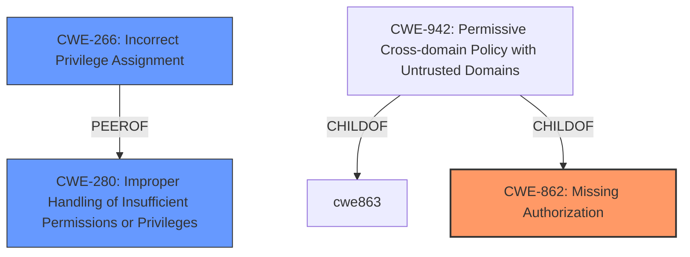

# Analysis Report for CVE-2024-4211

# Vulnerability Analysis Report: CVE-2024-4211

## Description

**Improper Validation of Specified Quantity in Input vulnerability** in OpenText OpenText Application Automation Tools allows Exploiting Incorrectly Configured Access Control Security Levels. **Multiple missing permission checks** - ALM job config has been discovered in OpenText Application Automation Tools. The vulnerability could allow users with Overall/Read permission to enumerate ALM server names, usernames and client IDs configured to be used with ALM servers. This issue affects OpenText Application Automation Tools 24.1.0 and below.

## Vulnerability Description Key Phrases

- **Rootcause:** Improper Validation of Specified Quantity in Input vulnerability
- **Weakness:** Multiple missing permission checks
- **Impact:** ['Exploiting Incorrectly Configured Access Control Security Levels', 'enumerate ALM server names', 'usernames and client IDs']
- **Attacker:** users with Overall/Read permission
- **Product:** OpenText OpenText Application Automation Tools
- **Version:** 24.1.0 and below

## Analysis (with Relationship Data)

# Summary
| CWE ID | CWE Name | Confidence | CWE Abstraction Level | CWE Vulnerability Mapping Label | CWE-Vulnerability Mapping Notes |
|---|---|---|---|---|---|
| CWE-862 | Missing Authorization | 0.9 | Class | Primary | Allowed-with-Review |
| CWE-266 | Incorrect Privilege Assignment | 0.6 | Base | Secondary Candidate | Allowed |
| CWE-280 | Improper Handling of Insufficient Permissions or Privileges | 0.5 | Base | Secondary Candidate | Allowed |

## Evidence and Confidence

*   **Confidence Score:** 0.9
*   **Evidence Strength:** HIGH

## Relationship Analysis
The primary CWE is CWE-862, which is a Class-level CWE. It represents a high-level category of missing authorization checks. There are several potential child CWEs that could provide more specific details, but the description doesn't offer sufficient evidence to determine which child CWE would be most appropriate. Therefore, the Class-level CWE is the most suitable choice.



## Vulnerability Chain
The vulnerability chain starts with **missing permission checks** (CWE-862), which leads to exploiting incorrectly configured access control security levels and enumerating ALM server names, usernames, and client IDs.

## Summary of Analysis
The vulnerability description explicitly states "**Multiple missing permission checks**," which directly aligns with the definition of CWE-862 (Missing Authorization). This is a Class-level CWE, and while more specific Base or Variant CWEs might exist, the provided information doesn't allow for a more granular classification. The impact of this **missing authorization** is that users with Overall/Read permissions can enumerate ALM server names, usernames, and client IDs, effectively bypassing intended access controls.

The Retriever Results also support this classification, with CWE-862 being the top result. The CWE Classification Guidance highlights that CWE-862 is appropriate when there is "No role/privilege check after login." This aligns perfectly with the vulnerability description, which indicates that permission checks are missing.

Other CWEs were considered but ultimately deemed less appropriate:

*   CWE-863 (Incorrect Authorization): This CWE implies that an authorization check is present but flawed. The description states that permission checks are missing, so CWE-862 is more accurate.
*   CWE-280 (Improper Handling of Insufficient Permissions or Privileges): Although potentially related, this CWE focuses on the *handling* of insufficient privileges, whereas the core issue here is the *absence* of permission checks.
*   CWE-266 (Incorrect Privilege Assignment): This could be a secondary issue if the "Overall/Read" permission is too broad, but the primary problem is the lack of checks for those permissions.

The decision to use CWE-862 is primarily based on the explicit mention of "**missing permission checks**" in the vulnerability description. This aligns with the definition of CWE-862, the Retriever Results, and the CWE Classification Guidance. While other CWEs might be indirectly relevant, they are not as directly supported by the evidence.

Relevant CWE Information:

# Enhanced Context (25 CWEs)
The following CWEs were identified as potentially relevant to this vulnerability:

## CWE-266: Incorrect Privilege Assignment
**Abstraction Level**: Base
**Similarity Score**: 0.75
**Source**: dense

**Description**:
A product incorrectly assigns a privilege to a particular actor, creating an unintended sphere of control for that actor.

**Mapping Guidance**:
- Usage: Allowed
- Rationale: This CWE entry is at the Base level of abstraction, which is a preferred level of abstraction for mapping to the root causes of vulnerabilities.

## CWE-280: Improper Handling of Insufficient Permissions or Privileges
**Abstraction Level**: Base
**Similarity Score**: 0.75
**Source**: dense

**Description**:
The product does not handle or incorrectly handles when it has insufficient privileges to access resources or functionality as specified by their permissions. This may cause it to follow unexpected code paths that may leave the product in an invalid state.

**Mapping Guidance**:
- Usage: Allowed
- Rationale: This CWE entry is at the Base level of abstraction, which is a preferred level of abstraction for mapping to the root causes of vulnerabilities.

## CWE-862: Missing Authorization
**Abstraction Level**: Class
**Similarity Score**: 2069.16
**Source**: sparse

**Description**:
The product does not perform an authorization check when an actor attempts to access a resource or perform an action.

**Mapping Guidance**:
- Usage: Allowed-with-Review
- Rationale: This CWE entry is a Class and might have Base-level children that would be more appropriate


## CWE Relationship Analysis

Current CWEs represent these abstraction levels: .


### Vulnerability Chain Analysis

**Chain starting from CWE-863:**
- 863 (Incorrect Authorization) - ROOT


**Chain starting from CWE-280:**
- 280 (Improper Handling of Insufficient Permissions or Privileges ) - ROOT


### CWE Relationship Diagram

```mermaid
graph TD
    classDef primary fill:#f96,stroke:#333,stroke-width:2px
    classDef secondary fill:#69f,stroke:#333
    classDef tertiary fill:#9e9,stroke:#333
```


*Report generated on 2025-07-13 13:45:51*
