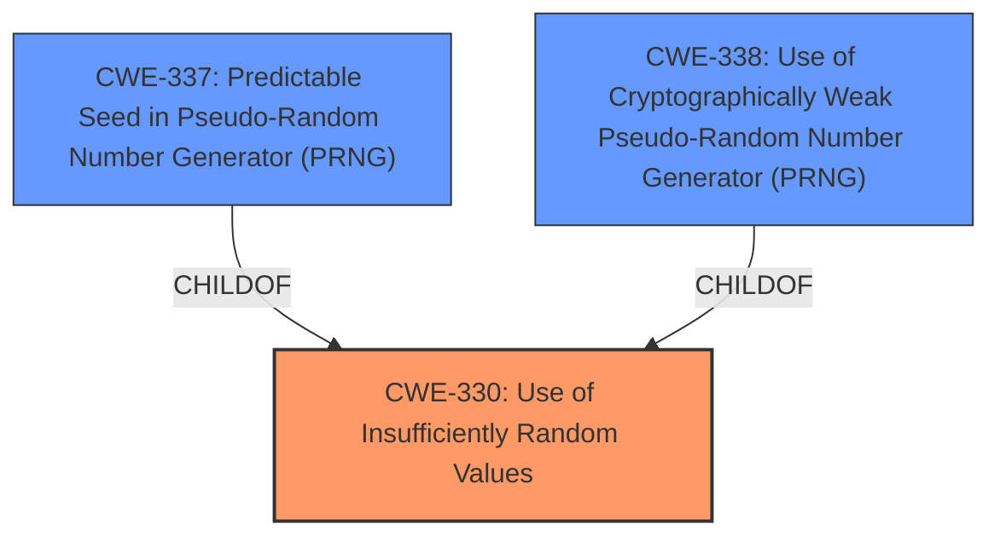

# Enhanced Analysis for CVE-2024-42164

# Summary
| CWE ID | CWE Name | Confidence | CWE Abstraction Level | CWE Vulnerability Mapping Label | CWE-Vulnerability Mapping Notes |
|---|---|---|---|---|---|
| CWE-330 | Use of Insufficiently Random Values | 0.9 | Class | Allowed-with-Review | The root cause of the vulnerability is **insufficiently random values for generating password reset token**. |
| CWE-337 | Predictable Seed in Pseudo-Random Number Generator (PRNG) | 0.7 | Variant | Allowed | A predictable seed could be the reason for the insufficiently random values. |
| CWE-338 | Use of Cryptographically Weak Pseudo-Random Number Generator (PRNG) | 0.7 | Base | Allowed | A cryptographically weak PRNG could be the reason for the insufficiently random values. |

## Evidence and Confidence

*   **Confidence Score:** 0.8
*   **Evidence Strength:** HIGH

## Relationship Analysis
The primary CWE is CWE-330, which is a Class-level CWE. CWE-337 (Variant) and CWE-338 (Base) are child CWEs of CWE-330 and represent more specific reasons that could lead to the **insufficiently random values**. Therefore, they are considered as secondary candidates.



## Vulnerability Chain
The chain of events is:
1.  **Root Cause:** CWE-330 (**Insufficiently random values for generating password reset token**)
2.  **Impact:** Attackers can disable two-factor authentication of any user by predicting the token.

## Summary of Analysis
The vulnerability description explicitly states that the root cause is **insufficiently random values for generating password reset token**. This directly corresponds to CWE-330. The impact is that attackers can disable two-factor authentication by predicting the token.

CWE-330 is a Class, and its children, CWE-337 and CWE-338, are more specific. The information available doesn't provide specific details to confirm whether the **insufficiently random values** are due to a predictable seed (CWE-337) or a weak PRNG (CWE-338). So, I am selecting CWE-330 as the Primary CWE.

I considered the other CWEs in the Retriever Results, such as CWE-1390 (Weak Authentication) and CWE-287 (Improper Authentication), but they are less relevant because the vulnerability is specifically about the randomness of the token, not the authentication process itself.

Relevant CWE Information:
*   CWE-330: Use of Insufficiently Random Values
*   CWE-337: Predictable Seed in Pseudo-Random Number Generator (PRNG)
*   CWE-338: Use of Cryptographically Weak Pseudo-Random Number Generator (PRNG)


## CWE Relationship Analysis

Current CWEs represent these abstraction levels: .


### Vulnerability Chain Analysis

**Chain starting from CWE-1390:**
- 1390 (Weak Authentication) - ROOT


**Chain starting from CWE-338:**
- 338 (Use of Cryptographically Weak Pseudo-Random Number Generator (PRNG)) - ROOT


### CWE Relationship Diagram

```mermaid
graph TD
    classDef primary fill:#f96,stroke:#333,stroke-width:2px
    classDef secondary fill:#69f,stroke:#333
    classDef tertiary fill:#9e9,stroke:#333
```