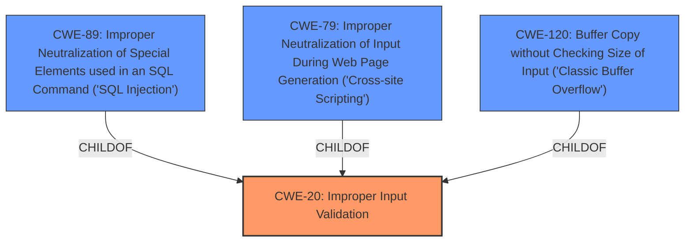

# Analysis Report for CVE-2024-42175

# Vulnerability Analysis Report: CVE-2024-42175

## Description

HCL MyXalytics is affected by a weak **input validation vulnerability**. The application accepts special characters and there is no length validation. This can lead to security vulnerabilities like **SQL injection**, **XSS**, and **buffer overflow**.

## Vulnerability Description Key Phrases

- **Rootcause:** input validation vulnerability
- **Weakness:** ['weak input validation', 'buffer overflow', 'SQL injection', 'XSS']
- **Impact:** ['and buffer overflow', 'SQL injection', 'XSS']
- **Product:** HCL MyXalytics

## Analysis (with Relationship Data)

# Summary
| CWE ID  | CWE Name                                                                           | Confidence | CWE Abstraction Level | CWE Vulnerability Mapping Label | CWE-Vulnerability Mapping Notes |
| :-------- | :--------------------------------------------------------------------------------- | :--------- | :---------------------- | :------------------------------ | :-------------------------------- |
| CWE-20  | Improper Input Validation                                                          | 0.9        | Class                   | Primary CWE                     | Discouraged                       |
| CWE-89  | Improper Neutralization of Special Elements used in an SQL Command ('SQL Injection') | 0.8        | Base                    | Secondary Candidate             | Allowed                           |
| CWE-79  | Improper Neutralization of Input During Web Page Generation ('Cross-site Scripting') | 0.8        | Base                    | Secondary Candidate             | Allowed                           |
| CWE-120 | Buffer Copy without Checking Size of Input ('Classic Buffer Overflow')              | 0.7        | Base                    | Secondary Candidate             | Allowed-with-Review               |

## Evidence and Confidence

*   **Confidence Score:** 0.8
*   **Evidence Strength:** MEDIUM

## Relationship Analysis

The primary weakness identified is **CWE-20** Improper Input Validation, a Class-level CWE. While it is discouraged to use Class-level CWEs, it is appropriate in this case as it is a general **input validation vulnerability** that could lead to several different exploitable conditions. The description mentions **SQL Injection**, **XSS**, and **buffer overflow** as potential consequences. Therefore, **CWE-89**, **CWE-79**, and **CWE-120** are included as secondary candidates.



## Vulnerability Chain

The vulnerability chain starts with **CWE-20** **Improper Input Validation**. Due to this weakness, an attacker can inject malicious code. Depending on the context, this can lead to:
1.  **SQL Injection** (**CWE-89**): If the input is used in an SQL query.
2.  **Cross-Site Scripting (XSS)** (**CWE-79**): If the input is reflected in a web page.
3.  **Buffer Overflow** (**CWE-120**): If the input is copied to a buffer without proper size checks.

## Summary of Analysis

The primary **weakness** is the **improper input validation**. The description clearly states that the application accepts special characters and lacks length validation. This **lack of input validation** is the root cause that enables other vulnerabilities such as **SQL injection**, **XSS**, and **buffer overflow**.

The initial assessment considered all the top CWEs suggested by the retriever, especially **CWE-20** Improper Input Validation, **CWE-89** SQL Injection, **CWE-79** XSS, and **CWE-120** Buffer Overflow. While **CWE-20** is a high-level Class, it accurately represents the **root cause**. The other CWEs represent potential impacts resulting from the primary weakness. I considered **CWE-1284** but it's more focused on quantity, rather than general validation so it was not chosen.

The graph relationships were crucial in understanding the relationship between the **root cause** and the potential impacts. The child-of relationship between **CWE-89**, **CWE-79**, **CWE-120** and **CWE-20** helped to solidify the decision to choose **CWE-20** as the primary **weakness**.

Relevant CWE Information:
*   **CWE-20**: The product receives input or data, but it does not validate or incorrectly validates that the input has the properties that are required to process the data safely and correctly.
*   **CWE-89**: The product constructs all or part of an SQL command using externally-influenced input from an upstream component, but it does not neutralize or incorrectly neutralizes special elements that could modify the intended SQL command when it is sent to a downstream component.
*   **CWE-79**: The product does not neutralize or incorrectly neutralizes user-controllable input before it is placed in output that is used as a web page that is served to other users.
*   **CWE-120**: The product copies an input buffer to an output buffer without verifying that the size of the input buffer is less than the size of the output buffer, leading to a buffer overflow.


## CWE Relationship Analysis

Current CWEs represent these abstraction levels: .


### Vulnerability Chain Analysis

**Chain starting from CWE-89:**
- 89 (Improper Neutralization of Special Elements used in an SQL Command ('SQL Injection')) - ROOT


**Chain starting from CWE-1284:**
- 1284 (Improper Validation of Specified Quantity in Input) - ROOT


### CWE Relationship Diagram

```mermaid
graph TD
    classDef primary fill:#f96,stroke:#333,stroke-width:2px
    classDef secondary fill:#69f,stroke:#333
    classDef tertiary fill:#9e9,stroke:#333
```


*Report generated on 2025-07-13 13:49:04*
